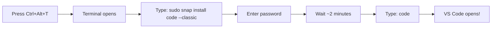
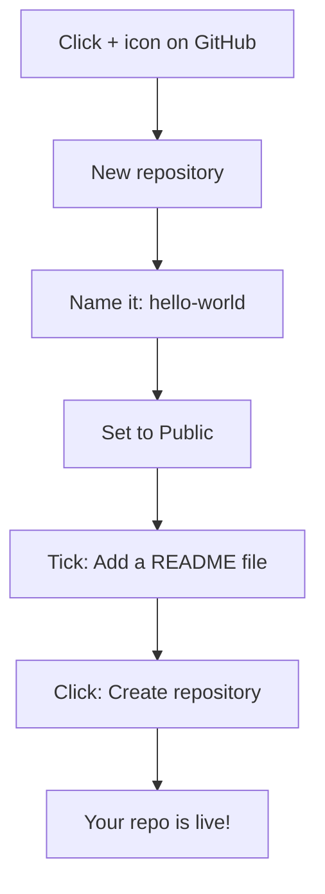
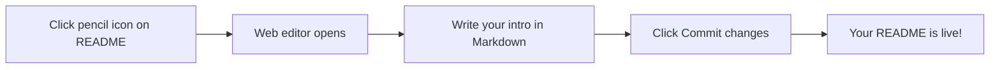

## Day 1 — Quick Wins: Feel Like a Developer

> **Goal:** By the end of today, your GitHub profile is live on the internet with your first file. No deep theory — just wins.

---

### Step 1 — Tour Ubuntu (10 min)

When you first log in to Ubuntu, you see the **desktop**. Here's what matters:

| What you see                                      | What it does                                            |
| ------------------------------------------------- | ------------------------------------------------------- |
| **Files** (folder icon on dock)                   | Browse your files — like Windows Explorer or Mac Finder |
| **Firefox**                                       | Web browser                                             |
| **Terminal**                                      | Your command-line — we'll use this a lot starting Day 2 |
| **Show Applications** (grid icon, bottom of dock) | Find all installed apps                                 |

**Try it:** Click the **Files** app and explore your home folder. You'll see folders like Documents, Downloads, Pictures. This is your home base.

> 📖 **Read more:** [Ubuntu Desktop Guide](https://help.ubuntu.com/stable/ubuntu-help/index.html)

---

### Step 2 — Install VS Code (10 min)

VS Code is the editor where you'll write all your code. It's free, powerful, and used by millions of professional developers.

**Open Terminal** — press `Ctrl + Alt + T` on your keyboard.

A black window opens. Type this command exactly and press Enter:

```bash
sudo snap install code --classic
```

You'll be asked for your password. Type it (you won't see the letters — that's normal) and press Enter.

Wait about 1–2 minutes. When it finishes, open VS Code:

```bash
code
```

VS Code opens. You're ready.



> 📖 **Read more:** [VS Code official docs](https://code.visualstudio.com/docs)

---

### Step 3 — Create Your GitHub Account (10 min)

GitHub is where developers store, share, and collaborate on code. Think of it as Google Drive, but designed for code — and it shows your work to the whole world.

1. Open **Firefox** and go to [https://github.com](https://github.com)
2. Click **Sign up**
3. Enter your email, create a password, and choose a **username**

> **Choosing a username — this matters!**
> Your username appears on every project you make. Choose something professional:
>
> - ✅ `sara-dev`, `yoman-codes`, `maya-learns`
> - ❌ `coolkid123`, `xXdarkXx`, `ilovepizza`

4. Verify your account (solve the puzzle)
5. Choose the **Free** plan
6. You can skip the survey questions

You now have a GitHub account. Leave the browser open.

> 📖 **Read more:** [GitHub Hello World guide](https://docs.github.com/en/get-started/quickstart/hello-world)

---

### Step 4 — Create Your First Repository (10 min)

A **repository** (or "repo") is a folder on GitHub that holds a project. Let's create your first one.

1. Click the **+** icon (top right of GitHub) → **New repository**
2. Fill in:
   - **Repository name:** `hello-world`
   - **Description:** `My first GitHub repository`
   - Set to **Public**
   - ✅ Tick **Add a README file**
3. Click **Create repository**



You now have a real repository on the internet. The page you're looking at IS your project's home page.

---

### Step 5 — Edit Your README with Markdown (15 min)

A **README.md** is the first file people see when they visit your repo. The `.md` stands for **Markdown** — a simple way to format text.

**How Markdown works:**

| You type        | You get          |
| --------------- | ---------------- |
| `# Hello`       | Big heading      |
| `## About me`   | Smaller heading  |
| `**bold text**` | **bold text**    |
| `*italic text*` | _italic text_    |
| `- item one`    | Bullet list item |
| `` `code` ``    | `code style`     |

**Now edit your README:**

1. On your `hello-world` repo page, click the **pencil icon** (✏️) on the README.md file
2. You're now in GitHub's web editor. Replace everything with this — but change the details to yours:

```markdown
# Hello, I'm Sara!

## About me

- I'm learning to code and use AI
- I'm in 5th grade
- I live in [your city]

## What I'm learning

- GitHub and Git
- Python programming
- How AI works

## Fun facts

- My favourite hobby is drawing
- I have a pet cat named Mochi
- I want to build apps one day
```

3. Scroll down, click **Commit changes**
4. Leave the commit message as is, click **Commit changes** again



> 📖 **Read more:** [Markdown basic syntax guide](https://www.markdownguide.org/basic-syntax/)

---

### Step 6 — See It Live (5 min)

1. Click your **username** (top right) → **Your profile**
2. You see your profile page — and your `hello-world` repo is listed there
3. Click the repo — your formatted README is displayed right there on the page

**You just published something to the internet.** That's exactly what developers do every day.

> **Celebrate this moment.** Everyone take a screenshot of your GitHub profile.

---

### What you learned today

- How Ubuntu's desktop is organized
- How to install software using the Terminal
- What GitHub is and why developers use it
- What a repository is
- How to write basic Markdown
- How to make your first commit

---

### Day 1 tip

> The terminal looked scary at first, right? We only used it for one command today. Starting tomorrow, we'll use it more — and by the end of the week it'll feel completely normal.
