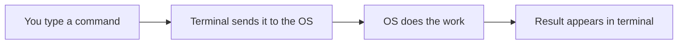
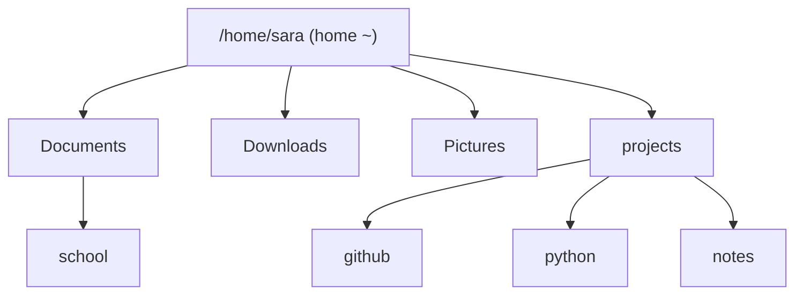

## Day 2 — Terminal Basics: Navigating Files

> **Goal:** Comfortably navigate your computer using only the terminal. No mouse needed.

---

### What is the Terminal?

The terminal is a way to talk to your computer using text instead of clicking. Every developer uses it daily because:

- It's **faster** than clicking through menus
- Many tools (like Git and Python) **only work in the terminal**
- It works the same way on every Linux/Mac computer in the world



Open Terminal now: `Ctrl + Alt + T`

> 📖 **Read more:** [Linux command line for beginners](https://ubuntu.com/tutorials/command-line-for-beginners)

---

### The 6 essential commands

#### `pwd` — where am I?

```bash
pwd
```

**Output:**

```
/home/sara
```

This shows your current location. `/home/sara` is your home folder — it's always where you start.

> Think of it like asking "what room am I in?" of the house that is your computer.

---

#### `ls` — what's in this folder?

```bash
ls
```

**Output:**

```
Desktop  Documents  Downloads  Music  Pictures  Videos
```

These are the folders inside your home folder. Like opening the Files app, but in text.

Try with more detail:

```bash
ls -l
```

This shows file sizes, dates, and permissions. Don't worry about all that yet — just notice it shows more information.

---

#### `cd` — move to a different folder

```bash
cd Documents
```

Now you're inside Documents. Run `pwd` again — you'll see `/home/sara/Documents`.

Go back up one level:

```bash
cd ..
```

`..` always means "go up one folder". Go all the way home:

```bash
cd ~
```

`~` always means your home folder, no matter where you are.



---

#### `mkdir` — create a new folder

```bash
mkdir projects
```

Then check it appeared:

```bash
ls
```

You should see `projects` in the list. Now create folders inside it:

```bash
cd projects
mkdir github
mkdir python
mkdir notes
```

Check:

```bash
ls
```

You should see: `github  notes  python`

---

#### `touch` — create a new empty file

```bash
touch notes/my-first-file.txt
```

This creates an empty file. Verify:

```bash
ls notes/
```

---

#### `cd` shortcut — Tab autocomplete

Start typing a folder name, then press **Tab**:

```bash
cd pro[TAB]
```

Terminal fills in `projects` automatically. This is one of the most useful things in the terminal — **always use Tab**.

---

### Practice exercise

Do all of these in order:

```bash
# Go home
cd ~

# Create the projects structure
mkdir projects
cd projects
mkdir github python notes

# Go back home
cd ~

# Confirm everything is there
ls projects/
```

Expected output of the last command:

```
github  notes  python
```

---

### Open VS Code from the terminal

```bash
cd ~/projects
code .
```

The `.` means "open VS Code in the current folder". VS Code opens and shows your `projects/` folder in the sidebar.

> 📖 **Read more:** [Linux filesystem explained](https://www.linux.com/training-tutorials/linux-filesystem-explained/)

---

### Day 2 tip

> Use `Tab` autocomplete constantly — it saves time and prevents typos. If Tab doesn't complete, it means the folder name doesn't exist yet (check your spelling with `ls`).
