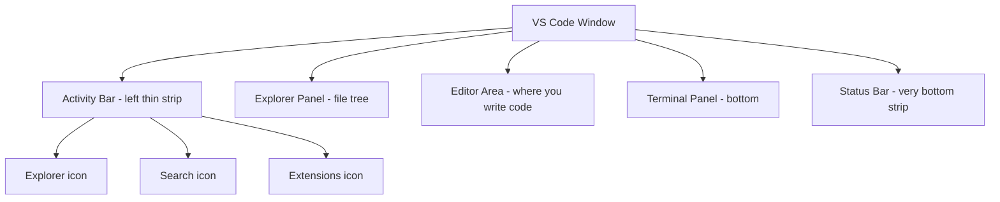

## Day 3 — VS Code Deep Dive

> **Goal:** Know VS Code well enough that it feels like home. You'll use it every single day from now on.

---

### The VS Code interface

When you open VS Code, you see several panels:



| Panel                | Shortcut       | What it does                   |
| -------------------- | -------------- | ------------------------------ |
| Explorer (file tree) | `Ctrl+Shift+E` | See and open your files        |
| Search               | `Ctrl+Shift+F` | Find text across all files     |
| Extensions           | `Ctrl+Shift+X` | Install new features           |
| Terminal             | `` Ctrl+` ``   | Open a terminal inside VS Code |
| Command Palette      | `Ctrl+Shift+P` | Search for any VS Code command |

> **Tip:** The terminal inside VS Code and the Terminal app are the same thing. Using the one inside VS Code means you don't have to switch windows.

---

### Install 3 essential extensions

Click the **Extensions icon** (puzzle piece) on the left sidebar, or press `Ctrl+Shift+X`.

Search for and install each of these:

1. **Markdown Preview Enhanced** — see your Markdown rendered as you type
2. **Python** (by Microsoft) — helps you write Python code
3. **GitLens** — shows Git history inside your files

For each one: search the name → click **Install**.

---

### Create your Linux commands cheat sheet

This is today's main task. You'll build a Markdown file that summarises every command you've learned.

1. Open VS Code terminal: `` Ctrl+` ``
2. Navigate to your notes folder:

```bash
cd ~/projects/notes
```

3. Create the file:

```bash
touch linux-commands.md
```

4. In VS Code Explorer (left sidebar), click `notes/linux-commands.md` to open it

5. Write this — and add your own notes in the "what it does" column:

````markdown
# Linux terminal commands — my cheat sheet

## Navigation

| Command | Example        | What it does                  |
| ------- | -------------- | ----------------------------- |
| `pwd`   | `pwd`          | Shows where I am              |
| `ls`    | `ls`           | Lists files in current folder |
| `ls -l` | `ls -l`        | Lists with details            |
| `cd`    | `cd Documents` | Move into a folder            |
| `cd ..` | `cd ..`        | Go up one level               |
| `cd ~`  | `cd ~`         | Go home                       |

## Files and folders

| Command | Example                | What it does             |
| ------- | ---------------------- | ------------------------ |
| `mkdir` | `mkdir projects`       | Create a new folder      |
| `touch` | `touch file.txt`       | Create an empty file     |
| `cp`    | `cp file.txt copy.txt` | Copy a file              |
| `mv`    | `mv old.txt new.txt`   | Rename or move a file    |
| `rm`    | `rm file.txt`          | Delete a file (careful!) |

## Useful tricks

| Trick            | How           | What it does                  |
| ---------------- | ------------- | ----------------------------- |
| Autocomplete     | Press Tab     | Fills in the rest of the name |
| Previous command | Press ↑ arrow | Recalls last command          |
| Cancel           | Ctrl+C        | Stops whatever is running     |

## Opening VS Code

```bash
code .        # Open current folder in VS Code
code file.md  # Open a specific file
```
````

````

6. Press `Ctrl+Shift+V` to open the **Markdown Preview**

You'll see your cheat sheet rendered with a real table. Two panes — raw text on the left, rendered view on the right.

> 📖 **Read more:** [VS Code tips and tricks](https://code.visualstudio.com/docs/getstarted/tips-and-tricks)

---

### cp, mv, rm — the file management commands

Open terminal in VS Code and practice these:

#### `cp` — copy a file
```bash
cd ~/projects/notes
cp linux-commands.md linux-commands-backup.md
ls
````

You now have two files. The original is untouched.

#### `mv` — move or rename a file

```bash
mv linux-commands-backup.md backup.md
ls
```

The file was renamed. `mv` with a new name in the same folder = rename.

#### `rm` — delete a file

```bash
rm backup.md
ls
```

Gone. **Warning:** There is no Recycle Bin in the terminal. `rm` is permanent.

> ⚠️ **Never run `rm` on a folder unless you know what you're doing.** For now, only use it on files you created yourself during practice.

---

### Save your cheat sheet to GitHub

Go to your GitHub account in Firefox → create a new repo called `learning-notes`. Tick "Add a README".

We'll properly connect VS Code to GitHub using Git tomorrow and in Week 2 — for now, you can manually copy your cheat sheet content into a new file on GitHub's web editor (same way you edited README on Day 1).

---

### Tip and trick for deeper understanding

#### Trick 1: Command Palette is your "universal remote"

If you forget where a feature lives in menus, use `Ctrl+Shift+P` and type what you want:

- `Markdown: Open Preview`
- `Terminal: Create New Terminal`
- `View: Toggle Word Wrap`

This builds tool fluency much faster than memorizing menu locations.

#### Trick 2: Keep one editor, one preview, one terminal

A clean three-pane flow helps focus:

1. Left: Markdown source
2. Right: Preview
3. Bottom: Terminal

This mirrors how developers work on docs, code, and commands at the same time.

#### Quick challenge (10 minutes)

Improve your cheat sheet with one new section:

```markdown
## Safety habits

- Run `ls` before `rm`
- Use clear file names before renaming
- Keep one backup copy before major edits
```

Then preview it and check formatting is correct.

---

### Day 3 tip

> Learn the shortcuts. `Ctrl+` ` ` (backtick) to open the terminal, `Ctrl+Shift+P` to search for any command. After a week these will feel automatic.
