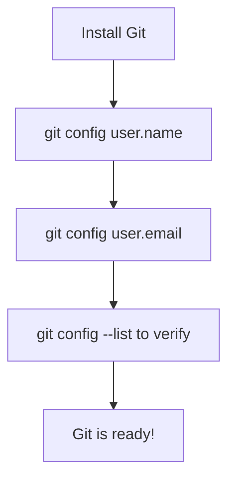

## Day 4 — File Permissions & Installing Tools

> **Goal:** Understand what file permissions mean, install Git, and build on your terminal skills.

---

### What are file permissions?

Every file and folder in Linux has **permissions** — rules about who can do what with it.

Run this in your terminal:

```bash
ls -l ~/projects/
```

You'll see something like:

```
drwxr-xr-x  2 sara sara 4096 May 20 10:00 github
drwxr-xr-x  2 sara sara 4096 May 20 10:00 notes
drwxr-xr-x  2 sara sara 4096 May 20 10:00 python
```

That `drwxr-xr-x` is a permission string. Here's how to read it:


| Letter | Meaning                                                           |
| ------ | ----------------------------------------------------------------- |
| `r`    | **read** — can see the contents                                   |
| `w`    | **write** — can change or delete                                  |
| `x`    | **execute** — can run it (for programs) or enter it (for folders) |
| `-`    | permission is NOT granted                                         |

> **Analogy:** Think of a shared notebook. `r` = allowed to read it. `w` = allowed to write in it. `x` = allowed to use it as a manual (for programs).

> 📖 **Read more:** [Linux file permissions explained](https://www.guru99.com/file-permissions.html)

---

### Install `tree` — visualise your folders

```bash
sudo apt install tree
```

Type your password when asked. Then run:

```bash
tree ~/projects/
```

Output:

```
/home/sara/projects/
├── github
├── notes
│   └── linux-commands.md
└── python
```

This shows your entire folder structure as a tree. Useful for seeing where everything lives.

---

### Install Git

Git is the tool that tracks changes to your files. We'll use it properly in Week 2 — today we just install it and configure it.

```bash
sudo apt install git
```

Verify it installed:

```bash
git --version
```

You should see something like: `git version 2.43.0`

Now tell Git who you are (use the same email as your GitHub account):

```bash
git config --global user.name "Your Name"
git config --global user.email "your@email.com"
```

Check it saved:

```bash
git config --list
```



> 📖 **Read more:** [Git official documentation](https://git-scm.com/doc)

---

### Update your cheat sheet

Open `linux-commands.md` in VS Code and add a new section:

```markdown
## Installing software

| Command            | Example                | What it does                       |
| ------------------ | ---------------------- | ---------------------------------- |
| `sudo apt install` | `sudo apt install git` | Install a program                  |
| `sudo apt update`  | `sudo apt update`      | Refresh list of available software |

## Tools installed today

- `tree` — visualise folder structure with `tree foldername/`
- `git` — version control, configured with name and email
```

Save it. Preview with `Ctrl+Shift+V`.

---

### Day 4 tip

> `sudo` means "do this as the administrator". You need it for installing software. You'll always be asked for your password. This is Ubuntu protecting itself from accidental changes.
