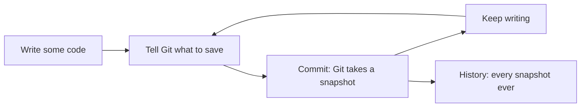
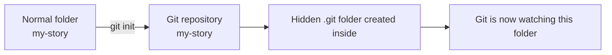
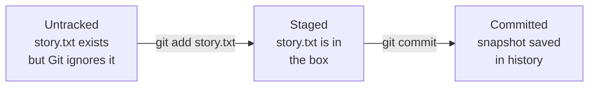

## Day 1 — What is Git? git init, git status, git add

> **Goal:** Turn a normal folder into a Git project, create your first file, and stage it — ready to be saved.

---

### What is Git?

Imagine you are writing a long story. You work on it every day. One day you accidentally delete three pages of great writing and hit save. There is no undo button. They are gone forever.

**Git solves that problem.**

Git is a tool that tracks every change you make to files in a folder. It keeps a full history. You can always go back. Think of it like the save-game feature in a video game:

- **Save whenever you want** — as often as you like
- **Go back to any save** — if something breaks or you change your mind
- **See exactly what changed** — between any two saves

Every professional developer uses Git every single day. You are about to learn the same tool they use.



> **Git vs GitHub:** Git is the tool on your computer. GitHub is a website that stores your Git projects online. This week we use Git entirely on your own machine. Next week we connect to GitHub.

> 📖 **Read more:** [Git handbook by GitHub](https://guides.github.com/introduction/git-handbook/)

---

### One-time setup

Before you use Git for the first time, tell it your name and email. Git stamps every save with this information so your history always shows who made each change.

Open Terminal (`Ctrl+Alt+T`) and run these commands. Replace the example with your real details:

```bash
git config --global user.name "Your Name"
git config --global user.email "you@example.com"
```

Also tell Git to name new projects `main` (some older versions default to a different name):

```bash
git config --global init.defaultBranch main
```

Check it worked:

```bash
git config --list
```

You should see your name and email in the output. You only ever need to do this once — Git remembers it forever across all your projects.

---

### `git init` — start tracking a folder

`git init` turns a normal folder into a **Git repository**. A repository (or "repo") is just a folder that Git is watching.

```bash
mkdir ~/my-story
cd ~/my-story
git init
```

Output:

```
Initialized empty Git repository in /home/sara/my-story/.git/
```

Git created a hidden folder called `.git` inside `my-story`. That is where Git stores its entire history. You never need to open it — just know it is there.

Check it exists:

```bash
ls -a
```

Output:

```
.  ..  .git
```

The `.` and `..` are always present. The `.git` folder is what makes this a Git repository.

> **Before `git init`:** your folder is just a folder.
> **After `git init`:** it is a Git repository — every change from now on is trackable.



---

### `git status` — what is going on?

`git status` is the most-used Git command. Run it any time to see what has changed. Think of it as asking Git: "What do you know right now?"

```bash
git status
```

Output in a brand-new, empty repo:

```
On branch main

No commits yet

nothing to commit (create/copy files and work, then use "git add")
```

This tells you:
- You are on the `main` branch (we will learn about branches on Day 4)
- There are no commits yet — no saves have been made
- Nothing is waiting to be saved

Now create a file and run it again:

```bash
touch story.txt
git status
```

New output:

```
On branch main

No commits yet

Untracked files:
  (use "git add <file>..." to include in what will be committed)
        story.txt

nothing added to commit but untracked files present
```

Git spotted `story.txt`. It says it is **untracked** — Git can see the file exists, but it is not watching it yet.

---

### `git add` — stage your changes

Before Git will save a file, you have to **stage** it. Staging means: "I want to include this file in my next save."

**Analogy:** Imagine you are sending a package to a friend. First you walk around the house gathering things to send — a book, a toy, a letter. You put them in a box. Putting things in the box is **staging**. Sealing the box and handing it to the courier is **committing** (that comes tomorrow).

```bash
git add story.txt
```

No output — that is normal. Now check the status:

```bash
git status
```

Output:

```
On branch main

No commits yet

Changes to be committed:
  (use "git rm --cached <file>..." to unstage)
        new file:   story.txt
```

`story.txt` moved from "Untracked" to "Changes to be committed". It is now staged — sitting in the box, ready to be saved.



> **Tip:** You can stage every changed file at once with `git add .` — the dot means "everything in this folder". Use it when you want to stage all your changes together.

---

### Hands-on exercise

**Time:** 30–40 min

You will set up the `my-story/` project that you will keep using all week. By the end of today, your first file will be staged and ready to commit tomorrow.

**Step 1 — One-time Git setup** (skip if you already did this in Week 1)

```bash
git config --global user.name "Your Name"
git config --global user.email "you@example.com"
git config --global init.defaultBranch main
```

**Step 2 — Create the project folder and init Git**

```bash
mkdir ~/my-story
cd ~/my-story
git init
```

Confirm Git is active:

```bash
git status
```

Expected: `On branch main — No commits yet`

**Step 3 — Create your story file**

Open VS Code in this folder:

```bash
code .
```

In VS Code, create a new file: click **New File** in the Explorer panel on the left, type `story.txt`, and press Enter.

Write these opening lines (or make up your own story — just keep the same structure):

```
The Lost Robot

Zara found a tiny robot on her doorstep one morning.
It had blinking blue eyes and a cracked screen on its chest.
She named it Pixel.
She found a note tucked under it that said: "Handle with care."
```

Save the file: `Ctrl+S`

**Step 4 — Check Git noticed**

In the VS Code terminal (press `` Ctrl+` `` to open it):

```bash
git status
```

You should see `story.txt` listed as **untracked**. Git can see it, but it is not watching it yet.

**Step 5 — Stage the file**

```bash
git add story.txt
```

Check again:

```bash
git status
```

You should see `story.txt` listed under **Changes to be committed**. It is staged!

**Step 6 — Explore what staging really means**

Go back to VS Code and add one more sentence to the very end of `story.txt`:

```
Its little wheels left muddy tracks across the porch.
```

Save the file with `Ctrl+S`. Now run:

```bash
git status
```

Something interesting happens — `story.txt` appears **twice**:

- Under "Changes to be committed" — the version you staged in Step 5
- Under "Changes not staged for commit" — the new sentence you just added

This shows that staging captures the file at a **specific moment**. Your new edit has not been staged yet.

Stage the latest version to include that new sentence:

```bash
git add story.txt
git status
```

Now there is only one entry: the fully updated file is staged and ready to commit tomorrow.

Well done — you just set up your first Git repository and learned the first half of the Git workflow!

---

### What you learned today

- Git is a save-game system that tracks every change to your files
- `git init` turns any folder into a Git repository
- Git creates a hidden `.git` folder to store its entire history
- `git status` shows what Git currently knows — run it constantly
- A file can be in one of three states: untracked, staged, or committed
- `git add filename` stages a file — puts it in the box ready to be saved
- Staging captures the file at the exact moment you stage it — later edits need to be staged again

---

### Tip and trick for deeper understanding

#### Trick 1: Staging lets you pick exactly what to save
When you run `git add story.txt`, Git only stages that one file — even if you changed ten other files in the same folder. This means you can make a bunch of changes, then choose which ones belong together in the same commit. Run `git status` after staging just one file and you will see some files listed under "Changes to be committed" and others still listed as "Untracked" — they are all waiting, but only the staged ones will be saved in the next commit.

#### Trick 2: `git status` always gives you the next command
Every section of `git status` output includes a hint in brackets. The line `(use "git add <file>..." to include in what will be committed)` is Git literally telling you what to type next. Most beginners skim past these hints because they are tucked inside brackets — but they are the most useful part of the output. Read the whole `git status` message every time, not just the first line.

#### Quick challenge (10 minutes)
Create two files in your `my-story/` folder, but stage only one of them:

```bash
cd ~/my-story
touch character-notes.txt
touch plot-ideas.txt
git status
git add character-notes.txt
git status
```

Look carefully at the two sections in the second `git status` output. Can you spot which file is staged and which is still untracked? Notice how Git puts them in separate groups. Now stage the second file and run `git status` one more time to confirm both files are under "Changes to be committed".

---

### Day 1 tip

> Run `git status` constantly — before every step and after every step. It costs nothing and always tells you exactly where you stand. Professional developers run it dozens of times a day. If you are ever unsure what to do next, `git status` usually gives you a hint right there in its output.
