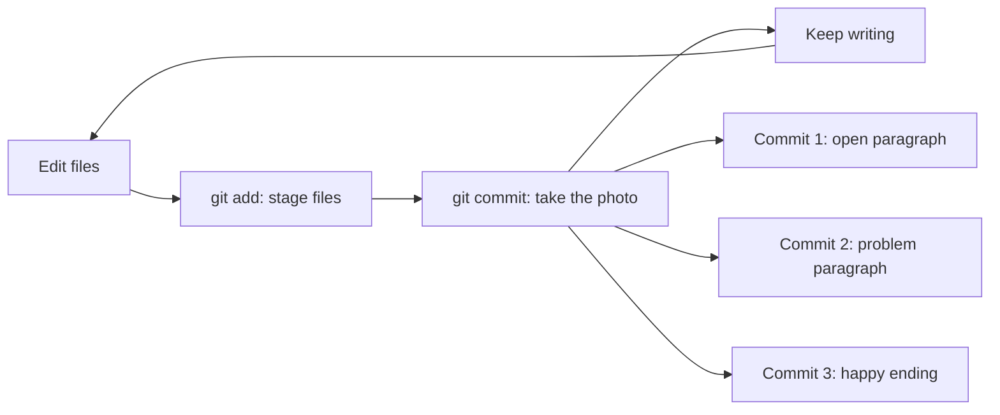
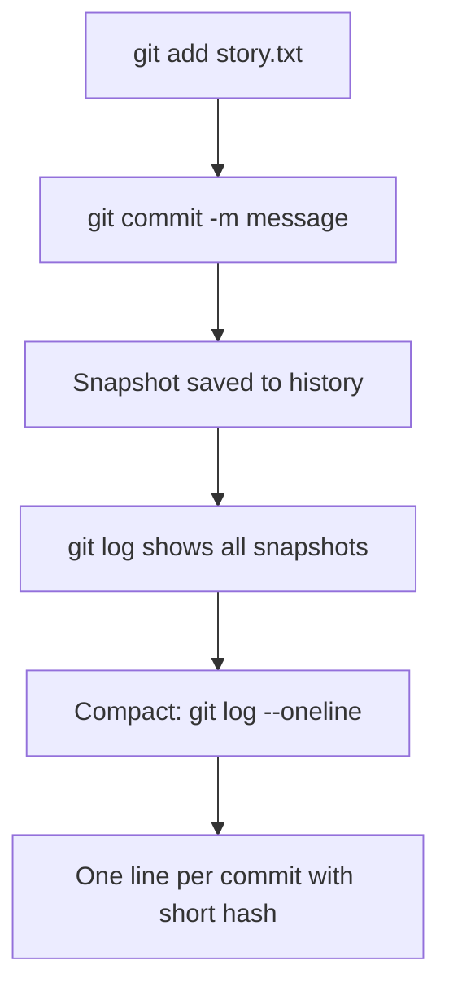

## Day 2 — git commit: Saving a Snapshot

> **Goal:** Make your first commits and build a history you can scroll through with git log.

---

### What is a commit?

A **commit** is a saved snapshot of your project at a specific moment in time.

Think of it like taking a photograph. The photo captures exactly what everything looked like right then. Your project can have hundreds of photos — one for every time you made an important change. Even if you change or delete something later, the old photos are still there forever.

Each commit has three things:

1. **A snapshot** — the exact state of every tracked file
2. **A message** — a short description you write explaining what changed and why
3. **A timestamp and author** — when it was saved and who saved it



> **Commit = photograph of your code at that exact moment.** Each one is permanent. Even if you delete a file later, the old commit still has the old version — you can always get it back.

---

### `git commit -m "message"` — take the snapshot

The `-m` flag lets you write your commit message right on the same command line:

```bash
git commit -m "Add opening paragraph introducing Zara and Pixel"
```

Output:

```
[main (root-commit) a1b2c3d] Add opening paragraph introducing Zara and Pixel
 1 file changed, 6 insertions(+)
 create mode 100644 story.txt
```

This tells you:
- `main` — which branch you committed to (Day 4 covers branches)
- `a1b2c3d` — a short unique ID for this commit (yours will be different)
- The commit message you wrote
- How many files changed and how many lines were added

---

### Writing good commit messages

The message is for you — and for anyone who reads your history later. That includes future-you, six months from now, wondering "what did I do here?"

**A good commit message explains *why*, not just *what*.**

| Bad message            | Good message                                       |
| ---------------------- | -------------------------------------------------- |
| `changed file`         | `Fix typo in opening paragraph`                    |
| `update`               | `Add second paragraph: Pixel can't remember home`  |
| `stuff`                | `Add happy ending where Pixel stays with Zara`     |
| `asdfgh`               | (never do this — your future self will be sad)     |

**Rules for good messages:**
- Start with a capital letter
- Use the present tense: "Add..." not "Added..."
- Be specific enough that you know what you did six months later
- Keep it under 72 characters

---

### `git log` — read your commit history

After making commits, use `git log` to see the full history. The most recent commit appears at the top.

```bash
git log
```

Example output:

```
commit c3d4e5f6a1b2c3d4e5f6a1b2c3d4e5f6a1b2c3d4
Author: Sara Learner <sara@example.com>
Date:   Mon Jun 9 10:35:00 2025 +0000

    Add ending: Pixel finds a home with Zara

commit b2c3d4e5f6a1b2c3d4e5f6a1b2c3d4e5f6a1b2c3
Author: Sara Learner <sara@example.com>
Date:   Mon Jun 9 10:32:00 2025 +0000

    Add second paragraph: Pixel lost and Zara decides to help

commit a1b2c3d4e5f6a1b2c3d4e5f6a1b2c3d4e5f6a1b2
Author: Sara Learner <sara@example.com>
Date:   Mon Jun 9 10:30:00 2025 +0000

    Add opening paragraph: Zara finds a robot named Pixel
```

Press `q` to quit the log view and return to the terminal.

> **That long string of letters and numbers is called a commit hash.** It is a unique ID for that exact commit — no two commits in the world share the same hash. You will use the short version (first 7 characters like `a1b2c3d`) in tomorrow's lesson.

---

### `git log --oneline` — the compact view

The full log can be a lot to read. The `--oneline` flag shows just one line per commit:

```bash
git log --oneline
```

Output:

```
c3d4e5f Add ending: Pixel finds a home with Zara
b2c3d4e Add second paragraph: Pixel lost and Zara decides to help
a1b2c3d Add opening paragraph: Zara finds a robot named Pixel
```

Short hash on the left, message on the right. Clean and easy to scan at a glance.



---

### Hands-on exercise

**Time:** 40–50 min

Continue from yesterday's `my-story/` project. You will add three paragraphs to your story — one at a time — making a commit after each one.

**Step 1 — Check where you left off**

```bash
cd ~/my-story
git status
git log --oneline
```

If `git log` shows "fatal: your current branch 'main' does not have any commits yet" then nothing was committed from yesterday. That is fine — your file should be staged. Check with `git status`.

If the file is staged, go straight to the first commit in Step 2. If it is not staged, open VS Code, write the opening paragraph from Day 1, save, then run `git add story.txt`.

**Step 2 — Commit the first paragraph**

Make sure `story.txt` contains only the opening paragraph (and nothing else staged):

```
The Lost Robot

Zara found a tiny robot on her doorstep one morning.
It had blinking blue eyes and a cracked screen on its chest.
She named it Pixel.
She found a note tucked under it that said: "Handle with care."
Its little wheels left muddy tracks across the porch.
```

Stage and commit:

```bash
git add story.txt
git commit -m "Add opening paragraph: Zara finds a robot named Pixel"
```

Check the log:

```bash
git log --oneline
```

Expected: one commit with your message.

**Step 3 — Write and commit the second paragraph**

Open `story.txt` in VS Code:

```bash
code story.txt
```

Add a blank line, then this second paragraph at the bottom:

```
Pixel could not remember where it came from.
Every time Zara asked, it just beeped sadly.
Together, they decided to search the whole neighbourhood.
```

Save with `Ctrl+S`. Stage and commit:

```bash
git add story.txt
git commit -m "Add second paragraph: Pixel lost and Zara decides to help"
```

Check the log again:

```bash
git log --oneline
```

Expected: two commits.

**Step 4 — Write and commit the third paragraph**

Back in VS Code, add another blank line and then the ending at the bottom:

```
After three days of searching, they found a note in the park.
It said: "Pixel belongs to whoever gives it a home."
Zara smiled and said, "Then Pixel belongs with me."
```

Save. Stage. Commit:

```bash
git add story.txt
git commit -m "Add ending: Pixel finds a home with Zara"
```

**Step 5 — View the full history**

```bash
git log
```

Three commits — most recent at top. Press `q` to exit.

Now the compact view:

```bash
git log --oneline
```

Three saves. Three moments in time. Each one permanent.

**Step 6 — Confirm everything is clean**

```bash
git status
```

Expected:

```
On branch main
nothing to commit, working tree clean
```

"Working tree clean" means every change is safely committed. This is the happy state — celebrate it every time you see it!

---

### What you learned today

- A commit is a permanent snapshot of your project with a message and timestamp
- `git commit -m "message"` saves a staged snapshot to the history
- Good commit messages explain *why* a change was made, not just what changed
- Use the present tense in commit messages: "Add..." not "Added..."
- `git log` shows the full history — most recent commit at the top, press `q` to exit
- `git log --oneline` shows a compact one-line-per-commit view
- Each commit has a unique hash — a long string of letters and numbers
- "Nothing to commit, working tree clean" means all your work is safely saved

---

### Tip and trick for deeper understanding

#### Trick 1: The short hash is all you ever need
The full commit hash in `git log` is 40 characters long — but you never have to type the whole thing. Git only needs the first 4 to 7 characters to identify a commit uniquely. The short version shown in `git log --oneline` (7 characters) always works. Try running `git show` with just your 7-character hash — Git finds the commit instantly without you typing all 40 letters.

#### Trick 2: You can search your commit history by message
Run `git log --oneline --grep="keyword"` to find every commit whose message contains that word. This is one of the biggest payoffs of writing clear commit messages: they become searchable notes about your project's history. If you wrote `"Add opening paragraph: Zara finds a robot named Pixel"`, you can find that commit months later just by searching `--grep="Zara"` or `--grep="opening"`.

#### Quick challenge (10 minutes)
After your three commits on `story.txt`, try these search commands:

```bash
git log --oneline --grep="paragraph"
git log --oneline --grep="Zara"
git log --oneline --grep="ending"
```

Which commits matched each search? Now imagine what would happen if all three messages just said `"update"` — would any of those searches return results? This shows exactly why specific commit messages matter.

---

### Day 2 tip

> Commit **often**. Every time you finish something small — a paragraph, a function, a bug fix — commit it. Small commits are easy to understand and easy to undo. Big commits are confusing. If your commit message needs the word "and" — like "Fix typo and add new section and update title" — it should probably be three separate commits.
