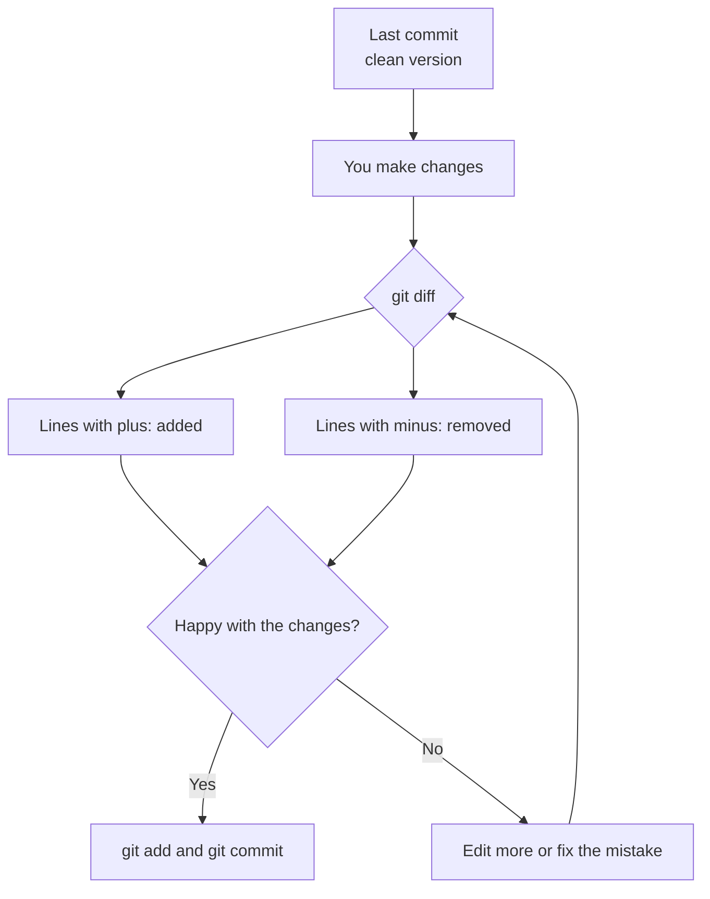
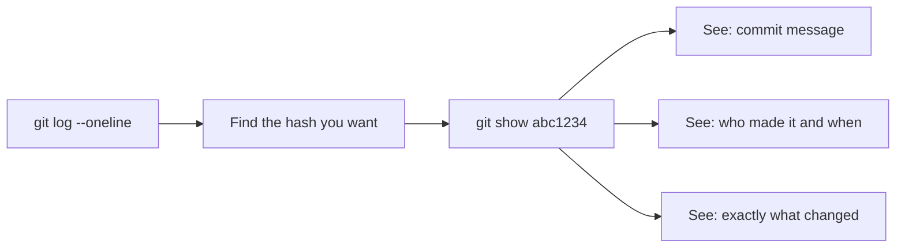

## Day 3 — git diff: Seeing What Changed

> **Goal:** Inspect exactly what changed in your files before committing, and navigate your project's history with confidence.

---

### Why look at diffs?

Before you commit, it is smart to check: "What exactly am I about to save?"

`git diff` answers that question. It shows you a **line-by-line comparison** between your current file and the last committed version — what was removed and what was added.

This is especially useful when:
- You made several edits and want to review them before saving
- You come back to a file after a break and forgot what you changed
- Something broke and you want to see exactly what you last touched



---

### `git diff` — compare to the last commit

Let's make a change to see how diff works. Open `story.txt` in VS Code and find this line in the first paragraph:

```
She named it Pixel.
```

Change it to:

```
She named it Pixel, after the tiny lights on its screen.
```

Save the file with `Ctrl+S`. Now run:

```bash
git diff
```

Output:

```diff
diff --git a/story.txt b/story.txt
index 1a2b3c4..5d6e7f8 100644
--- a/story.txt
+++ b/story.txt
@@ -3,7 +3,7 @@
 Zara found a tiny robot on her doorstep one morning.
 It had blinking blue eyes and a cracked screen on its chest.
-She named it Pixel.
+She named it Pixel, after the tiny lights on its screen.
 She found a note tucked under it that said: "Handle with care."
```

Reading the diff:

| Symbol           | Meaning                                              |
| ---------------- | ---------------------------------------------------- |
| `---`            | This is the old version of the file                  |
| `+++`            | This is the new version of the file                  |
| `-` at line start| This line was **removed** (shown in red in terminal) |
| `+` at line start| This line was **added** (shown in green in terminal) |
| No symbol        | This line is unchanged — shown for context only      |

> **Tip:** If your terminal does not show colours, remember: minus = removed, plus = added.

---

### `git diff --staged` — diff of what you have staged

Once you run `git add`, the changes move into the staging area. Running plain `git diff` no longer shows them — they are staged now, not "unstaged". To see what is staged and ready to commit, use the `--staged` flag:

```bash
git add story.txt
git diff            # Shows nothing — change is now staged
git diff --staged   # Shows your staged change
```

Remember this rule:

| Command              | Shows                                     |
| -------------------- | ----------------------------------------- |
| `git diff`           | Changes made but **not yet staged**       |
| `git diff --staged`  | Changes that **are staged** and ready     |

This matters in practice. If you stage a file then keep editing it, `git diff` shows the new edits and `git diff --staged` shows what will actually be saved when you commit.

---

### `git log --oneline` — find commits quickly

You used this yesterday. Today we use it as a lookup tool — to find the hash of a specific commit so we can inspect it.

```bash
git log --oneline
```

Example output:

```
c3d4e5f Add ending: Pixel finds a home with Zara
b2c3d4e Add second paragraph: Pixel lost and Zara decides to help
a1b2c3d Add opening paragraph: Zara finds a robot named Pixel
```

You can limit the output. To see only the last 2 commits:

```bash
git log --oneline -2
```

---

### `git show` — look inside a specific commit

`git show` lets you peek inside any commit and see exactly what changed — like replaying a specific photograph.

To see the most recent commit:

```bash
git show
```

To see a specific commit by its short hash:

```bash
git show a1b2c3d
```

The output looks like a diff: the commit message at the top, then red lines for removed, green lines for added.



> **Try it:** Run `git log --oneline`, copy one of the short hashes (the 7-character code on the left), then run `git show` with that hash. You will see the full change that commit made.

---

### Hands-on exercise

**Time:** 40–50 min

Continue from the `my-story/` project. You will make several edits, inspect them with diff before committing, and explore the history with `git show`.

**Step 1 — Check your starting state**

```bash
cd ~/my-story
git status
git log --oneline
```

You should be on `main` with 3 commits and a clean working tree. If there is a staged change from yesterday's diff step, commit it first:

```bash
git commit -m "Improve Pixel's name description"
```

**Step 2 — Make two edits**

Open `story.txt` in VS Code:

```bash
code story.txt
```

Make these two changes:

1. In the first paragraph, add a physical detail to Pixel:
   - Find: `It had blinking blue eyes and a cracked screen on its chest.`
   - Change to: `It had blinking blue eyes, a cracked screen on its chest, and one wobbly antenna.`

2. In the second paragraph, make the beeping more expressive:
   - Find: `Every time Zara asked, it just beeped sadly.`
   - Change to: `Every time Zara asked, it played a quiet little tune that sounded like crying.`

Save with `Ctrl+S`.

**Step 3 — Inspect the changes before staging**

```bash
git diff
```

Read the output carefully:
- Lines with `-` show what was there before
- Lines with `+` show what is there now
- Lines with no symbol are unchanged context

Can you spot both changes you made?

**Step 4 — Stage and compare diff commands**

Stage the file:

```bash
git add story.txt
```

Now run both commands and observe what each shows:

```bash
git diff            # What output do you see?
git diff --staged   # What output do you see?
```

`git diff` should show nothing (the changes are staged). `git diff --staged` should show both edits.

**Step 5 — Commit the changes**

```bash
git commit -m "Improve descriptions of Pixel in paragraphs 1 and 2"
```

**Step 6 — Explore the history**

Check the log:

```bash
git log --oneline
```

You should now have 4 commits. Pick the very first commit (at the bottom of the list) and inspect it:

```bash
git show a1b2c3d   # Use your actual hash from the log
```

What do you see? The commit message, and the lines that were added in that first commit.

Now look at the most recent commit with no hash:

```bash
git show
```

This shows your latest change — the improved descriptions.

**Step 7 — One more change, one more commit**

Edit `story.txt` in VS Code — change something small in the ending paragraph (fix a word, add a detail). Run `git diff` to inspect it. Then commit:

```bash
git add story.txt
git commit -m "Polish the ending paragraph"
git log --oneline
```

You should now have 5 commits. Each one is a permanent saved moment in your story.

---

### What you learned today

- `git diff` shows line-by-line changes between your current files and the last commit
- Lines starting with `-` were removed; lines starting with `+` were added
- `git diff` only shows **unstaged** changes
- `git diff --staged` shows changes that **are staged** and ready to commit
- Always run `git diff` (or `git diff --staged`) before committing — it is a healthy habit
- `git log --oneline` shows a compact, scannable history
- `git log --oneline -2` limits the output to the last 2 commits
- `git show` shows what the latest commit changed
- `git show abc1234` shows what any specific commit changed

---

### Tip and trick for deeper understanding

#### Trick 1: Compare any two commits directly with `git diff`
You already know `git diff` shows what changed since the last commit. But you can also compare any two commits by passing two hashes: `git diff HASH1 HASH2`. Grab two hashes from `git log --oneline` and run this — you will see every change that happened between those two snapshots, across all files at once. This is extremely useful for answering "what exactly did I do between Monday and Friday?"

#### Trick 2: The `@@` line tells you exactly where the change is
Every chunk of diff output starts with a line like `@@ -3,7 +3,7 @@`. The numbers tell you the location: `-3,7` means the old file starts showing at line 3 for 7 lines, and `+3,7` means the new file does the same. When a file is hundreds of lines long, this helps you jump straight to the right spot instead of scrolling through the entire diff looking for the red and green lines.

#### Quick challenge (10 minutes)
Find your first and most recent commits and compare them:

```bash
git log --oneline
```

Copy the hash of the very first commit (at the bottom of the list) and the hash of the most recent commit (at the top). Then run:

```bash
git diff FIRST_HASH LATEST_HASH
```

Replace `FIRST_HASH` and `LATEST_HASH` with your real 7-character hashes. The output shows every change you have ever made to `story.txt` in one go. Then use `git show` on your first commit alone to see how the story originally started:

```bash
git show FIRST_HASH
```

---

### Day 3 tip

> Before every commit, make it a habit: run `git diff --staged` to review exactly what you are about to save. Even experienced developers catch mistakes this way — a stray debug line, an accidental deletion, a file they did not mean to include. Two seconds of checking saves minutes of fixing later.
