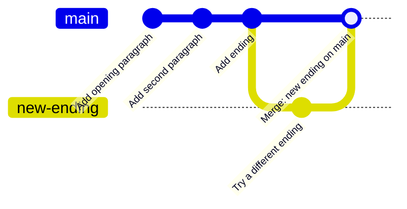
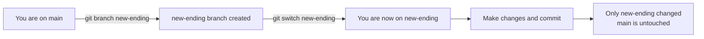
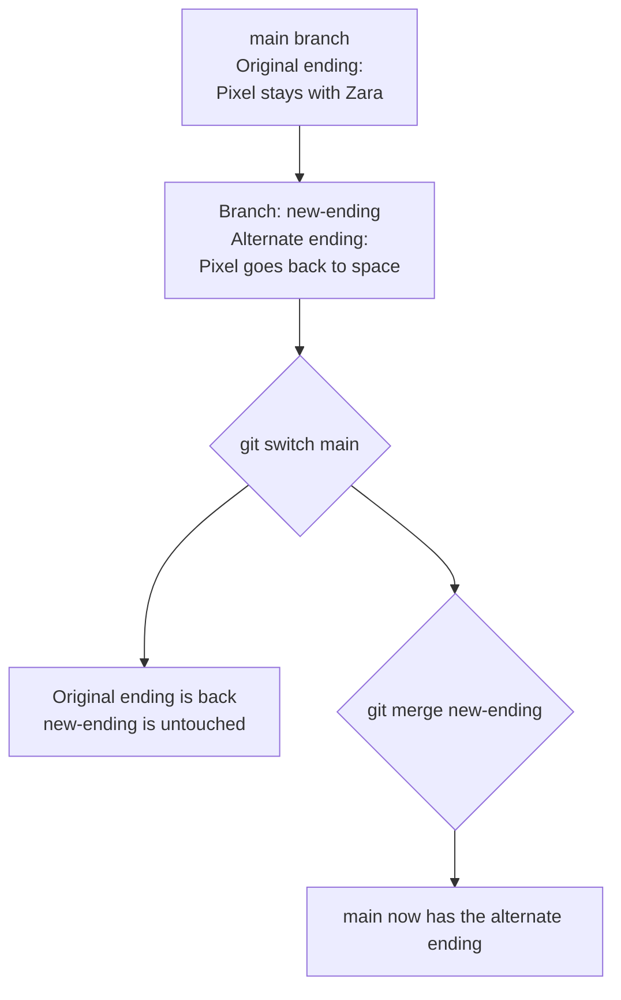

## Day 4 — Branches: Working in Parallel

> **Goal:** Create a branch to try a new idea, then merge it back into main when you are happy — without ever touching the original.

---

### What is a branch?

Imagine your story is almost finished. You have been working on it for days. Now you want to try a completely different ending — but you definitely do not want to lose the current one.

In the real world, you might make a copy of the file: `story-v2.txt`. But then you have two files to manage. Which one is the "real" one? What if you want to combine ideas from both?

**Git has a better solution: branches.**

A branch is like a parallel timeline for your project. You start from the same point and make changes that only exist on that branch. The original is completely untouched. When you are happy with the experiment, you can **merge** it back in.



> **Every Git project starts with at least one branch.** It is called `main`. All your commits this week have been on `main`. Branches let you step sideways into a safe space to experiment.

---

### `git branch` — list your branches

```bash
git branch
```

Output:

```
* main
```

The `*` shows which branch you are currently on. Right now, only `main` exists.

---

### `git branch name` — create a new branch

Creating a branch is instant and free. It does not copy files or change anything — it just marks a new starting point for a separate line of history.

```bash
git branch new-ending
```

Check:

```bash
git branch
```

Output:

```
* main
  new-ending
```

Two branches exist now. But you are still on `main` (the `*` is still there).

---

### `git switch name` — move to a branch

Creating a branch does not move you to it. You have to switch explicitly:

```bash
git switch new-ending
```

Output:

```
Switched to branch 'new-ending'
```

Check again:

```bash
git branch
```

Output:

```
  main
* new-ending
```

The `*` moved. You are now on `new-ending`. Any changes you make from here will be saved on this branch. `main` is completely untouched.

> **Older style:** You may see `git checkout new-ending` in older tutorials or Stack Overflow answers. It does the same thing. `git switch` is the modern command — clearer and easier to remember.



---

### Making commits on a branch

Once you are on the new branch, `git add` and `git commit` work exactly the same way. The only difference is *where* the commits go — they go on `new-ending`, not `main`.

Open `story.txt` in VS Code and find the ending paragraph:

```
After three days of searching, they found a note in the park.
It said: "Pixel belongs to whoever gives it a home."
Zara smiled and said, "Then Pixel belongs with me."
```

Replace it with a completely different ending (delete those lines and write new ones):

```
On the last street, they spotted a flashing light in the sky.
A small spaceship landed and a robot voice called out, "Pixel! We found you!"
Zara waved goodbye as Pixel rolled up the ramp, heading home.
```

Save with `Ctrl+S`. Stage and commit on this branch:

```bash
git add story.txt
git commit -m "Add alternate ending: Pixel reunited with its crew"
```

Check the log:

```bash
git log --oneline
```

You will see your new commit at the top, plus all the old commits from `main`. Branches inherit the full history from the point they branched off.

---

### Switching back — see the original is safe

Switch back to `main`:

```bash
git switch main
```

Now open `story.txt` again:

```bash
code story.txt
```

Look at the ending paragraph. **The original ending is back!** The alternate ending only exists on the `new-ending` branch. This is the magic — each branch has its own version of the files.



---

### `git merge` — combine branches back into main

When you are happy with the work on a branch and want to bring it back:

1. Switch to the branch you want to merge *into* (usually `main`)
2. Run `git merge branchname`

```bash
git switch main
git merge new-ending
```

Output:

```
Updating c3d4e5f..d4e5f6a
Fast-forward
 story.txt | 6 +++---
 1 file changed, 3 insertions(+), 3 deletions(-)
```

Open `story.txt` — the alternate ending is now on `main` too. The merge brought the branch's commits over.

Check the log:

```bash
git log --oneline
```

All commits, including the one from `new-ending`, are now on `main`.

> **What does "Fast-forward" mean?** It means `main` had no new commits while you were working on the branch — so Git simply moved `main` forward to include the branch's commits. Clean and simple. (When both branches have new commits, Git does a more complex merge — you will see that in Week 3.)

---

### Hands-on exercise

**Time:** 45–55 min

You will create a `new-ending` branch, write a different story ending, merge it back into `main`, and explore the result.

**Step 1 — Check your starting state**

```bash
cd ~/my-story
git status
git log --oneline
git branch
```

Expected: on `main`, clean working tree, several commits visible, only `main` branch.

**Step 2 — Create and switch to the new branch**

```bash
git branch new-ending
git switch new-ending
```

Confirm:

```bash
git branch
```

The `*` should be next to `new-ending`.

**Step 3 — Write the alternate ending**

Open `story.txt` in VS Code:

```bash
code story.txt
```

Find the ending paragraph (starting with "After three days of searching..."). Delete those three lines and write your own alternate ending. Use this one or invent something completely different:

```
On the last street, they spotted a flashing light in the sky.
A small spaceship landed and a robot voice called out, "Pixel! We found you!"
Zara waved goodbye as Pixel rolled up the ramp, heading home at last.
```

Save with `Ctrl+S`.

**Step 4 — Stage and commit on the branch**

```bash
git add story.txt
git commit -m "Add alternate ending: Pixel reunited with its crew"
```

Check the log:

```bash
git log --oneline
```

Your new commit is at the top, above all the `main` commits.

**Step 5 — Switch to main and check the ending**

```bash
git switch main
code story.txt
```

Is the original ending back? It should be. This confirms that `main` was never touched.

Check the log on `main`:

```bash
git log --oneline
```

The "alternate ending" commit is not here yet — it is still only on `new-ending`.

**Step 6 — Merge the branch into main**

```bash
git merge new-ending
```

Open `story.txt` again:

```bash
code story.txt
```

The alternate ending is now on `main`. The merge brought it across.

Check the final log:

```bash
git log --oneline
```

All commits including the branch commit are now visible on `main`.

**Step 7 — Bonus: list the branches**

```bash
git branch
```

Both `main` and `new-ending` are still listed — merging does not delete a branch. In real projects you can delete merged branches to keep things tidy. We will cover that in Week 3.

Congratulations — you just completed a full branch, experiment, and merge cycle. This is exactly how professional developers work every day.

---

### What you learned today

- A branch is a parallel timeline — changes on it do not affect any other branch
- Every project starts with a `main` branch
- `git branch name` creates a new branch without switching to it
- `git switch name` switches to a branch — the `*` in `git branch` shows where you are
- Commits on a branch stay on that branch until you merge
- `git merge name` brings a branch's commits onto the current branch
- Merging does not delete the branch — it just copies the commits across
- "Fast-forward" means main moved straight forward with no conflicts

---

### Tip and trick for deeper understanding

#### Trick 1: Create and switch to a branch in one step
Instead of typing two commands — `git branch new-ending` and then `git switch new-ending` — you can do both at once with the `-c` flag: `git switch -c new-ending`. The `-c` stands for "create." Professional developers almost always use this one-liner. Once you know it, typing two separate commands feels unnecessarily slow.

#### Trick 2: Always check which branch you are on before committing
The `git branch` command shows a `*` next to your current branch, and `git status` says `On branch main` (or whatever branch you are on) right at the top. Committing to the wrong branch is one of the most common beginner mistakes — it is easy to do and surprisingly annoying to fix. Build the habit: glance at `git status` before `git add`, and you will never accidentally put work in the wrong place.

#### Quick challenge (10 minutes)
Practice the one-step branch shortcut and then observe how the log differs between branches:

```bash
cd ~/my-story
git switch -c practice-branch
git branch
```

Confirm the `*` moved to `practice-branch`. Make a tiny change to `story.txt` (add one word anywhere), save it, then commit it. Now compare the logs on each branch:

```bash
git switch main
git log --oneline           # your new commit is NOT here
git switch practice-branch
git log --oneline           # your new commit IS here
git switch main             # go back to main when done
```

---

### Day 4 tip

> Branches are **free** — creating one costs nothing and takes less than a second. Use them generously. Every time you want to try something risky or experimental, make a branch first. If the experiment works, merge it. If it does not, just switch back to `main` and ignore the branch. Nothing on `main` was ever at risk. This is how professional teams ship code safely every day.
