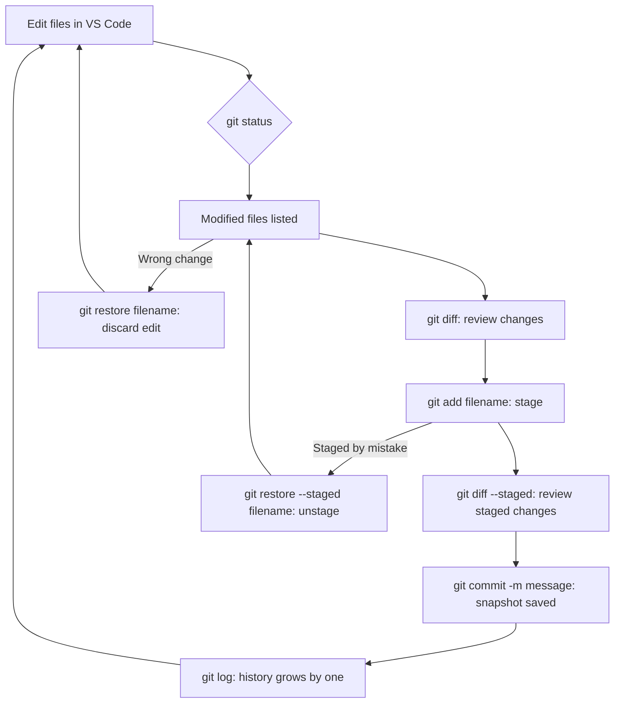

## Day 5 — Week 2 Review + git restore (Undo)

> **Goal:** Learn to undo mistakes safely, prove you know the whole Git workflow from memory, and get a preview of what is coming in Week 3.

---

### `git restore` — undo unsaved changes

Sometimes you edit a file and immediately realise: that was a mistake. You want to go back to the last committed version.

`git restore` does exactly that. It throws away your unsaved edits and restores the file to exactly how it was at the last commit.

> **Warning:** This is permanent. The changes you discard are gone — Git can only help you with work you have already committed (or staged). Always save important work before using restore.

Try it: open `story.txt` and make a silly change — delete a paragraph, type random letters, anything obviously wrong. Save with `Ctrl+S`.

Check what you changed:

```bash
cd ~/my-story
git diff
```

You will see the changes. Now undo everything:

```bash
git restore story.txt
```

Open `story.txt` — it is back to the clean committed version. The mess is gone completely.


---

### `git restore --staged` — unstage a file

Sometimes you stage a file by accident — or you staged it but then decided you are not ready to commit it yet. Your changes should stay, but the file should come back out of the staging area.

`git restore --staged` moves the file back out of the box without losing your edits.

```bash
# Make a change and stage it
code story.txt
```

Add any small change to `story.txt`. Save. Stage it:

```bash
git add story.txt
git status
```

Output shows `story.txt` is staged (ready to commit). Now unstage it without losing the edit:

```bash
git restore --staged story.txt
git status
```

Output shows `story.txt` is back to "modified but not staged". Your edit is still in the file — it is just no longer in the box.

> **Summary — two versions of restore:**
>
> | Command                         | What it does                                                         |
> | ------------------------------- | -------------------------------------------------------------------- |
> | `git restore filename`          | Discard the edit entirely — go back to last commit (changes are lost) |
> | `git restore --staged filename` | Unstage — keep the edit but move it out of the staging area (safe)   |

---

### The full Git workflow — putting it all together

You now know the complete local Git workflow. Here is the whole map in one place:



Every step you have learned this week has a place on this map. Print it, draw it, or just re-read it until it feels natural.

---

### Week 2 knowledge check

Before the scavenger hunt, close your notes and try to answer these from memory. No peeking — this is just for you to know where you stand:

- [ ] What command turns a folder into a Git repository?
- [ ] What does `git status` tell you?
- [ ] What does "staging" mean? What command does it?
- [ ] What is a commit? What does the `-m` flag do?
- [ ] What command shows the full commit history?
- [ ] What is the difference between `git diff` and `git diff --staged`?
- [ ] What is a branch? Why is it useful?
- [ ] How do you create a branch? How do you switch to it?
- [ ] How do you merge a branch into `main`?
- [ ] How do you undo unsaved changes to a file?
- [ ] How do you unstage a file without losing your edits?

If any question stumped you, flip back to that day and re-read the section before starting the hands-on.

---

### Preview: Week 3 — GitHub

So far, Git has only lived on your computer. Nobody else can see your history, your branches, or your commits.

In Week 3 you will push your local repository up to GitHub. This means:
- Your project is **backed up** on the internet
- Other people can **see and clone** your code
- You can **collaborate** with teammates on the same project
- You can open **pull requests** — the professional way to propose changes before merging

The new commands you will learn next week:

| Command                       | What it will do                              |
| ----------------------------- | -------------------------------------------- |
| `git remote add origin <url>` | Connect your local repo to a GitHub repo     |
| `git push`                    | Send your commits up to GitHub               |
| `git pull`                    | Download changes from GitHub                 |
| `git clone <url>`             | Copy a repository from GitHub to your laptop |

Everything you learned this week is the foundation. Pushing and pulling are just sending the same commits and history over the internet. The concepts are identical — only the destination changes.

---

### Hands-on exercise

**Time:** 45–60 min

Six challenges. Work through them in order. Try each one from memory first — only check the hints if you are stuck for more than two minutes.

---

**Challenge 1 — Start fresh**

Create a brand-new Git project from scratch:

```bash
mkdir ~/week2-challenge
cd ~/week2-challenge
git init
git status
```

Expected: `On branch main — No commits yet`

---

**Challenge 2 — First file and staging**

Create a file called `ideas.txt`, write some content in it, then stage it:

```bash
touch ideas.txt
code ideas.txt
```

In VS Code write:

```
My coding project ideas:
1. A quiz game about animals
2. A calculator
3. A story generator
```

Save with `Ctrl+S`. Now stage it and verify:

```bash
git add ideas.txt
git status
```

Expected: `ideas.txt` listed under "Changes to be committed"

<details>
<summary>Hint (try without first)</summary>

```bash
git add ideas.txt
```

</details>

---

**Challenge 3 — First commit and log**

Commit the staged file with a good message, then view the log:

```bash
git commit -m "Add initial project ideas list"
git log --oneline
```

Expected: one commit in the log with your message and a short hash.

---

**Challenge 4 — Edit, diff, commit**

Open `ideas.txt` in VS Code and add two more project ideas at the bottom. Save. Then:

1. View what changed with `git diff`
2. Stage the file
3. View the staged diff with `git diff --staged`
4. Commit with a good message

```bash
# 1. View the diff
git diff

# 2. Stage
git add ideas.txt

# 3. View staged diff
git diff --staged

# 4. Commit
git commit -m "Add two more project ideas"

# Check
git log --oneline
```

Expected: two commits in the log.

---

**Challenge 5 — Branch, experiment, merge**

Create a branch called `experiment`, add a new file on it, then merge it back into `main`:

```bash
# Create and switch to the branch
git branch experiment
git switch experiment

# Create a new file on this branch
touch notes.txt
code notes.txt
```

In VS Code, write anything in `notes.txt` — a reminder, a question, a random thought. Save.

```bash
git add notes.txt
git commit -m "Add notes file on experiment branch"

# Confirm you are on the experiment branch
git branch

# Switch back to main
git switch main

# Check: notes.txt should NOT be here yet
ls

# Merge experiment into main
git merge experiment

# Check: notes.txt should be here now
ls
git log --oneline
```

Expected: after merging, `notes.txt` is visible and the log shows all commits including the branch commit.

---

**Challenge 6 — Undo (bonus)**

Make a change to `ideas.txt` — write something you immediately regret. Then undo it:

```bash
# Open and make an unwanted change, then save
code ideas.txt

# Check the diff — confirm the change is there
git diff

# Undo the change
git restore ideas.txt

# Verify the change is gone
git diff
git status
```

Expected: `git diff` shows nothing after restore. The unwanted change is completely gone.

---

### What you learned today

- `git restore filename` discards unsaved edits and restores the last committed version
- `git restore --staged filename` moves a staged file back to "modified but unstaged" without losing edits
- The full Git workflow: edit → diff → add → diff --staged → commit → log
- Git protects you from mistakes — branches and restore make experimentation safe
- Everything you learned this week is the foundation for pushing to GitHub next week

---

### Tip and trick for deeper understanding

#### Trick 1: Unstage everything at once with a dot
If you accidentally staged several files at once — for example by running `git add .` — and want to pull them all back out, you do not have to unstage them one by one. Run `git restore --staged .` and the dot means "everything in this folder." Your actual edits are still safe inside the files; they just move back out of the staging area. Run `git status` right after to confirm all the files are now "modified but not staged" instead of "to be committed."

#### Trick 2: `git restore` without `--staged` is the one to be careful with
The two restore commands look almost identical, so here is the rule to remember: `git restore --staged filename` is **safe** — your edit is kept, it just leaves the staging area. But `git restore filename` with no `--staged` is **permanent** — the edit is erased completely and Git cannot bring it back. When in doubt, run `git diff` first to see exactly what you are about to lose before deciding which version of restore to use.

#### Quick challenge (10 minutes)
Practice both restore commands back to back so the difference becomes automatic:

```bash
cd ~/my-story
# Open story.txt in VS Code and add one sentence, then save

# Step 1 — try the safe unstage version
git add story.txt
git status           # story.txt is staged
git restore --staged story.txt
git status           # story.txt is modified but NOT staged
git diff             # your edit is still there in the file!

# Step 2 — now try the permanent discard version
git restore story.txt
git diff             # nothing — the edit is completely gone
git status           # clean
```

Notice how step 1 kept your edit but step 2 erased it. That is the one key difference between the two restore commands.

---

### Day 5 tip

> Git can only rescue work you have **committed** (or at least staged). If you lose a file before ever committing it, Git cannot bring it back. Build this habit now: commit early, commit often. A commit is free and instant — a lost file is neither.
