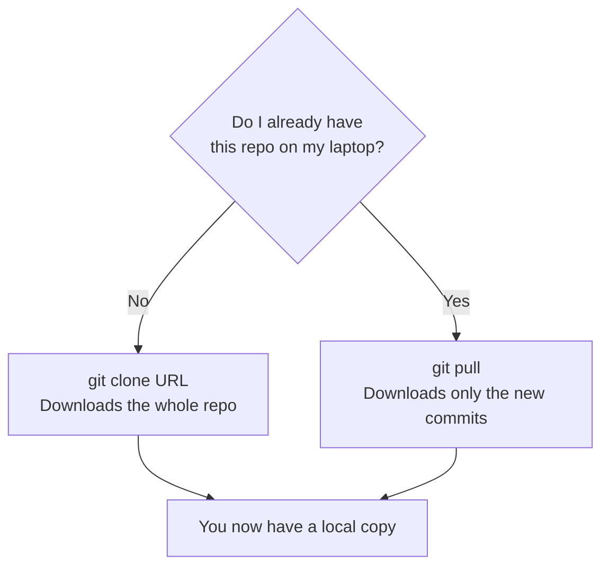
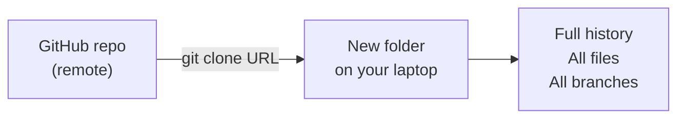
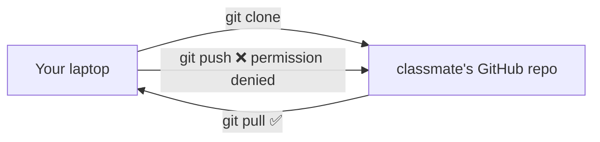

## Day 2 — Clone and Pull

> **Goal:** Download any GitHub repo to your computer with `git clone`, then keep it up to date with `git pull`.

---

### The difference between clone and pull

Two commands — each for a specific situation:

| Command     | When you use it                                                              |
| ----------- | ---------------------------------------------------------------------------- |
| `git clone` | The **first time** you download a repo. You do not have it yet at all.       |
| `git pull`  | When you **already have** the repo and want to download new changes from it. |

> **Analogy:** `git clone` is like borrowing a book from a library for the first time — you get the whole book. `git pull` is like getting the updated edition of a book you already own — you just get the new pages that changed.



---

### `git clone` — download a repo for the first time

`git clone` takes a GitHub URL and creates a complete copy of the repo on your laptop — including all the commits, all the branches, and all the files.

```bash
git clone https://github.com/SOME-USERNAME/SOME-REPO.git
```

Git creates a new folder with the repo name and downloads everything into it. You do not need to run `git init` — cloning handles all of that automatically.

**Example — clone a public Python cheat sheet repo:**

```bash
cd ~/projects/github
git clone https://github.com/gto76/python-cheatsheet.git
```

This downloads the whole project. Check what appeared:

```bash
ls
```

You will see a new folder called `python-cheatsheet`. Move into it:

```bash
cd python-cheatsheet
```

Explore the files:

```bash
ls
git log --oneline
```

You can see all the commits made by the original authors. You now have a full local copy.

> **You did not write any of this code** — and that is the whole point. Open source means you can download and learn from anyone's work.



---

### `git pull` — get the latest changes

Once you have cloned a repo, it can fall behind. The original authors keep adding commits. Your local copy gets stale.

`git pull` downloads all the new commits and applies them to your local copy:

```bash
git pull
```

You should see something like:

```
remote: Enumerating objects: 5, done.
remote: Counting objects: 100% (5/5), done.
Updating abc1234..def5678
Fast-forward
 README.md | 3 +++
 1 file changed, 3 insertions(+)
```

Or, if there is nothing new:

```
Already up to date.
```

Both outcomes are fine. "Already up to date" just means your copy is current.

> `git pull` is actually doing two things at once: it **fetches** (checks GitHub for new commits) and then **merges** (applies them to your current branch). Most of the time `git pull` is all you need.

---

### What happens when you clone someone else's repo

When you clone a repo you do not own, you get a read-only connection to the remote. You can pull updates, but you cannot push changes back — GitHub will refuse because it is not your repo.



Later this week you will learn about **forks** — your own copy of someone else's repo where you *can* push. But for today, just read-only is fine.

---

### Explore a cloned repo in VS Code

After cloning, open the repo in VS Code:

```bash
cd ~/projects/github/python-cheatsheet
code .
```

VS Code opens the folder. In the Explorer panel (left sidebar) you can browse all the files. Notice:

- The **source control icon** (third icon in the Activity Bar) shows the repo is already connected to Git
- If you click it, you can see the repo has no staged changes yet — everything is clean

> **Try this:** Open a file and make a small change. Watch the source control icon get a number badge — that is VS Code showing you have unsaved Git changes. Press `Ctrl+Z` to undo and the badge disappears.

---

### Hands-on exercise

Work through each step and do not skip the exploration parts — those are where the learning happens.

**Step 1 — Clone a classmate's repo**

Ask a classmate for their `my-story` GitHub URL. If no classmate is available, use this public beginner-friendly repo:

```bash
cd ~/projects/github
git clone https://github.com/octocat/Hello-World.git
```

**Step 2 — Explore the cloned repo**

```bash
cd Hello-World
ls
git log --oneline
git log --oneline --graph
```

Answer these questions before moving on:

1. How many commits are in the repo?
2. Who made the first commit?
3. What was the commit message?

**Step 3 — Open it in VS Code**

```bash
code .
```

Read every file in the repo. Even if it is a tiny project — read it.

**Step 4 — Try to push (it should fail)**

```bash
echo "test change" >> README
git add README
git commit -m "My test change"
git push
```

You will see an error like:

```
remote: Permission to octocat/Hello-World.git denied to YOUR-USERNAME.
fatal: unable to access '...': The requested URL returned error: 403
```

That error is expected. It proves you cannot change someone else's repo. Undo the commit so your local copy is clean again:

```bash
git reset HEAD~1
git checkout README
```

**Step 5 — Pull updates from your own repo**

Switch to your `my-story` repo (the one you pushed yesterday):

```bash
cd ~/projects/github/my-story
```

Go to GitHub in Firefox and edit `story.txt` directly on the website — add one new sentence. Commit the change on GitHub.

Now pull it down:

```bash
git pull
cat story.txt
```

The sentence you wrote on GitHub appears in your local file. Push and pull — you now own that workflow.

**Step 6 — Check the status of both repos**

```bash
cd ~/projects/github/Hello-World
git status

cd ~/projects/github/my-story
git status
```

Both should say "nothing to commit, working tree clean". Clean is good.

---

### What you learned today

- The difference between `git clone` (first download) and `git pull` (get new changes)
- How to clone any public GitHub repo with `git clone URL`
- How to browse a cloned project in VS Code and read its commit history
- Why you cannot push to a repo you do not own
- How to keep your own repo in sync between GitHub and your laptop using `git pull`
- What "Already up to date" and "Fast-forward" mean in pull output

---

### Tip and trick for deeper understanding

#### Trick 1: `git clone` sets up `origin` for you automatically
When you ran `git remote add origin URL` on Day 1, you did that manually because you already had a local repo. When you `git clone`, Git handles that step for you — it reads the URL you provided and creates the `origin` remote automatically. Run `git remote -v` right after cloning any repo and you will see `origin` already pointing at the correct address. You never need to run `git remote add` on a cloned repo.

#### Trick 2: `git pull` is secretly two commands running back to back
Under the hood, `git pull` first runs `git fetch` (download new commits from GitHub into a hidden holding area) and then runs `git merge` (apply those commits to your current branch). If you ever want to *see* what has changed on GitHub before deciding to merge it, run `git fetch` by itself, then check with `git log origin/main --oneline`. You will see the remote commits listed without anything in your files changing yet.

#### Quick challenge (10 minutes)
Practise the difference between fetch and pull on your own `my-story` repo:

```bash
cd ~/projects/github/my-story

# Step 1: only download — do not merge yet
git fetch

# Step 2: peek at what came down from GitHub
git log origin/main --oneline

# Step 3: now apply it (this is the second half of git pull)
git merge origin/main

# Step 4: confirm everything is in sync
git status
```

---

### Day 2 tip

> Run `git pull` every time you sit down to work on a project — before you write a single line of code. This is especially important when you are collaborating. It takes one second and saves hours of headaches later.
