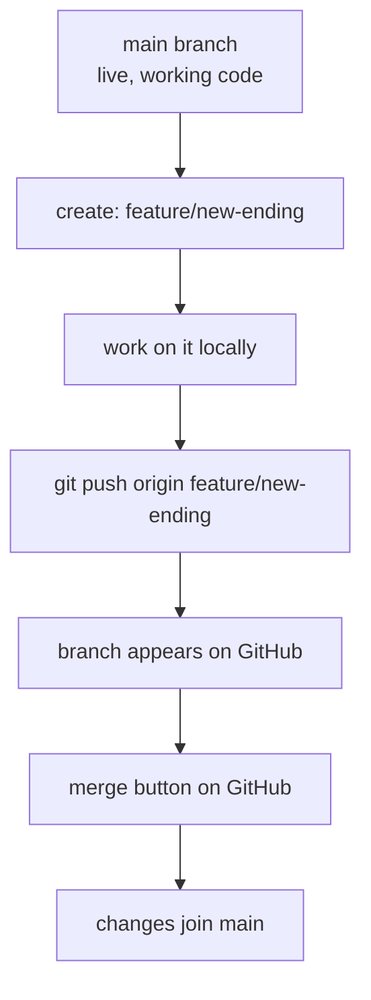
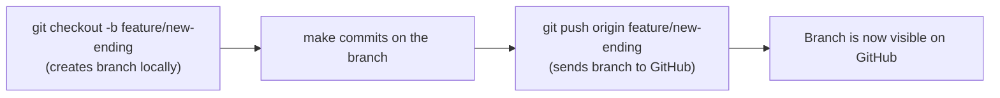
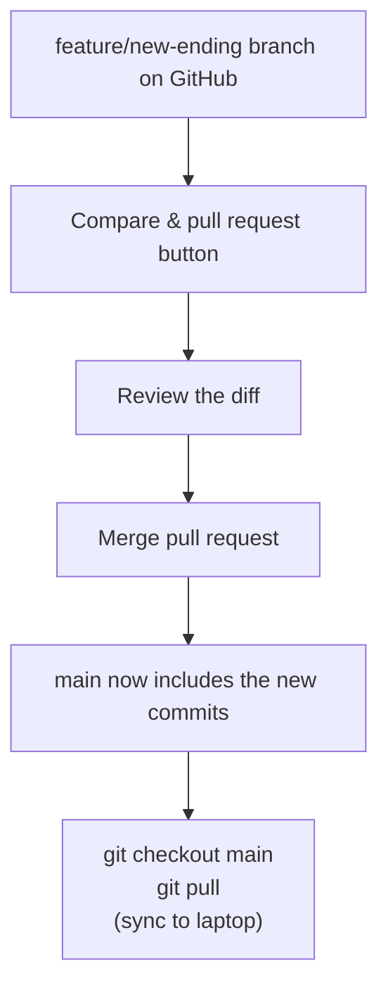

## Day 3 — Branches on GitHub

> **Goal:** Create a branch locally, push it to GitHub, and merge it back using the GitHub website's merge button.

---

### Why branches matter on GitHub

In Week 2 you learned that branches let you work on a new idea without touching the main code. That was all local. Today you take that further: you push branches to GitHub so your teammates can see them, discuss them, and help merge them.

> **Analogy:** Imagine a group project where everyone is writing a different chapter of the same book. Each person works on their own chapter (their branch) and only adds it to the book (merges to main) when it is finished and checked. GitHub is the shared book everyone can read.



---

### Review: branches in Git

Quick recap from Week 2. A branch is a separate line of development. You can always see your branches:

```bash
git branch
```

The branch with a `*` is the one you are currently on.

Create a new branch and switch to it:

```bash
git checkout -b feature/new-ending
```

The `-b` flag creates the branch and switches to it in one step. This is the shortcut you will use every time.

> **Naming branches:** Use lowercase words joined by hyphens. Start with a prefix that says what kind of change it is. Common prefixes are `feature/`, `fix/`, and `update/`. Examples: `feature/dark-mode`, `fix/login-bug`, `update/readme`.

---

### Pushing a branch to GitHub

By default, a new branch only exists on your laptop. To share it with the world, push it:

```bash
git push origin feature/new-ending
```

That is it. `origin` is your GitHub remote. `feature/new-ending` is the name of the branch to push.

The first time you push a branch, Git tells you:

```
To https://github.com/YOUR-USERNAME/my-story.git
 * [new branch]      feature/new-ending -> feature/new-ending
```

After the first push, you can just use `git push` for this branch too.



---

### Seeing your branches on GitHub

Go to your GitHub repo in Firefox. Look for the **branch switcher** — a dropdown that currently says `main`. Click it.

You should see `feature/new-ending` listed there. Click it and GitHub switches the view to show files as they exist on that branch. If your branch has extra commits, you will see them here.

You can also see all branches at once by clicking the **branches** link near the top of the repo page (it shows something like "2 branches").

---

### List remote branches from the terminal

You do not have to open the browser to check what branches are on GitHub. From the terminal:

```bash
git branch -r
```

Output:

```
  origin/HEAD -> origin/main
  origin/feature/new-ending
  origin/main
```

The `r` stands for "remote". These are all the branches GitHub knows about.

Combine it with `-a` to see both local and remote:

```bash
git branch -a
```

---

### Merging on GitHub — the merge button

GitHub has a friendly way to merge branches using buttons on its website. This is different from doing `git merge` in the terminal — GitHub wraps it in a nice interface that lets you review changes before merging.

Here is the process:

1. On your repo page, click **Compare & pull request** (GitHub shows this button when it detects a new branch)
   - If you do not see this button, go to the **Pull requests** tab → **New pull request**
2. Set **base:** `main` and **compare:** `feature/new-ending`
3. GitHub shows you a **diff** — all the lines you changed, green for added, red for removed
4. Click **Create pull request** (give it a title if you like)
5. On the pull request page, click **Merge pull request** → **Confirm merge**

Your branch is now merged into `main`.

> You just used a Pull Request to merge a branch. Pull Requests (PRs) are the main topic of Day 4 — today we are just using the merge button to see the result. Tomorrow you go deeper.

After merging, pull the updated `main` back to your laptop:

```bash
git checkout main
git pull
```

Your laptop's `main` now has all the commits from your feature branch.



---

### Clean up the old branch

After merging, you do not need the feature branch anymore. Delete it from GitHub:

On the merged pull request page, GitHub shows a **Delete branch** button. Click it.

Delete it from your laptop too:

```bash
git branch -d feature/new-ending
```

The `-d` flag (lowercase) only deletes the branch if it has been merged. This is safe — Git will refuse if you accidentally try to delete an unmerged branch.

> **Keep your repo tidy.** Delete branches after they are merged. A repo with 50 old branches is confusing. Delete as you go.

---

### Hands-on exercise

This exercise takes you through the full local-branch-to-GitHub-merge cycle.

**Step 1 — Start from a clean main**

```bash
cd ~/projects/github/my-story
git checkout main
git pull
git status
```

Everything should be clean and up to date.

**Step 2 — Create a feature branch**

```bash
git checkout -b feature/title-page
```

Confirm you are on the new branch:

```bash
git branch
```

**Step 3 — Add a title page file**

```bash
touch title-page.txt
```

Open `title-page.txt` in VS Code and add:

```
MY STORY
========

Author: YOUR NAME
Written: June 2026

A tale of adventure and learning.
```

Save the file.

**Step 4 — Commit the change**

```bash
git add title-page.txt
git commit -m "Add title page"
```

**Step 5 — Push the branch to GitHub**

```bash
git push origin feature/title-page
```

Go to Firefox and open your GitHub repo. You should see a yellow banner: **"feature/title-page had recent pushes"** with a **Compare & pull request** button.

**Step 6 — Merge via GitHub**

1. Click **Compare & pull request**
2. Title it: `Add title page to story`
3. Click **Create pull request**
4. Click **Merge pull request** → **Confirm merge**
5. Click **Delete branch**

**Step 7 — Sync your laptop**

```bash
git checkout main
git pull
ls
```

You should now see `title-page.txt` on your local `main` branch.

**Step 8 — Clean up locally**

```bash
git branch -d feature/title-page
git branch
```

Only `main` should remain.

**Bonus — check the full history**

```bash
git log --oneline --graph
```

You can see the merge commit where `feature/title-page` joined `main`.

---

### What you learned today

- How to create a local branch and push it to GitHub with `git push origin branch-name`
- How to view your branches on GitHub using the branch switcher and the branches page
- How to list remote branches from the terminal with `git branch -r`
- How to merge a branch using GitHub's website (Compare & pull request → Merge)
- How to sync your laptop after a GitHub merge with `git checkout main && git pull`
- How to delete a branch both on GitHub (Delete branch button) and locally (`git branch -d`)

---

### Tip and trick for deeper understanding

#### Trick 1: Use `-u` on feature branches to save typing on every push
The same `-u` flag from Day 1 works for any branch, not just `main`. The first time you push a feature branch, run `git push -u origin feature/title-page`. After that, every future `git push` on that branch sends to the right place automatically — no need to type `origin feature/title-page` every time. This is especially useful when you are making several small commits on the same branch over a few hours.

#### Trick 2: Check remote branches from the terminal without opening the browser
`git branch -r` lists every branch that currently exists on GitHub — the `r` stands for "remote". This is faster than switching to Firefox, and it works even when you are offline after a recent `git fetch`. If you see a teammate's branch listed there and want to check it out locally, run `git checkout feature/their-branch-name` and Git automatically creates a local copy that tracks the remote one.

#### Quick challenge (10 minutes)
Try the `-u` shortcut on a new branch and confirm the remote branch list updates:

```bash
# 1. Create and push a quick test branch using -u
git checkout -b feature/test-tricks
echo "Testing the -u trick" >> story.txt
git add story.txt
git commit -m "Test -u flag on feature branch"
git push -u origin feature/test-tricks

# 2. Make one more commit and push with NO extra arguments
echo "Second commit — no origin needed." >> story.txt
git add story.txt
git commit -m "Second commit on test branch"
git push

# 3. Confirm the branch appears in the remote list
git branch -r
```

---

### Day 3 tip

> Always create a new branch before you start any new piece of work — even a tiny change. Branching is free and fast. The habit of "one branch per task" keeps your history clean and makes collaboration much easier tomorrow.
