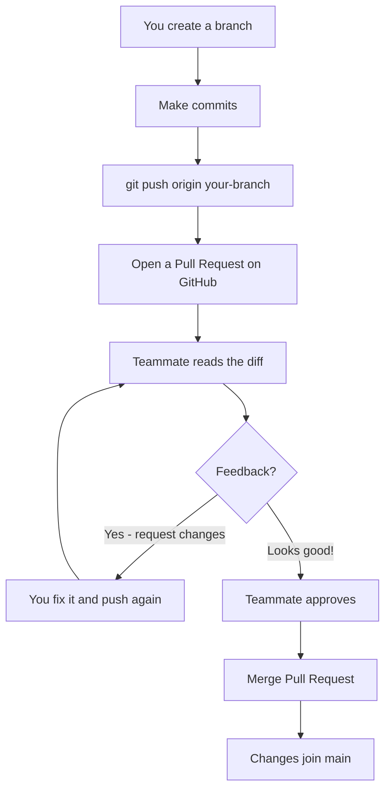
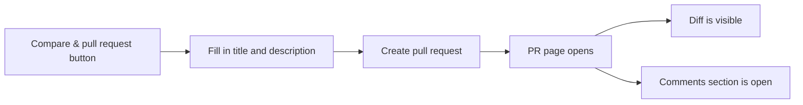
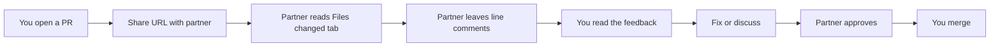

## Day 4 — Pull Requests

> **Goal:** Open a real pull request on GitHub, leave a review comment, and merge it — the same workflow used by professional developers everywhere.

---

### What is a Pull Request?

A **Pull Request (PR)** is a formal way of saying: "I made some changes on a branch. Please look at them, and if you approve, merge them into main."

PRs are the heart of collaboration on GitHub. Every change to a shared project — whether it is one line or ten thousand lines — goes through a PR. Your teammates can read your changes, leave comments, suggest improvements, and approve or reject the work before it ever touches the main branch.

> **Analogy:** Imagine you wrote a new chapter for a shared story. You do not just tape it into the book — you hand it to the group and say "I wrote this, what do you think?" The group reads it, maybe suggests fixing a spelling mistake, then says "looks great, let's add it." That review-and-approve process is exactly what a PR does.



---

### Anatomy of a Pull Request

When you open a PR on GitHub, you fill in three things:

| Part            | What it is                                                                 |
| --------------- | -------------------------------------------------------------------------- |
| **Title**       | A short summary of what the PR does. One sentence.                         |
| **Description** | More detail — what changed, why, and how to test it.                       |
| **Diff**        | The actual file changes GitHub shows automatically (green = added, red = removed) |

A good PR description answers three questions:

1. **What did I change?** Describe the change in plain language.
2. **Why did I change it?** What problem does it solve?
3. **How can you test it?** What should the reviewer check?

---

### Step 1 — Create a branch with a meaningful change

Make sure you are on `main` and everything is up to date:

```bash
cd ~/projects/github/my-story
git checkout main
git pull
```

Create a new branch:

```bash
git checkout -b feature/chapter-two
```

Open VS Code and create a new file:

```bash
touch chapter-two.txt
code chapter-two.txt
```

Write a short second chapter — at least 3 sentences. Save it.

Now commit it:

```bash
git add chapter-two.txt
git commit -m "Add chapter two to the story"
```

---

### Step 2 — Push the branch to GitHub

```bash
git push origin feature/chapter-two
```

---

### Step 3 — Open a Pull Request

Go to your GitHub repo in Firefox. You will see the yellow **"Compare & pull request"** banner. Click it.

On the PR creation page:

1. **Title:** `Add chapter two`
2. **Description:** Write something like this (adapt it for your story):

```
## What I changed
Added chapter-two.txt — the second chapter of my story.

## Why
The story only had one chapter. It needed a continuation.

## How to review
Read chapter-two.txt and check that it makes sense after chapter one.
```

3. Click **Create pull request**

You are now on the PR page. This is where the review happens.



---

### Step 4 — Leave a review comment

Even if you are working alone today, you can leave comments on your own PR to practice the workflow.

**Option A — Line comment (comment on a specific line of code)**

1. On the PR page, click the **Files changed** tab
2. Hover over any line in `chapter-two.txt` — a small blue `+` icon appears on the left
3. Click the `+`
4. A comment box opens inline. Type something like: `This line sets the scene really well!`
5. Click **Add single comment**

**Option B — General PR comment**

1. Click the **Conversation** tab
2. Scroll to the comment box at the bottom
3. Type: `Reviewed chapter two — story is shaping up nicely.`
4. Click **Comment**

Both types of comments are part of the permanent record of this PR. Reviewers use line comments to point to specific things. General comments are for overall feedback.

> **In real teams:** when a reviewer wants you to fix something before merging, they click **Request changes** instead of **Comment**. When they are happy, they click **Approve**. You will not see these options on your own PR (GitHub does not let you approve your own work), but you will see them on a partner's PR in today's exercise.

---

### Step 5 — Merge the Pull Request

1. On the PR page, click the **Conversation** tab
2. Scroll down to the green **Merge pull request** button
3. Click it → **Confirm merge**

The PR is merged. The banner changes to purple and says "Merged".

4. Click **Delete branch** to clean up the feature branch on GitHub.

---

### Step 6 — Sync your laptop

```bash
git checkout main
git pull
ls
```

`chapter-two.txt` is now in your local `main` branch. The feature branch is gone on GitHub; delete it locally too:

```bash
git branch -d feature/chapter-two
```

---

### Review a partner's PR

This is the most important part of today. Find a classmate, each of you:

1. Push a new branch with a change to your `my-story` repo
2. Open a PR
3. Share your PR URL with your partner
4. Each of you reads the other's PR, leaves at least one line comment, and one general comment
5. Both of you merge your own PRs

**To leave a line comment on someone else's PR:**

1. Open the PR URL they share with you
2. Click **Files changed**
3. Hover over a line → click the `+`
4. Write your comment → **Add single comment**

> **Be kind in code review.** The goal of a review comment is to help, not to criticise. Say what you like, and suggest improvements with "what if you tried..." instead of "this is wrong".



---

### Hands-on exercise

Follow the complete workflow below from start to finish.

**Step 1 — Prepare your repo**

```bash
cd ~/projects/github/my-story
git checkout main
git pull
```

**Step 2 — Create a branch with two changes**

```bash
git checkout -b feature/polish
```

Open `story.txt` in VS Code. Fix any spelling mistakes you find, or improve two sentences. Also add a blank line between paragraphs if there are none.

Save the file.

**Step 3 — Commit and push**

```bash
git add story.txt
git commit -m "Polish story text: fix spelling and improve flow"
git push origin feature/polish
```

**Step 4 — Open a PR with a good description**

On GitHub, open a PR with this description template:

```
## What I changed
- Fixed spelling mistakes in story.txt
- Added blank lines between paragraphs for readability

## Before and after
The story now reads more smoothly from start to finish.

## Checklist
- [x] Spell checked
- [x] Read it aloud and it sounds natural
```

> The `- [x]` syntax creates a **checkable checkbox** in GitHub Markdown. Reviewers love checklists.

**Step 5 — Review your own diff**

Click the **Files changed** tab. Read every changed line carefully. If you spot something to fix, go back to VS Code, fix it, commit, and push again — the PR updates automatically.

**Step 6 — Exchange with a partner**

Share your PR URL. Leave a comment on theirs. Respond to their comment on yours.

**Step 7 — Merge and clean up**

```bash
# After merging on GitHub:
git checkout main
git pull
git branch -d feature/polish
git log --oneline
```

---

### What you learned today

- What a Pull Request is and why teams use them instead of merging directly
- How to write a good PR title and description that answers what, why, and how to test
- How to open a PR on GitHub after pushing a branch
- How to leave a line comment on a specific line in the Files changed tab
- How to leave a general comment in the Conversation tab
- How to merge a PR and clean up the branch on both GitHub and your laptop
- Why being kind and specific in code review matters

---

### Tip and trick for deeper understanding

#### Trick 1: Pushing new commits to a branch updates the open PR automatically
If a reviewer asks you to fix something before they approve, you do not close the PR and open a new one. Just go back to your local branch, make the fix, commit, and run `git push`. The PR on GitHub updates instantly — the new commit appears in the timeline and the **Files changed** tab shows the latest version. The reviewer gets a notification and can see exactly what you changed. One branch, one PR, however many fix commits you need.

#### Trick 2: Type `Closes #3` in your PR description to auto-close an issue
If your repo has an issue in the Issues tab (for example, issue number 3), write `Closes #3` anywhere in your PR description. When the PR is merged, GitHub automatically marks that issue as closed — no extra clicks needed. You can link multiple issues with `Closes #3, Closes #7`. This keeps your issue tracker tidy and gives reviewers instant context about *why* you made the change.

#### Quick challenge (10 minutes)
Practise updating an open PR with a follow-up commit:

```bash
# While your feature/polish PR is still open on GitHub:
git checkout feature/polish

# Make one more small improvement
echo "(Proofread and approved by author)" >> story.txt
git add story.txt
git commit -m "Add proofreading note"
git push
```

Go to your open PR in Firefox — without refreshing, watch the new commit appear in the timeline. Click **Files changed** to confirm the diff now includes your latest line.

---

### Day 4 tip

> When you review someone's code, always find at least one thing to praise before suggesting any improvements. Nobody works harder after hearing only criticism. One genuine "this part is really clear" makes the whole review feel collaborative rather than combative.
