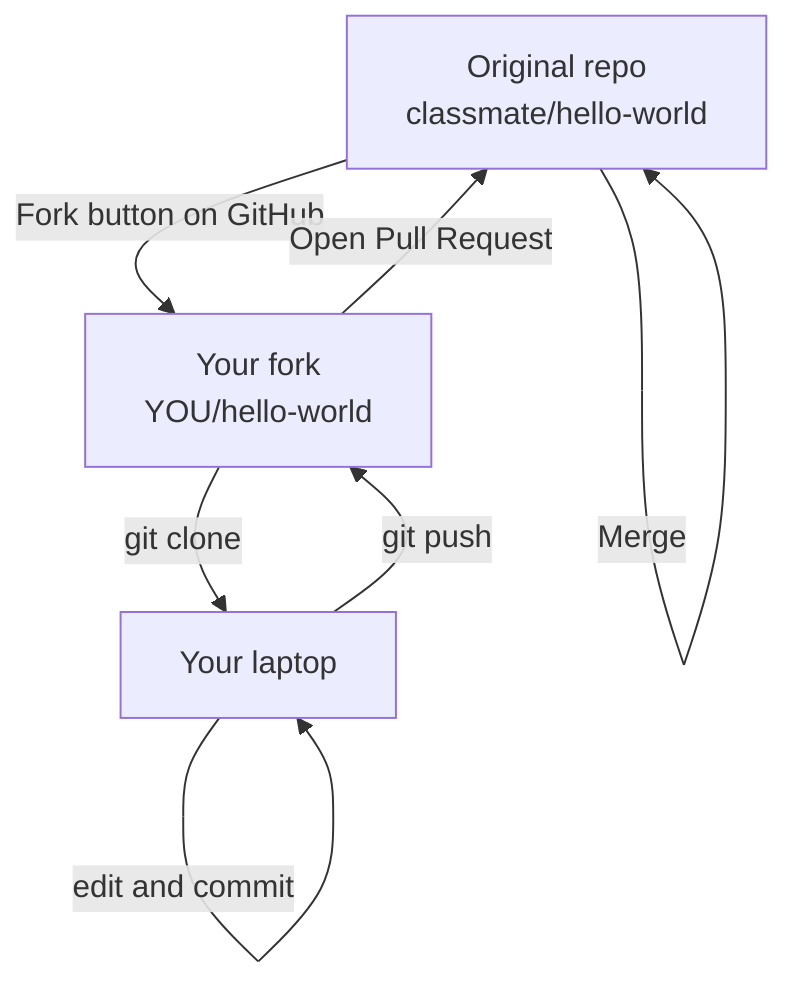
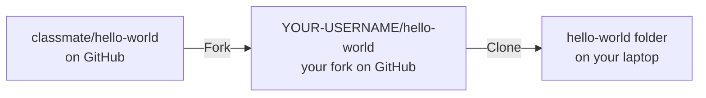
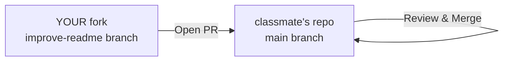

## Day 5 — Fork & Contribute + Week 3 Review

> **Goal:** Fork a partner's repo, improve their README, and open a Pull Request back to their original repo — the same workflow used by every open source contributor in the world.

---

### What is a Fork?

So far you have only pushed to repos you own. But what if you want to contribute to someone else's project — someone you have never met — and they have not given you permission to push to their repo?

The answer is a **fork**.

A fork is your own copy of someone else's repo. When you fork a repo, GitHub creates an exact duplicate of it under your account. You own your fork. You can push to it freely. And when your changes are ready, you can open a **Pull Request** from your fork back to the original — asking the original author to accept your work.

> **Analogy:** Imagine a recipe book in a library. You cannot write in the library's copy. But you can photocopy it, take it home, modify your copy however you like, and then mail a letter to the library saying "I improved the pasta recipe — here is what I changed. Would you like to update your book?" That letter is the Pull Request. The photocopy is your fork.



---

### The fork-to-PR workflow

This is the standard open source contribution workflow. Every time you see a "Contribute" button on a GitHub project, this is what happens:

| Step | Where | Command or action |
| ---- | ----- | ----------------- |
| 1 | GitHub | Click **Fork** on the original repo |
| 2 | Terminal | `git clone URL` of **your fork** |
| 3 | Terminal | `git checkout -b your-branch-name` |
| 4 | VS Code | Make your changes |
| 5 | Terminal | `git add`, `git commit`, `git push origin your-branch-name` |
| 6 | GitHub | Open a Pull Request **from your fork → to the original repo** |
| 7 | Original author | Reviews and merges (or asks for changes) |

---

### Step 1 — Fork a repo

For this exercise, find a classmate's `hello-world` or `my-story` repo on GitHub.

1. Go to their repo URL in Firefox
2. Click the **Fork** button (top right of the repo page)
3. Leave all the settings as default
4. Click **Create fork**

GitHub redirects you to your fork. Notice the URL now says `YOUR-USERNAME/hello-world` — this is your copy. At the top of the page you see a note: **"forked from classmate/hello-world"**.



---

### Step 2 — Clone your fork

Clone **your fork** — not the original. Copy the URL from the page you are on (your fork):

```bash
cd ~/projects/github
git clone https://github.com/YOUR-USERNAME/hello-world.git
cd hello-world
```

Confirm the remote points to your fork:

```bash
git remote -v
```

Output:

```
origin  https://github.com/YOUR-USERNAME/hello-world.git (fetch)
origin  https://github.com/YOUR-USERNAME/hello-world.git (push)
```

Good. You are pushing to your fork, not to the original.

---

### Step 3 — Add the original repo as "upstream"

A good habit: add the original repo as a second remote called `upstream`. This lets you pull future updates from the original into your fork.

```bash
git remote add upstream https://github.com/CLASSMATE-USERNAME/hello-world.git
git remote -v
```

Now you have two remotes:

```
origin    https://github.com/YOUR-USERNAME/hello-world.git (fetch)
origin    https://github.com/YOUR-USERNAME/hello-world.git (push)
upstream  https://github.com/CLASSMATE-USERNAME/hello-world.git (fetch)
upstream  https://github.com/CLASSMATE-USERNAME/hello-world.git (push)
```

- `origin` = your fork (where you push to)
- `upstream` = the original (where you eventually PR to)

> You will not need `upstream` for today's exercise, but adding it is standard practice. Professional open source contributors always do this.

---

### Step 4 — Create a branch and improve the README

```bash
git checkout -b improve-readme
```

Open the README in VS Code:

```bash
code README.md
```

A good README has at least these things:

- A heading with the project name
- One or two sentences explaining what the project is
- A "How to use it" section
- The author's name

Here is a template to build on (adapt it for your classmate's project):

```markdown
# Hello World

A short introduction project made while learning Git and GitHub.

## About this project

This is the first GitHub repository I created. It contains a simple story 
and shows how to use Git for version control.

## Files

- `README.md` — this file
- `story.txt` — a short original story

## Author

Written by [CLASSMATE NAME] — June 2026
```

Make at least 3 meaningful improvements to their README. Save the file.

---

### Step 5 — Commit and push to your fork

```bash
git add README.md
git commit -m "Improve README: add description, file list, and author section"
git push origin improve-readme
```

---

### Step 6 — Open a Pull Request to the original repo

Go to **your fork** on GitHub in Firefox. You will see the "Compare & pull request" banner.

Click it. Notice that GitHub automatically sets:

- **base repository:** `classmate/hello-world` ← the original
- **base:** `main`
- **head repository:** `YOUR-USERNAME/hello-world` ← your fork
- **compare:** `improve-readme`

This is a cross-repo PR. You are asking the original owner to pull changes from your fork.

Fill in the description:

```
## What I improved
- Added a project description at the top
- Added a file list so readers know what to expect
- Added an author section with the date

## Why
The original README was a placeholder. This version gives visitors 
a much clearer idea of what the project is.
```

Click **Create pull request**.

Your classmate will now see this PR on their repo's Pull Requests tab.



---

### Step 7 — Review and merge each other's PRs

Switch roles. Your classmate should now:

1. Go to **their** repo's Pull Requests tab
2. Click on your PR
3. Click **Files changed** and read your changes
4. Leave at least one comment
5. If the changes look good: click **Merge pull request** → **Confirm merge**

Meanwhile you do the same for their PR on your repo.

> If the original author (your classmate) wants changes before merging, they click **Request changes** and leave a comment. You then go back to your laptop, make the fix, commit, and push to the same branch. The PR updates automatically.

---

### Week 3 review challenge

Before you finish today, test yourself. Do each of these from memory — no notes:

```bash
# 1. Go to your my-story repo
cd ~/projects/github/my-story

# 2. Create a review branch
git checkout -b week3-review

# 3. Create a new file
touch week3-notes.txt
```

Open `week3-notes.txt` in VS Code and write, without looking anything up:

```
Week 3 — what I learned

git remote:
[write what it does]

git push:
[write what it does]

git pull:
[write what it does]

git clone:
[write what it does]

Pull Request:
[describe in one sentence what a PR is]

Fork:
[describe in one sentence what a fork is]

The fork-to-PR workflow:
[list the steps from memory]
```

Commit and push:

```bash
git add week3-notes.txt
git commit -m "Add Week 3 review notes"
git push origin week3-review
```

Open a PR on GitHub with the title "Week 3 self-review". Merge it.

---

### Week 3 wrap-up checklist

Before moving on to Week 4, make sure you can do all of these without help:

- [ ] Link a local repo to GitHub with `git remote add origin URL`
- [ ] Push commits to GitHub with `git push`
- [ ] Pull new changes from GitHub with `git pull`
- [ ] Clone a public repo with `git clone URL`
- [ ] Create a local branch, push it to GitHub, and see it on the website
- [ ] Open a Pull Request with a clear title and description
- [ ] Leave a line comment and a general comment on a PR
- [ ] Merge a Pull Request and delete the branch
- [ ] Fork a repo, clone your fork, make a change, and open a PR back to the original
- [ ] Explain the difference between `origin` and `upstream`

If any box is unchecked, use the weekend to revisit that day's section.

---

### Preview: Week 4 — Python

Starting Monday, you are going to write actual programs.

Python is one of the most popular programming languages in the world — it is used for everything from websites to scientific research to AI. It reads almost like plain English, which makes it the best first programming language to learn.

Here is a tiny preview. This is a complete Python program:

```python
name = input("What is your name? ")
print("Hello, " + name + "!")
print("Welcome to Week 4.")
```

Save that into a file called `hello.py` and run it in the terminal:

```bash
python3 hello.py
```

The program asks your name and greets you. Three lines. A real program.

Next week you will learn variables, conditions, loops, and functions — enough to build small games and tools. Everything you learned in Weeks 1–3 (VS Code, the terminal, Git, GitHub) will be the toolkit you use to write and share that Python code.

> 📖 **Read ahead if you like:** [Python for Everybody — Chapter 1](https://www.py4e.com/html3/01-intro) (free online textbook, very beginner-friendly)

---

### Hands-on exercise

Complete the full fork-to-PR workflow with a partner:

**Step 1 — Fork their repo**

Visit your partner's GitHub profile. Fork their `hello-world` or `my-story` repo.

**Step 2 — Clone, branch, edit**

```bash
cd ~/projects/github
git clone https://github.com/YOUR-USERNAME/PARTNER-REPO.git
cd PARTNER-REPO
git remote add upstream https://github.com/PARTNER-USERNAME/PARTNER-REPO.git
git checkout -b improve-readme
```

Open `README.md` in VS Code. Add at least 3 meaningful improvements.

**Step 3 — Push and open PR**

```bash
git add README.md
git commit -m "Improve README with description and structure"
git push origin improve-readme
```

Open a PR from your fork to their original repo. Write a clear description.

**Step 4 — Review each other's PRs**

Each person: read the PR on your own repo, leave a line comment, and merge it.

**Step 5 — Pull the merged change to your laptop**

Ask your partner to confirm the merge. Then:

```bash
cd ~/projects/github/my-story
git pull
git log --oneline
```

Confirm you can see the merge commit at the top of the history.

**Step 6 — Celebrate**

You just contributed to someone else's project using the exact same workflow that millions of developers use every day on real open source software. That is not a small thing.

---

### What you learned today

- What a fork is — your own copy of someone else's repo on GitHub
- How to fork a repo using the Fork button on GitHub
- How to clone your fork and add the original repo as `upstream`
- The complete fork → clone → branch → change → push → PR workflow
- How to open a cross-repo PR (from your fork to the original repo)
- How a PR author and reviewer take turns until the work is ready to merge
- How to do a self-review using `week3-notes.txt` to test your memory

---

### Tip and trick for deeper understanding

#### Trick 1: Keep your fork up to date using the `upstream` remote
After you fork a repo, the original author keeps adding commits — your fork does not get them automatically. To sync up, run `git fetch upstream` (download their new commits) then `git merge upstream/main` (apply them to your local main). Do this before you start any new branch on your fork so your changes are based on the latest version of the project, which means far fewer merge conflicts when your PR is reviewed.

#### Trick 2: Always run `git remote -v` right after cloning your fork
A very common mistake is cloning the *original* repo by accident instead of your fork — the URLs look similar and it is easy to grab the wrong one. If you cloned the original, `git push` will fail immediately with a "permission denied" error. Run `git remote -v` straight after cloning and confirm the URL shows **your** GitHub username, not the original author's. If you got the wrong one, fix it without re-cloning:

```bash
git remote set-url origin https://github.com/YOUR-USERNAME/REPO.git
```

#### Quick challenge (10 minutes)
Run through the two safety checks every open-source contributor does before starting work:

```bash
# 1. Confirm origin points at YOUR fork, not the original
git remote -v

# 2. Download any new commits from the original repo
git fetch upstream

# 3. Apply them to your local main so you are up to date
git merge upstream/main

# 4. Check the last 5 commits to see if anything new came in
git log --oneline -5
```

---

### Day 5 tip

> Every major open source project you have ever used — Linux, Python, Firefox, VS Code — was built using this exact fork-and-PR workflow. The next time you find a typo in a README on GitHub, you now know how to fix it and send a PR. You have the skills. Use them.
