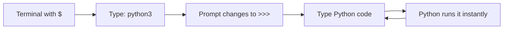
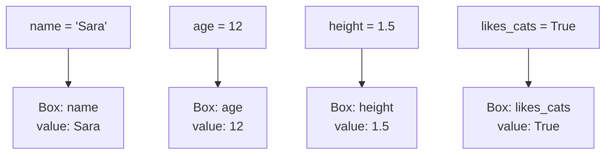
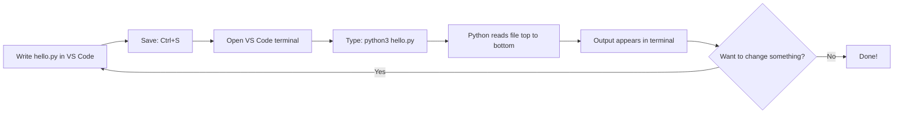

## Day 1 — Hello Python: Variables & Types

> **Goal:** Run Python in the terminal, print your first message, and store information using variables.

---

### What is Python?

Python is a programming language — a way to give instructions to a computer. It was invented in 1991 and is now used by:

- NASA to control spacecraft
- Netflix to recommend shows
- Scientists to analyse data
- Game developers to build games

It was designed to look almost like English, so it is one of the best languages to start with.

> **Analogy:** Think of Python as a recipe. Each line is one instruction. The computer reads top to bottom and does exactly what you say.

---

### Step 1 — Check Python is installed

Open your terminal (`Ctrl + Alt + T`) and type:

```bash
python3 --version
```

**Expected output:**

```
Python 3.10.12
```

Any version starting with `3` is perfect. Python 3 is already installed on Ubuntu — nothing to download.

---

### Step 2 — Open Python's interactive mode

Type this in the terminal and press Enter:

```bash
python3
```

Your prompt changes from `$` to `>>>`. This is **Python's interactive mode** — you type Python and it runs instantly.

```
Python 3.10.12 (main, Nov 20 2023, 15:14:05) [GCC 11.4.0] on linux
Type "help", "copyright", "credits" or "license" for more information.
>>> 
```

> **Think of `>>>` as Python saying "I'm listening — give me something to do."**



---

### Step 3 — Your first Python line: `print()`

In the `>>>` prompt, type exactly this and press Enter:

```python
print("Hello, World!")
```

**Output:**

```
Hello, World!
```

That's it. You just ran your first Python program. `print()` is a **function** — a built-in action that Python knows how to do. You call it by writing its name followed by brackets `()`.

Try a few more:

```python
print("I am learning Python!")
print("This is awesome.")
print(42)
print(3.14)
```

Notice:
- Text goes inside **double quotes** `" "`
- Numbers go in without any quotes
- Every `print()` shows on its own line

---

### Step 4 — Variables: storing information

A **variable** is like a labelled box. You put a value in the box and give the box a name. Later you can open that box and use whatever is inside.

```python
name = "Sara"
age = 12
height = 1.5
likes_cats = True
```

Now ask Python to show you what is in each box:

```python
print(name)
print(age)
print(height)
print(likes_cats)
```

**Output:**

```
Sara
12
1.5
True
```



> **The `=` sign in Python does not mean "equal".** It means "store this value in this variable". Read `name = "Sara"` as: "put 'Sara' into the box called name". You will see `==` (double equals) later — that one checks if two things are equal.

---

### Step 5 — The four basic types

Every value in Python has a **type**. The type tells Python what kind of thing is stored in a variable.

| Type    | Stands for | Example              | When to use                    |
| ------- | ---------- | -------------------- | ------------------------------ |
| `str`   | string     | `"hello"`, `"Sara"`  | Text — names, messages, words  |
| `int`   | integer    | `12`, `100`, `-3`    | Whole numbers, no decimal      |
| `float` | float      | `1.5`, `3.14`        | Numbers with a decimal point   |
| `bool`  | boolean    | `True`, `False`      | Yes or no, on or off decisions |

Check what type a variable is by using `type()`:

```python
print(type(name))
print(type(age))
print(type(height))
print(type(likes_cats))
```

**Output:**

```
<class 'str'>
<class 'int'>
<class 'float'>
<class 'bool'>
```

> **Fun fact:** The word "string" comes from imagining letters threaded on a string one after another — like beads on a necklace.

---

### Step 6 — Using variables in `print()`

You can print text and variables together. Separate them with a comma inside `print()`:

```python
name = "Jordan"
age = 11
print("My name is", name)
print("I am", age, "years old")
```

**Output:**

```
My name is Jordan
I am 11 years old
```

You can also do maths with number variables right inside `print()`:

```python
print("In 10 years I will be", age + 10, "years old")
```

**Output:**

```
In 10 years I will be 21 years old
```

Change `age` to a different number, run `print()` again — the message updates automatically. That is the whole point of variables.

---

### Step 7 — Leave interactive mode and write a real file

Type this to exit interactive mode:

```python
exit()
```

Your prompt goes back to `$`. Now let's write a proper Python file in VS Code.

> 📖 **Read more:** [Python official beginner's guide](https://docs.python.org/3/tutorial/introduction.html)

---

### Hands-on exercise

**Build a personal intro program** — estimated time: 35–45 minutes.

**Part A — Create your working folder (5 min)**

In the terminal, create the folder for this week's Python programs and open VS Code:

```bash
mkdir -p ~/projects/python/week4
cd ~/projects/python/week4
code .
```

VS Code opens. In the Explorer sidebar on the left, click the **New File** icon and name the file:

```
hello.py
```

**Part B — Write the program (20 min)**

In `hello.py`, type this program — but change every value to match **you**:

```python
# My personal intro
# This file prints information about me
# Lines starting with # are comments — Python ignores them

name = "Sara"
age = 12
height = 1.62
city = "London"
favourite_subject = "Art"
likes_coding = True

print("=== About Me ===")
print("Name:", name)
print("Age:", age)
print("Height:", height, "metres")
print("City:", city)
print("Favourite subject:", favourite_subject)
print("Likes coding:", likes_coding)
print("================")
```

Save the file with `Ctrl + S`.

**Part C — Run it from the VS Code terminal (5 min)**

In VS Code, open the built-in terminal: go to **View → Terminal** (or press `` Ctrl+` ``).

Make sure the terminal shows you are in the `week4` folder. Then run:

```bash
python3 hello.py
```

**Expected output:**

```
=== About Me ===
Name: Sara
Age: 12
Height: 1.62 metres
City: London
Favourite subject: Art
Likes coding: True
================
```



**Part D — Experiment and extend (10 min)**

Try each of these one at a time. Save and run after each change:

1. Add a new variable `favourite_food = "pizza"` and print it.
2. Add `pet_name = "Mochi"` — or set it to `"no pet"` if you do not have one.
3. Add this maths line at the bottom:

```python
print("Next year I will be", age + 1, "years old")
```

4. Try changing `likes_coding = True` to `likes_coding = False`. What changes in the output?
5. **Bonus:** Add a variable `score = 95.5` (a float) and print a message using it.

> **Celebrate:** You just wrote, saved, and ran a real Python program. That is exactly what every developer does.

---

### What you learned today

- Python is a programming language that reads almost like English
- `python3` in the terminal opens interactive mode — great for quick experiments
- `print()` displays any value or message on the screen
- Variables are named boxes that store values
- The four basic types are `str`, `int`, `float`, and `bool`
- Lines starting with `#` are comments — Python ignores them, but they help humans understand the code
- `type(x)` tells you what type a variable is
- `python3 hello.py` runs a Python file from the terminal
- You can do maths with number variables directly inside `print()`

---

### Tip and trick for deeper understanding

#### Trick 1: Variables can be updated using their own current value
When you write `score = score + 10`, Python reads the current value of `score`, adds 10, and stores the result back in the same box. This means variables are not frozen at the first value you gave them — you can update them as many times as you like. This idea of "update a variable using itself" shows up constantly in real programs:

```python
score = 0
score = score + 10
score = score + 5
print(score)   # 15
```

#### Trick 2: `print()` can change what goes between your items
When you separate items with commas in `print()`, Python puts a space between them by default. You can change that space to any character by adding `sep=` at the end. This is handy for building dates, usernames, or formatted output without needing an f-string:

```python
print("2024", "06", "12", sep="-")       # 2024-06-12
print("Name", "Age", "City", sep=" | ")  # Name | Age | City
```

#### Quick challenge (10 minutes)
1. Create `score = 0`. Add 10 to it three separate times using `score = score + 10`. Print the final score — it should be `30`.
2. Run `print(type("42"))` and `print(type(42))`. Why are they different even though they look the same?
3. Try `print("first", "second", "third", sep=" -> ")` and see what appears in the output.

---

### Day 1 tip

> The `>>>` interactive mode is your best friend for testing small ideas. Before adding a new line to your file, try it in `>>>` first — if it works there, it works in the file. Professional developers do this all the time.
