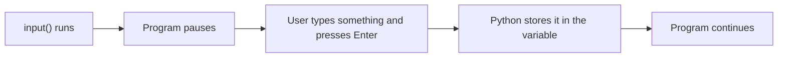
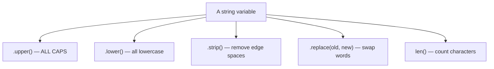
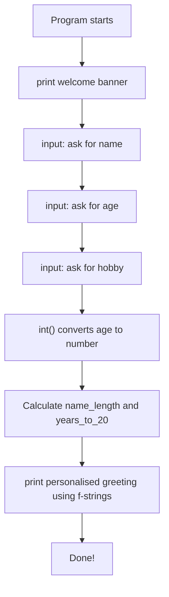

## Day 2 — Strings & User Input

> **Goal:** Ask the user questions with `input()`, manipulate text using string methods, and build messages with f-strings.

---

### What is a string again?

A **string** is any piece of text in Python. You create one by putting text inside double quotes `" "` or single quotes `' '`:

```python
"Hello, World!"
'I am learning Python'
"Sara"
"12"     # This is a string, not a number!
```

That last example is important: `"12"` and `12` are different things. One is text, the other is a number.

Today you will learn to:
- Ask the user to type something
- Do useful things with strings (count, uppercase, lowercase)
- Slot variables into messages elegantly

---

### Step 1 — `input()`: asking the user a question

So far your programs only showed things. Now they will **ask** things too.

Open a `>>>` Python session first to experiment:

```bash
python3
```

Try this:

```python
name = input("What is your name? ")
print("Hello,", name)
```

When you run this, Python **pauses and waits**. Type a name and press Enter. Python stores what you typed into the variable `name`, then prints the message.



> **Everything from `input()` is always a string** — even if the user types a number. Keep that in mind.

---

### Step 2 — Converting types

Because `input()` always gives a string, you need to **convert** it if you want to do maths.

```python
age_text = input("How old are you? ")
print(type(age_text))      # <class 'str'>

age = int(age_text)        # Convert string to integer
print(type(age))           # <class 'int'>

print("Next year you will be", age + 1)
```

You can also do it in one step:

```python
age = int(input("How old are you? "))
print("Next year you will be", age + 1)
```

| Conversion  | What it does                       | Example                    |
| ----------- | ---------------------------------- | -------------------------- |
| `int("12")` | Turns the string `"12"` into `12`  | Now you can add to it      |
| `float("1.5")` | Turns `"1.5"` into `1.5`       | Now you can multiply it    |
| `str(42)`   | Turns the number `42` into `"42"`  | Now you can join it to text |

> **What happens if the user types letters when you expect a number?** Python crashes with an error. We will learn how to handle that in a later week — for now, trust your users to type numbers when asked for numbers.

---

### Step 3 — String methods: tools for text

Python gives you built-in tools to work with strings. These are called **methods**. You use them with a dot after the string (or variable).

#### `len()` — count the characters

```python
word = "elephant"
print(len(word))         # 8
print(len("hi"))         # 2
```

`len()` counts every character including spaces:

```python
print(len("hello world"))   # 11
```

#### `.upper()` and `.lower()` — change the case

```python
message = "hello, world"
print(message.upper())    # HELLO, WORLD
print(message.lower())    # hello, world
```

```python
name = input("Enter your name: ")
print("Welcome,", name.upper(), "!")
```

#### `.strip()` — remove extra spaces

Users sometimes accidentally add spaces when they type. `.strip()` removes spaces from both ends:

```python
user_input = "   Sara   "
print(user_input)            #    Sara   
print(user_input.strip())    # Sara
```

Always use `.strip()` on input from users — it prevents sneaky bugs.

```python
name = input("Enter your name: ").strip()
```

#### `.replace()` — swap text

```python
sentence = "I love cats"
print(sentence.replace("cats", "dogs"))   # I love dogs
```



---

### Step 4 — f-strings: the elegant way to mix text and variables

So far you have been using commas in `print()` to mix text and variables:

```python
print("My name is", name, "and I am", age, "years old")
```

That works but gets messy quickly. **f-strings** are cleaner. Put an `f` right before the opening quote, then write your variables inside `{ }`:

```python
name = "Sara"
age = 12

print(f"My name is {name} and I am {age} years old")
```

**Output:**

```
My name is Sara and I am 12 years old
```

You can even put maths inside the `{ }`:

```python
print(f"Next year I will be {age + 1} years old")
```

**Output:**

```
Next year I will be 13 years old
```

> **Analogy:** An f-string is like a fill-in-the-blank sentence. The `{ }` marks are the blank spaces, and Python fills them in with the variable's value.

Compare the two approaches side by side:

```python
# Old way — commas
print("Hello,", name, "! You are", age, "years old.")

# f-string way — much cleaner
print(f"Hello, {name}! You are {age} years old.")
```

Both produce the same output. Always prefer f-strings from now on.

---

### Step 5 — Putting it together: a quick demo

Quit interactive mode (`exit()`) and create a new file in VS Code called `greet.py`. Type this:

```python
# A quick test of all today's ideas

raw_name = input("Enter your name: ")
name = raw_name.strip()

print(f"You typed {len(raw_name)} characters (before stripping).")
print(f"Hello, {name.upper()}!")
print(f"Your name in lowercase: {name.lower()}")
print(f"Your name has {len(name)} letters.")
```

Run it:

```bash
python3 greet.py
```

Try entering your name with extra spaces before and after — see what `.strip()` does.

> 📖 **Read more:** [Python string methods — official docs](https://docs.python.org/3/library/stdtypes.html#string-methods)

---

### Hands-on exercise

**Build the "Greet Me" program** — estimated time: 35–45 minutes.

**Part A — Create the file (2 min)**

In VS Code (in your `~/projects/python/week4` folder), create a new file:

```
greet_me.py
```

**Part B — Ask for information (15 min)**

Write a program that asks the user for their name, age, and favourite hobby:

```python
# greet_me.py
# A personalised greeting program

print("=== Welcome to Greet Me! ===")
print()

# Ask for information
name = input("What is your first name? ").strip()
age = int(input("How old are you? "))
hobby = input("What is your favourite hobby? ").strip()
```

> The empty `print()` with nothing inside it prints a blank line — useful for spacing out your output.

**Part C — Build the custom message (15 min)**

Add this below what you already have:

```python
# Calculate some fun facts
name_length = len(name)
years_to_20 = 20 - age

# Print the personalised greeting
print()
print("=== Here is your greeting! ===")
print(f"Hello, {name.upper()}!")
print(f"You are {age} years old — only {years_to_20} years until you are 20!")
print(f"Your name has {name_length} letters in it.")
print(f"Wow, {name}, I love that your hobby is {hobby}!")
print(f"Keep it up — you rock!")
print("==============================")
```

**Part D — Run and test (8 min)**

```bash
python3 greet_me.py
```

**Sample run:**

```
=== Welcome to Greet Me! ===

What is your first name? Sara
How old are you? 12
What is your favourite hobby? drawing

=== Here is your greeting! ===
Hello, SARA!
You are 12 years old — only 8 years until you are 20!
Your name has 4 letters in it.
Wow, Sara, I love that your hobby is drawing!
Keep it up — you rock!
==============================
```



**Part E — Extend it (10 min)**

Add at least two more questions and include the answers in the greeting. Ideas:

- Favourite colour: `colour = input("What is your favourite colour? ").strip()`
- Home city: `city = input("What city do you live in? ").strip()`
- Print: `f"A {colour}-loving coder from {city} — fantastic!"`

**Bonus:** Use `.replace()` to change every space in the user's name with a dash, like a username:

```python
username = name.lower().replace(" ", "-")
print(f"Your username could be: {username}")
```

---

### What you learned today

- `input("question")` pauses the program and waits for the user to type something
- Everything from `input()` is a string — use `int()` or `float()` to convert it for maths
- `len(string)` counts the characters in a string
- `.upper()` and `.lower()` change the capitalisation of a string
- `.strip()` removes accidental spaces from the start and end
- `.replace(old, new)` swaps one piece of text for another
- f-strings (`f"Hello, {name}!"`) are the cleanest way to mix text and variables
- An empty `print()` prints a blank line — good for layout

---

### Tip and trick for deeper understanding

#### Trick 1: You can chain string methods one after another
After a string method like `.strip()` finishes, the result is still a string — so you can immediately call another method on it. This lets you clean and transform text in one smooth line instead of three separate steps. You already saw this with `.strip().lower()` in the exercises:

```python
raw = "   HELLO WORLD   "
cleaned = raw.strip().lower().replace("world", "Python")
print(cleaned)   # hello Python
```

#### Trick 2: The curly braces in f-strings can hold any expression, not just a variable name
You can do maths, call methods, and even call `len()` right inside the `{}`. This means you often do not need a separate variable just to print a calculated result — anything that produces a value can go inside the braces:

```python
name = "Jordan"
age = 12
print(f"HELLO, {name.upper()}! In 5 years you will be {age + 5}.")
print(f"Your name has {len(name)} letters.")
```

#### Quick challenge (10 minutes)
1. Ask the user for their full name with `name = input("Name: ").strip()`. Print their name in ALL CAPS and also print how many characters it has, using an f-string for both.
2. Ask for a favourite animal. Use `.replace()` to swap the animal name with `"Python"` in the sentence `"I love cats"`. Print the result.
3. Try chaining without a variable: `print("  hello  ".strip().upper())`. What do you expect? Run it and check.

---

### Day 2 tip

> Always `.strip()` the result of `input()`. Users will accidentally add spaces all the time, and it causes confusing bugs. Make it a habit: `name = input("Name: ").strip()` — every single time.
