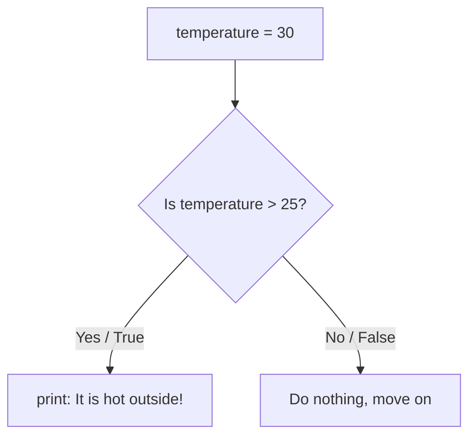
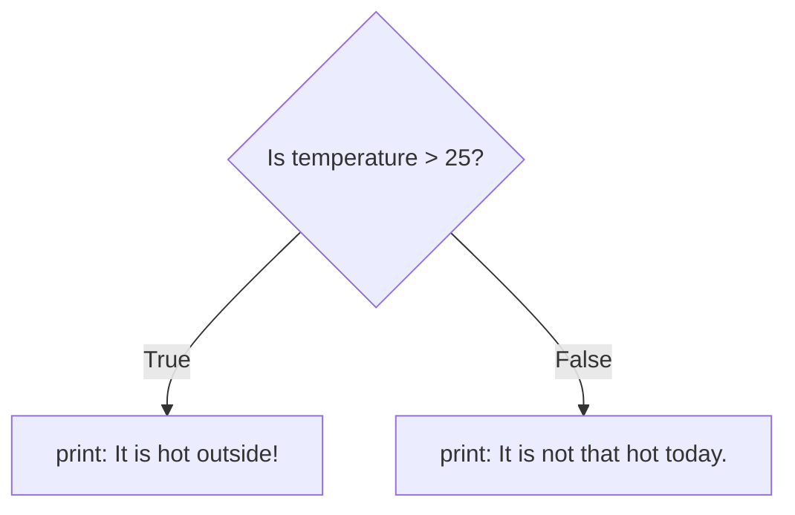
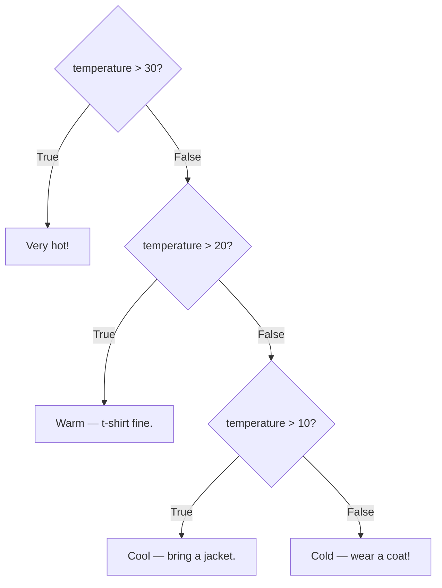
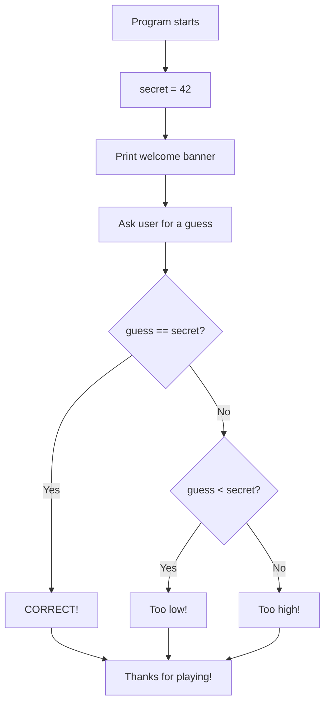

## Day 3 — Making Decisions: if / elif / else

> **Goal:** Write programs that choose what to do based on conditions, using if, elif, and else.

---

### Why do programs need to make decisions?

Every interesting program makes choices. Examples from real life:

- A weather app says "bring an umbrella" **if** it is going to rain
- A game says "you win!" **if** your score is high enough
- A lock opens **if** you enter the right code

Python makes decisions using **if statements**. Today you will master them.

> **Analogy:** An if statement is like a traffic light. Different conditions lead to different actions.

---

### Step 1 — Basic if statement

Open Python interactive mode to experiment:

```bash
python3
```

Here is the simplest if statement:

```python
temperature = 30

if temperature > 25:
    print("It is hot outside!")
```

**Output:**

```
It is hot outside!
```

**Key rules:**
1. Start with `if`
2. Write the condition
3. End the line with a colon `:`
4. **Indent the next line** — press Tab once. This is how Python knows the `print()` belongs to the `if`.



> **Indentation is not optional in Python.** It is how Python groups code. Every line inside an `if` block must be indented by the same amount — usually 4 spaces or one Tab. VS Code does this automatically when you press Enter after a colon.

---

### Step 2 — else: the fallback

What if the condition is False? Use `else`:

```python
temperature = 15

if temperature > 25:
    print("It is hot outside!")
else:
    print("It is not that hot today.")
```

**Output:**

```
It is not that hot today.
```

`else` runs when the `if` condition is False. You only need one `else`, and it has no condition of its own.



---

### Step 3 — elif: checking more conditions

What if there are more than two possibilities? Use `elif` (short for "else if"):

```python
temperature = 20

if temperature > 30:
    print("Very hot — drink lots of water!")
elif temperature > 20:
    print("Warm — a t-shirt is fine.")
elif temperature > 10:
    print("Cool — maybe bring a jacket.")
else:
    print("Cold — wear a coat!")
```

Python checks each condition **in order from top to bottom**. It runs the first one that is True and **skips all the rest**.



> **The order matters.** Python stops at the first True condition. Put the most specific checks first.

---

### Step 4 — Comparison operators

These are the symbols you use in conditions:

| Operator | Meaning               | Example          | Result  |
| -------- | --------------------- | ---------------- | ------- |
| `==`     | Equal to              | `5 == 5`         | `True`  |
| `!=`     | Not equal to          | `5 != 3`         | `True`  |
| `>`      | Greater than          | `10 > 3`         | `True`  |
| `<`      | Less than             | `3 < 10`         | `True`  |
| `>=`     | Greater than or equal | `5 >= 5`         | `True`  |
| `<=`     | Less than or equal    | `4 <= 5`         | `True`  |

Try some in interactive mode:

```python
print(10 > 5)       # True
print(10 < 5)       # False
print(10 == 10)     # True
print(10 != 10)     # False
print("cat" == "cat")   # True
print("cat" == "dog")   # False
```

> **Common mistake:** `=` stores a value. `==` compares two values. These are completely different. `if score = 100:` is an error. `if score == 100:` is correct.

---

### Step 5 — Combining conditions: and, or, not

Sometimes you need to check two things at once.

#### `and` — both conditions must be True

```python
age = 14
has_ticket = True

if age >= 12 and has_ticket:
    print("You can enter!")
else:
    print("Sorry, you cannot enter.")
```

#### `or` — at least one condition must be True

```python
day = "Saturday"

if day == "Saturday" or day == "Sunday":
    print("It is the weekend!")
else:
    print("It is a weekday.")
```

#### `not` — flips True to False and False to True

```python
raining = False

if not raining:
    print("No rain — go outside!")
```

| Condition A | Condition B | `A and B` | `A or B` |
| ----------- | ----------- | --------- | -------- |
| True        | True        | True      | True     |
| True        | False       | False     | True     |
| False       | True        | False     | True     |
| False       | False       | False     | False    |

---

### Step 6 — if with user input

Combine `input()` from Day 2 with `if` statements:

```python
answer = input("Do you like pizza? (yes/no): ").strip().lower()

if answer == "yes":
    print("Great taste!")
elif answer == "no":
    print("More pizza for the rest of us!")
else:
    print("Please type yes or no.")
```

Notice `.strip().lower()` — you can chain multiple string methods together. This handles `"Yes"`, `"YES"`, `"  yes  "` all as the same answer.

> 📖 **Read more:** [Python if statements — official tutorial](https://docs.python.org/3/tutorial/controlflow.html)

---

### Hands-on exercise

**Build a "Guess the Number" game** — estimated time: 40–50 minutes.

In this game, the computer picks a secret number and the player makes one guess. The program tells them if it is too high, too low, or correct.

**Part A — Create the file (2 min)**

In VS Code, in your `~/projects/python/week4` folder, create:

```
guess.py
```

**Part B — Write the game (20 min)**

```python
# guess.py
# Guess the number game (one-guess version)
# We will upgrade this to multiple guesses on Day 5!

secret = 42   # The hidden number — change this to anything you like!

print("=== Guess the Number ===")
print("I am thinking of a number between 1 and 100.")
print()

guess = int(input("Enter your guess: "))

if guess == secret:
    print("CORRECT! Amazing! You got it!")
elif guess < secret:
    print(f"Too low! The number was {secret}.")
else:
    print(f"Too high! The number was {secret}.")

print()
print("Thanks for playing!")
```

**Part C — Run and test (5 min)**

```bash
python3 guess.py
```

Run it three times:
1. Guess lower than 42
2. Guess higher than 42
3. Guess exactly 42

**Sample run (too low):**

```
=== Guess the Number ===
I am thinking of a number between 1 and 100.

Enter your guess: 20
Too low! The number was 42.

Thanks for playing!
```



**Part D — Add a score (10 min)**

Before the final print, add a message that depends on how close the guess was:

```python
difference = abs(guess - secret)   # abs() gives the positive difference

if guess == secret:
    print("PERFECT SCORE! Incredible!")
elif difference <= 5:
    print("So close! You were only", difference, "away.")
elif difference <= 20:
    print("Not bad — you were", difference, "away.")
else:
    print("Pretty far off —", difference, "away. Keep practising!")
```

> `abs()` is short for "absolute value" — it turns negative numbers positive. `abs(-10)` gives `10`. You need it here because the difference could be negative if the guess is too high.

**Part E — Extend the challenge (10 min)**

Try adding these improvements:

1. Change the `secret` number and play again — notice you only need to change one line.
2. Add a clue if the guess is wrong: print whether the secret number is even or odd using:
   ```python
   if secret % 2 == 0:
       print("Hint: the secret number is even.")
   else:
       print("Hint: the secret number is odd.")
   ```
   `%` is the **modulo** operator — it gives the remainder after division. `10 % 2 == 0` means 10 is evenly divisible by 2, so it is even.

---

### What you learned today

- `if condition:` runs a block of code only when the condition is True
- `else:` runs when none of the `if` conditions were True
- `elif condition:` checks another condition — you can have as many as you need
- Python checks `if`/`elif` conditions in order and stops at the first True one
- Comparison operators: `==`, `!=`, `>`, `<`, `>=`, `<=`
- `and` requires both conditions to be True
- `or` requires at least one condition to be True
- `not` flips True to False and False to True
- Indentation (Tab) is how Python groups code inside an if block
- `abs()` gives the positive (absolute) value of a number

---

### Tip and trick for deeper understanding

#### Trick 1: Python lets you chain comparisons the way you write them in maths
Instead of writing `age >= 10 and age <= 18`, Python lets you write it exactly as you would on paper: `10 <= age <= 18`. Both mean the same thing — Python checks that `age` sits between 10 and 18 inclusive. This shorter form is easier to read and less likely to have a typo:

```python
age = 14
if 10 <= age <= 18:
    print("You are a teenager!")

score = 75
if 50 <= score < 90:
    print("Good — but not quite excellent yet.")
```

#### Trick 2: A bool variable is already a condition — no `== True` needed
When a variable holds `True` or `False`, you can put it straight into an `if` statement without comparing it to anything. Writing `if has_ticket:` is cleaner than `if has_ticket == True:` and does exactly the same thing. The `not` keyword flips it for the False case:

```python
is_raining = False
has_umbrella = True

if not is_raining:
    print("No rain — go outside!")
if has_umbrella:
    print("You are prepared either way.")
```

#### Quick challenge (10 minutes)
1. Ask the user for a number. Use a chained comparison to check whether it is between 1 and 10 (inclusive), and print either `"In range!"` or `"Out of range!"`.
2. Create `logged_in = True` and `is_admin = False`. Use `and` and `not` to print `"Welcome, regular user!"` only when the person is logged in but not an admin.
3. Test all six comparison operators (`==`, `!=`, `>`, `<`, `>=`, `<=`) with the numbers `5` and `5`. Which ones return `True`?

---

### Day 3 tip

> When your condition is not working the way you expect, add a `print()` just before the `if` to see what value Python is actually checking. For example: `print(f"Checking: guess = {guess}, secret = {secret}")`. This trick is called **print debugging** and every developer uses it.
