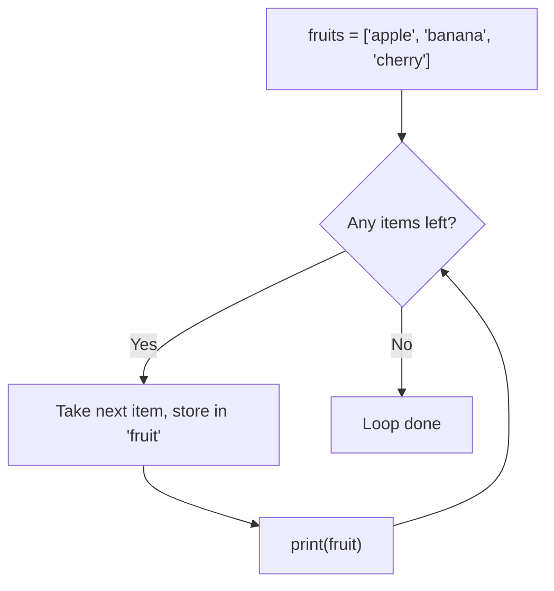
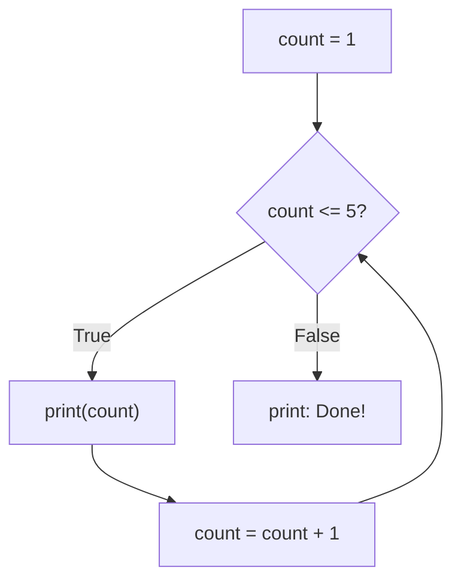
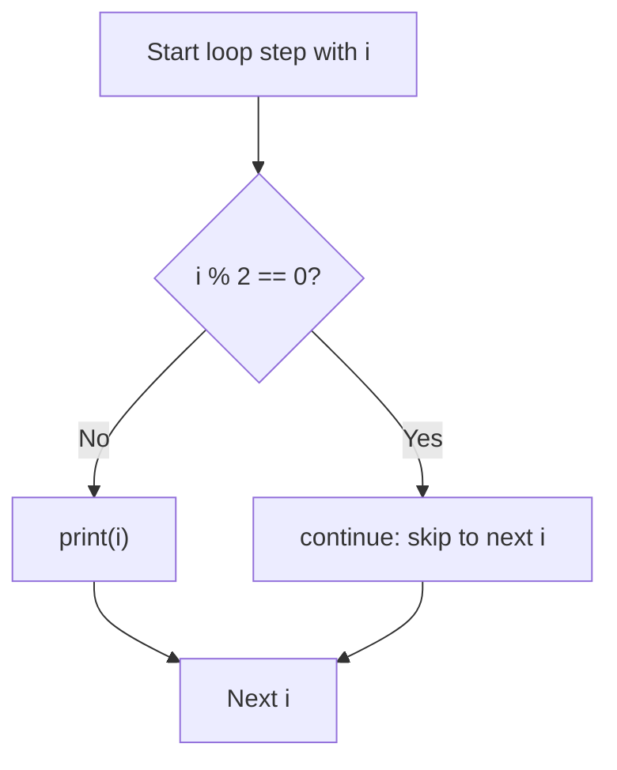
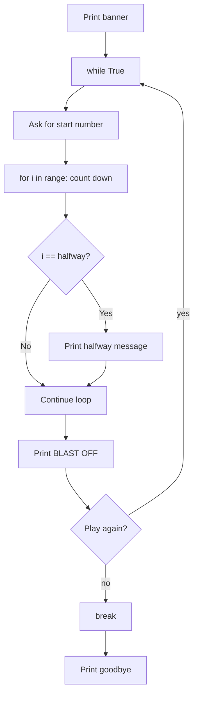

## Day 4 — Loops: Doing Things Many Times

> **Goal:** Use `for` and `while` loops to repeat actions automatically, and control them with `break` and `continue`.

---

### Why do we need loops?

Imagine you need to print every number from 1 to 100. Without loops:

```python
print(1)
print(2)
print(3)
# ... 97 more lines ...
print(100)
```

With a loop:

```python
for i in range(1, 101):
    print(i)
```

Two lines. Same result. Loops are one of the most powerful ideas in all of programming.

> **Analogy:** A loop is like a sports drill. You do the same action over and over until the coach says stop. The loop is the drill; the condition is the coach.

---

### Step 1 — `for` loop: going through a list

Open Python interactive mode:

```bash
python3
```

The `for` loop goes through a collection of items, one at a time:

```python
fruits = ["apple", "banana", "cherry"]

for fruit in fruits:
    print(fruit)
```

**Output:**

```
apple
banana
cherry
```

Python takes each item in `fruits`, puts it in the variable `fruit`, runs the indented block, then moves to the next item.



You can loop over any list:

```python
colours = ["red", "green", "blue"]
for colour in colours:
    print(f"I like {colour}!")
```

> **Naming convention:** the list is usually plural (`fruits`), and the loop variable is singular (`fruit`). This makes the code read naturally: "for each fruit in fruits".

---

### Step 2 — `range()`: looping a set number of times

`range(n)` generates the numbers 0, 1, 2, ... up to but **not including** n.

```python
for i in range(5):
    print(i)
```

**Output:**

```
0
1
2
3
4
```

To start from 1 instead of 0, give `range()` a start and a stop:

```python
for i in range(1, 6):
    print(i)
```

**Output:**

```
1
2
3
4
5
```

To count by 2s (or any step), add a third argument:

```python
for i in range(0, 11, 2):
    print(i)
```

**Output:**

```
0
2
4
6
8
10
```

| `range()` call      | Numbers produced         |
| ------------------- | ------------------------ |
| `range(5)`          | 0, 1, 2, 3, 4            |
| `range(1, 6)`       | 1, 2, 3, 4, 5            |
| `range(0, 10, 2)`   | 0, 2, 4, 6, 8            |
| `range(10, 0, -1)`  | 10, 9, 8, 7, ..., 1      |

---

### Step 3 — `while` loop: repeat until a condition is False

A `while` loop keeps running as long as its condition is True:

```python
count = 1

while count <= 5:
    print(count)
    count = count + 1

print("Done!")
```

**Output:**

```
1
2
3
4
5
Done!
```

Each time around the loop:
1. Python checks `count <= 5`
2. If True, run the indented block
3. The block increases `count` by 1
4. Go back to step 1



> **Warning: infinite loops.** If the condition never becomes False, the loop runs forever and your program freezes. Always make sure something in the loop changes the condition. Press `Ctrl + C` in the terminal to stop a frozen program.

---

### Step 4 — `break`: exit a loop early

`break` stops the loop immediately, even if there are items left:

```python
for i in range(1, 11):
    if i == 6:
        print("Stopping at 6!")
        break
    print(i)
```

**Output:**

```
1
2
3
4
5
Stopping at 6!
```

`break` is especially useful in `while` loops for games:

```python
while True:                          # This would loop forever...
    answer = input("Type 'quit' to stop: ")
    if answer == "quit":
        break                        # ...unless we break out

print("Goodbye!")
```

`while True:` intentionally loops forever — `break` is how you escape it. This pattern is very common for menus and games.

---

### Step 5 — `continue`: skip to the next step

`continue` skips the rest of the current loop step and jumps to the next one:

```python
for i in range(1, 11):
    if i % 2 == 0:    # If the number is even...
        continue       # ...skip printing it
    print(i)
```

**Output:**

```
1
3
5
7
9
```

Only odd numbers are printed because even numbers hit `continue` and never reach `print()`.



---

### Step 6 — Loops and variables together

A common pattern: use a variable to **accumulate** (collect or count up) while looping.

```python
total = 0

for number in [5, 10, 3, 8, 2]:
    total = total + number

print(f"The total is: {total}")     # 28
```

Or count how many items match a condition:

```python
names = ["Sara", "Jordan", "Alex", "Sam", "Mia"]
short_names = 0

for name in names:
    if len(name) <= 3:
        short_names = short_names + 1

print(f"{short_names} names have 3 letters or fewer")    # 2 (Sam, Mia)
```

> 📖 **Read more:** [Python loops — official tutorial](https://docs.python.org/3/tutorial/controlflow.html#for-statements)

---

### Hands-on exercise

**Build the Countdown Blaster** — estimated time: 40–50 minutes.

**Part A — Create the file (2 min)**

In VS Code, in your `~/projects/python/week4` folder, create:

```
countdown.py
```

**Part B — The basic countdown (10 min)**

```python
# countdown.py
# Countdown game with loops

print("=== Rocket Countdown ===")
print()

for i in range(10, 0, -1):
    print(f"{i}...")

print()
print("BLAST OFF! 🚀")
```

Run it:

```bash
python3 countdown.py
```

**Output:**

```
=== Rocket Countdown ===

10...
9...
8...
7...
6...
5...
4...
3...
2...
1...

BLAST OFF! 🚀
```

**Part C — Add suspense with a message at 5 (10 min)**

Update the loop to add a message halfway through:

```python
for i in range(10, 0, -1):
    print(f"{i}...")
    if i == 5:
        print()
        print(">>> HALFWAY THERE! <<<")
        print()
```

**Part D — Ask the user for the starting number (10 min)**

Make the countdown interactive:

```python
print("=== Rocket Countdown ===")
print()

start = int(input("Enter countdown start (try 10): "))

print()
for i in range(start, 0, -1):
    print(f"{i}...")
    if i == start // 2:
        print()
        print(">>> HALFWAY THERE! <<<")
        print()

print()
print("BLAST OFF! 🚀")
print()
print(f"Counted down from {start} — mission complete!")
```

> `//` is integer division (rounds down). `10 // 2` gives `5`. `9 // 2` gives `4`.

**Part E — Play again with a while loop (10 min)**

Wrap the whole game in a `while True:` loop with a `break` to exit:

```python
# countdown.py — full version with play again

print("=== Rocket Countdown ===")

while True:
    print()
    start = int(input("Enter countdown start (try 10): "))

    print()
    for i in range(start, 0, -1):
        print(f"{i}...")
        if i == start // 2:
            print()
            print(">>> HALFWAY THERE! <<<")
            print()

    print()
    print("BLAST OFF! 🚀")
    print()

    again = input("Play again? (yes/no): ").strip().lower()
    if again != "yes":
        break

print()
print("Thanks for playing — see you in orbit!")
```



**Bonus challenges:**

1. Add a `continue` that skips printing the number 7 (it is considered unlucky in the game world):
   ```python
   if i == 7:
       print("(skipping 7 — unlucky number!)")
       continue
   ```
2. Count how many countdowns the player has done and show it at the end.

---

### What you learned today

- `for item in list:` loops over every item in a collection
- `for i in range(n):` loops exactly n times with a counter
- `range(start, stop, step)` lets you control the numbers precisely
- `while condition:` loops as long as the condition stays True
- `while True:` is an intentional infinite loop — use `break` to exit
- `break` exits the loop immediately
- `continue` skips the rest of the current step and moves to the next one
- You can accumulate a total or count by using a variable that changes inside the loop
- Press `Ctrl + C` in the terminal to stop a frozen/infinite loop

---

### Tip and trick for deeper understanding

#### Trick 1: You can loop over a string — it is just a sequence of characters
A string works exactly like a list of individual letters, so a `for` loop moves through it one character at a time. This lets you do things like count how many times a specific letter appears, or print each character on its own line — without any extra setup:

```python
for letter in "Python":
    print(letter)
# prints P, y, t, h, o, n each on their own line

count = 0
for letter in "banana":
    if letter == "a":
        count = count + 1
print(count)   # 3
```

#### Trick 2: `+=` is a shortcut for adding to a variable
Writing `total = total + number` works perfectly, but Python gives you a shorter version: `total += number`. They do exactly the same thing. You will see `+=` in almost every loop that builds up a total or counter, so it is worth getting comfortable with it now:

```python
total = 0
for number in [3, 7, 2, 8]:
    total += number   # same as: total = total + number
print(total)   # 20
```

#### Quick challenge (10 minutes)
1. Loop over your first name and print each letter on its own line using a `for` loop.
2. Use a `for` loop and `+=` to add up all the numbers from 1 to 10 with `range(1, 11)`. Print the total — it should be `55`.
3. Loop over the string `"Hello World"` and use `continue` to skip any spaces. Only letters should appear in the output.

---

### Day 4 tip

> When writing a `while` loop, ask yourself: "what will eventually make this condition False?" If the answer is "nothing", you have an infinite loop. Always make sure the loop has a way out — either the condition becomes False, or you use `break`.
