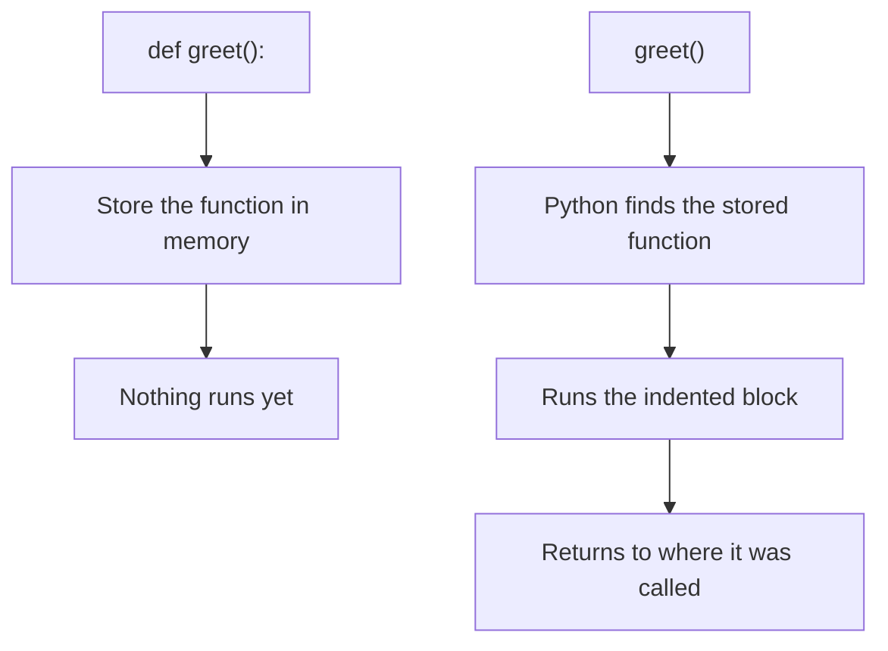
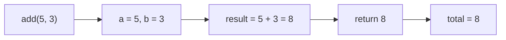
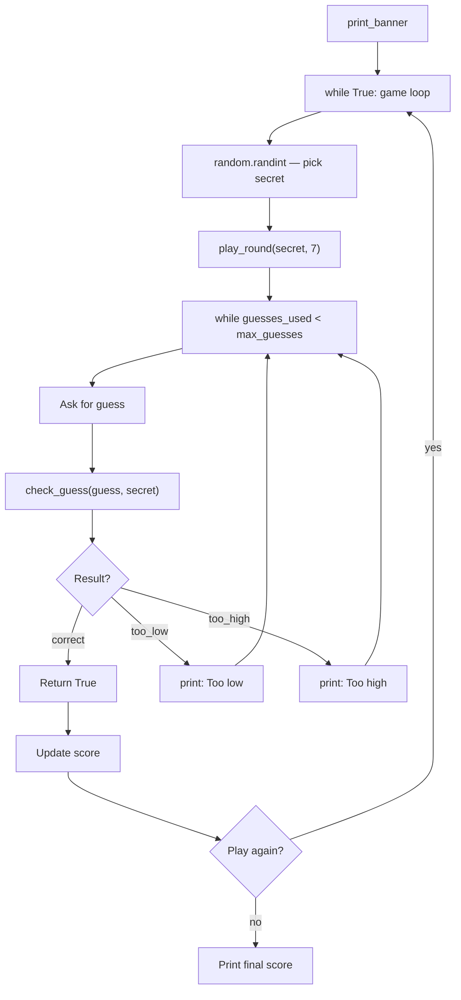

## Day 5 — Functions + Week 4 Review

> **Goal:** Package code into reusable functions, upgrade the guessing game with multiple chances, and prove you know this week's skills from memory.

---

### Why do we need functions?

You have been writing programs that run from top to bottom — one time, one direction. But real programs do things over and over. Without functions, you end up copying the same code everywhere.

> **Analogy:** A function is like a recipe card. Instead of rewriting every recipe step into every meal plan, you write it once on a card and just say "make pancakes" whenever you need them. The instructions are stored once and used many times.

The principle has a famous name: **DRY — Don't Repeat Yourself**. Functions are the main tool for following it.

---

### Step 1 — Defining and calling a function

Open Python interactive mode:

```bash
python3
```

Here is the simplest function:

```python
def greet():
    print("Hello!")
    print("Welcome to Python.")
```

`def` is short for "define". You are defining a new action that Python should know about.

Nothing happens when you define a function. You have to **call** it:

```python
greet()
```

**Output:**

```
Hello!
Welcome to Python.
```

Call it as many times as you like:

```python
greet()
greet()
greet()
```

Three sets of output — one function definition, three uses.



---

### Step 2 — Parameters: giving the function information

A function becomes much more useful when you can **pass information in**. Information you pass is called a **parameter** (or argument):

```python
def greet(name):
    print(f"Hello, {name}!")
    print(f"Great to meet you, {name}.")
```

Now call it with a value:

```python
greet("Sara")
greet("Jordan")
greet("Alex")
```

**Output:**

```
Hello, Sara!
Great to meet you, Sara.
Hello, Jordan!
Great to meet you, Jordan.
Hello, Alex!
Great to meet you, Alex.
```

Three outputs, zero repeated code. The function uses `name` as a placeholder — each call fills in a different value.

Multiple parameters — just separate them with commas:

```python
def introduce(name, age):
    print(f"Hi! I am {name} and I am {age} years old.")

introduce("Sara", 12)
introduce("Jordan", 11)
```

---

### Step 3 — Return values: getting information back out

A function can also **send a result back** to wherever it was called. Use `return`:

```python
def add(a, b):
    result = a + b
    return result
```

Call it and store the result:

```python
total = add(5, 3)
print(total)             # 8
print(add(10, 20))       # 30
```

Without `return`, a function does not give anything back — it just does its thing and finishes.



A more useful example:

```python
def celsius_to_fahrenheit(c):
    return (c * 9 / 5) + 32

boiling = celsius_to_fahrenheit(100)
freezing = celsius_to_fahrenheit(0)
body_temp = celsius_to_fahrenheit(37)

print(f"Boiling: {boiling}°F")       # 212.0°F
print(f"Freezing: {freezing}°F")     # 32.0°F
print(f"Body temp: {body_temp}°F")   # 98.6°F
```

---

### Step 4 — Functions with default parameter values

You can give a parameter a default value. If the caller does not provide one, the default is used:

```python
def greet(name, greeting="Hello"):
    print(f"{greeting}, {name}!")

greet("Sara")                      # Hello, Sara!
greet("Jordan", "Good morning")    # Good morning, Jordan!
greet("Alex", "Hey")               # Hey, Alex!
```

---

### Step 5 — The full picture: define, call, return

Here is a function that brings everything together:

```python
def check_score(score):
    if score >= 90:
        return "A — Excellent!"
    elif score >= 70:
        return "B — Good work!"
    elif score >= 50:
        return "C — Keep practising."
    else:
        return "D — More study needed."

result = check_score(95)
print(result)         # A — Excellent!

result = check_score(72)
print(result)         # B — Good work!
```

Notice: `return` also **exits** the function immediately. As soon as Python hits a `return`, it stops and sends the value back.

> 📖 **Read more:** [Python functions — official tutorial](https://docs.python.org/3/tutorial/controlflow.html#defining-functions)

---

### Hands-on exercise

**Upgrade the Guess the Number game with functions** — estimated time: 45–55 minutes.

Today you will take `guess.py` from Day 3 and completely rebuild it using functions and a loop. The result is a proper multi-round game.

**Part A — Create the new file (2 min)**

In VS Code, in your `~/projects/python/week4` folder, create:

```
guess_v2.py
```

**Part B — Write the helper functions first (20 min)**

Functions should be defined before you use them. Put them at the top of the file:

```python
# guess_v2.py
# Guess the number game — upgraded with functions!

# --- Functions ---

def print_banner():
    print("=" * 30)
    print("   GUESS THE NUMBER GAME")
    print("=" * 30)
    print()

def check_guess(guess, secret):
    """Compare the guess to the secret number and return a message."""
    if guess == secret:
        return "correct"
    elif guess < secret:
        return "too_low"
    else:
        return "too_high"

def play_round(secret, max_guesses):
    """Play one round of the game. Returns True if the player won."""
    guesses_used = 0

    while guesses_used < max_guesses:
        guesses_left = max_guesses - guesses_used
        print(f"Guesses left: {guesses_left}")
        guess = int(input("Enter your guess (1-100): "))
        guesses_used = guesses_used + 1

        result = check_guess(guess, secret)

        if result == "correct":
            print(f"CORRECT! You got it in {guesses_used} guess(es)!")
            return True
        elif result == "too_low":
            print("Too low — try higher!")
        else:
            print("Too high — try lower!")

        print()

    # If we get here, the player used all guesses
    print(f"Out of guesses! The number was {secret}.")
    return False
```

> The text in triple quotes `"""..."""` is a **docstring** — a description of what the function does. It is a comment that lives inside the function. Good habit to write them.

**Part C — Write the main game loop (15 min)**

Below the functions, write the main program that calls them:

```python
# --- Main game ---

import random    # This lets Python pick random numbers

print_banner()

rounds_won = 0
rounds_played = 0

while True:
    secret_number = random.randint(1, 100)   # Pick a random number 1-100
    max_guesses = 7

    print(f"Round {rounds_played + 1}: I am thinking of a number between 1 and 100.")
    print(f"You have {max_guesses} guesses.")
    print()

    won = play_round(secret_number, max_guesses)
    rounds_played = rounds_played + 1
    if won:
        rounds_won = rounds_won + 1

    print()
    print(f"Score: {rounds_won} wins out of {rounds_played} rounds")
    print()

    again = input("Play another round? (yes/no): ").strip().lower()
    if again != "yes":
        break

print()
print("=" * 30)
print(f"  Final score: {rounds_won}/{rounds_played}")
if rounds_played > 0:
    win_rate = rounds_won * 100 // rounds_played
    print(f"  Win rate: {win_rate}%")
print("  Thanks for playing!")
print("=" * 30)
```

**Part D — Run and test (5 min)**

```bash
python3 guess_v2.py
```

**Sample run:**

```
==============================
   GUESS THE NUMBER GAME
==============================

Round 1: I am thinking of a number between 1 and 100.
You have 7 guesses.

Guesses left: 7
Enter your guess (1-100): 50
Too low — try higher!

Guesses left: 6
Enter your guess (1-100): 75
Too high — try lower!

Guesses left: 5
Enter your guess (1-100): 62
CORRECT! You got it in 3 guess(es)!

Score: 1 wins out of 1 rounds

Play another round? (yes/no): no

==============================
  Final score: 1/1
  Win rate: 100%
  Thanks for playing!
==============================
```



**Part E — Challenge extensions (10 min)**

Try adding one or more of these:

1. **Difficulty levels:** ask the player to choose Easy (10 guesses), Medium (7 guesses), or Hard (5 guesses) at the start of each round.

```python
level = input("Difficulty (easy/medium/hard): ").strip().lower()
if level == "easy":
    max_guesses = 10
elif level == "hard":
    max_guesses = 5
else:
    max_guesses = 7
```

2. **Best score tracking:** add a variable `best_guesses` that records the fewest guesses ever used to win a round.

3. **Add a `get_feedback()` function** that takes the difference between guess and secret and returns a string like "ice cold", "warm", "hot", or "on fire!".

---

### Week 4 review checklist

Before moving on to Week 5, make sure you can do all of these without help:

- [ ] Open Python's interactive mode with `python3`
- [ ] Use `print()` to display messages and variables
- [ ] Create variables of type `str`, `int`, `float`, and `bool`
- [ ] Use `input()` to ask the user for information
- [ ] Convert a string to an integer with `int()`
- [ ] Use `len()`, `.upper()`, `.lower()`, `.strip()` on strings
- [ ] Build a message using an f-string
- [ ] Write an `if` / `elif` / `else` block
- [ ] Use `==`, `!=`, `>`, `<`, `>=`, `<=` in conditions
- [ ] Combine conditions with `and`, `or`, `not`
- [ ] Loop over a list with `for item in list:`
- [ ] Use `range()` to loop a set number of times
- [ ] Write a `while` loop with a clear exit condition
- [ ] Use `break` to exit a loop early
- [ ] Use `continue` to skip a loop step
- [ ] Define a function with `def name():`
- [ ] Add parameters to a function
- [ ] Use `return` to send a value back from a function
- [ ] Run a Python file from the terminal with `python3 file.py`

If any box is unchecked — go back to that day's section and redo the hands-on exercise.

---

### Week 4 reflection

Create a reflection file:

```bash
touch ~/projects/python/week4/reflection.md
code ~/projects/python/week4/reflection.md
```

Write:

```markdown
# Week 4 reflection

## What I found easy

-

## What was tricky

-

## The concept that clicked the most

-

## One program I am proud of

-

## Questions I still have

-
```

Fill it in honestly. There are no wrong answers.

---

### What you learned today

- `def function_name():` defines a function — it stores the code but does not run it yet
- `function_name()` calls a function — this is when the code actually runs
- Parameters let you pass information into a function (values go in the brackets when calling)
- `return` sends a value back out of a function and exits it immediately
- Default parameter values let you call a function with fewer arguments
- Docstrings (`"""description"""`) describe what a function does — good habit
- `import random` and `random.randint(1, 100)` pick a random whole number
- The DRY principle — Don't Repeat Yourself — is why functions exist
- Functions can call other functions, building up complex behaviour from simple pieces
- Breaking a program into functions makes it easier to read, test, and fix

---

### Tip and trick for deeper understanding

#### Trick 1: `return` exits the function immediately — use it for early escape
The moment Python hits a `return` statement it stops the function and sends back the value, even if there are more lines below. This means you can put multiple `return` statements inside an `if`/`elif`/`else` block and let the function bail out as soon as it finds the right answer — no extra variables needed:

```python
def is_passing(score):
    if score >= 50:
        return "Pass"
    return "Fail"   # only reached when score < 50

print(is_passing(72))   # Pass
print(is_passing(30))   # Fail
```

#### Trick 2: You can use a function's return value directly — no middle variable needed
Instead of storing the result in a variable first and then printing it, you can pass the function call straight to `print()` or slot it inside an f-string. This makes short, one-off calculations much tidier and trains you to think of functions as values:

```python
def double(n):
    return n * 2

print(double(5))                      # 10
print(f"Double 7 is {double(7)}")     # Double 7 is 14
print(double(double(3)))              # 12  (nest one call inside another)
```

#### Quick challenge (10 minutes)
1. Write a function `square(n)` that returns `n * n`. Call it three times inside `print()` with the values `3`, `5`, and `10` — without storing any result in a variable first.
2. Write a function `is_even(n)` that returns `True` if `n` is even and `False` if not. Test it with `print(is_even(4))` and `print(is_even(7))`.
3. Use an f-string and your `square()` function together in one line: `print(f"5 squared is {square(5)}")`.

---

### Day 5 tip

> Functions are the single biggest leap you make this week. If everything else feels solid but functions still feel fuzzy — that is normal. Go back and write three tiny functions from scratch: one that prints, one that calculates something, one that returns a string based on an if/else. Muscle memory builds fast.
