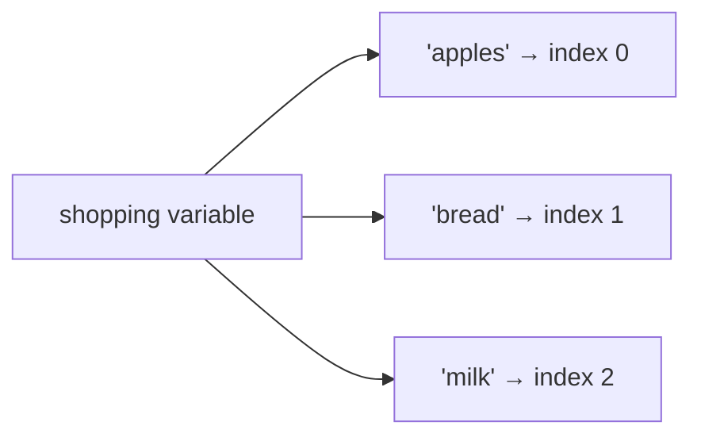
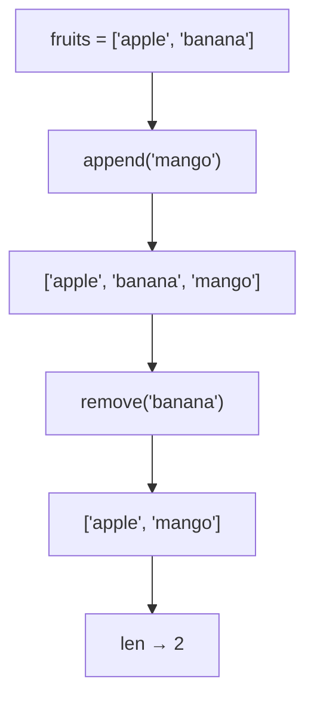

## Day 1 — Lists: Keeping Things in Order

> **Goal:** Create and use Python lists to store multiple values, loop over them, and build an interactive to-do list program.

---

### What is a list?

Imagine a shopping list on paper:

```
1. apples
2. bread
3. milk
```

A Python **list** is exactly that — a collection of items stored in one variable, kept in order.

```python
shopping = ["apples", "bread", "milk"]
```

One variable, three items. That's it.

Lists can hold **any type of data** — text, numbers, or even a mix:

```python
scores = [10, 25, 8, 42]
mixed  = ["Alice", 14, True]
```



---

### Creating a list

```python
fruits = ["apple", "banana", "cherry"]
print(fruits)
```

Output:

```
['apple', 'banana', 'cherry']
```

An empty list you can fill later:

```python
tasks = []
```

---

### Getting one item — indexing

Every item has a **position number** called an **index**. Python starts counting at **0**, not 1.

```python
fruits = ["apple", "banana", "cherry"]

print(fruits[0])   # apple
print(fruits[1])   # banana
print(fruits[2])   # cherry
```

> Think of the index like seat numbers in a cinema that starts at row 0.

You can also count from the **end** using negative numbers:

```python
print(fruits[-1])  # cherry  — the last item
print(fruits[-2])  # banana  — second from last
```

Trying to use an index that doesn't exist gives an error:

```python
print(fruits[5])   # IndexError: list index out of range
```

---

### Adding and removing items

#### `append` — add to the end

```python
fruits = ["apple", "banana"]
fruits.append("mango")
print(fruits)   # ['apple', 'banana', 'mango']
```

#### `remove` — delete a specific item

```python
fruits.remove("banana")
print(fruits)   # ['apple', 'mango']
```

> `remove` deletes the **first** match it finds.

#### `len` — count the items

```python
print(len(fruits))   # 2
```



---

### Looping over a list

A `for` loop visits every item one by one. You don't have to write the index yourself.

```python
fruits = ["apple", "banana", "mango"]

for fruit in fruits:
    print(fruit)
```

Output:

```
apple
banana
mango
```

Number each item using `range` and `len`:

```python
tasks = ["study Python", "walk the dog", "read a book"]

for i in range(len(tasks)):
    print(i + 1, "-", tasks[i])
```

Output:

```
1 - study Python
2 - walk the dog
3 - read a book
```

---

### Useful list operations at a glance

| Operation                | Example                    | What it does                          |
| ------------------------ | -------------------------- | ------------------------------------- |
| `append(item)`           | `tasks.append("sleep")`    | Add item to end                       |
| `remove(item)`           | `tasks.remove("sleep")`    | Remove first match                    |
| `pop(index)`             | `tasks.pop(0)`             | Remove item at index and return it    |
| `len(list)`              | `len(tasks)`               | Count items                           |
| `list[i]`                | `tasks[0]`                 | Get item at index i                   |
| `list[-1]`               | `tasks[-1]`                | Get last item                         |
| `for x in list:`         | `for t in tasks:`          | Loop every item                       |
| `"thing" in list`        | `"sleep" in tasks`         | Check if item exists (True/False)     |

---

### Hands-on exercise

**Build a to-do list program** — about 45 min.

This program will let the user add tasks, view them, and remove them. Save the file as `~/projects/week5/todo.py`.

First, open the terminal and set up your folder:

```bash
mkdir -p ~/projects/week5
cd ~/projects/week5
code .
```

VS Code opens. Create a new file called `todo.py`.

#### Step 1 — Start with an empty list and a welcome message

```python
# todo.py

tasks = []

print("=== My To-Do List ===")
print("Commands: add  |  view  |  remove  |  quit")
print()
```

Run it now to confirm it prints without errors:

```bash
python3 todo.py
```

#### Step 2 — Add a loop that keeps running until the user types "quit"

```python
while True:
    command = input("What do you want to do? ").strip().lower()

    if command == "quit":
        print("Goodbye! Come back to your tasks soon.")
        break
```

#### Step 3 — Handle "view"

Add this inside the `while True` loop, after the `quit` block:

```python
    elif command == "view":
        if len(tasks) == 0:
            print("Your list is empty. Add something!")
        else:
            print("\nYour tasks:")
            for i in range(len(tasks)):
                print(f"  {i + 1}. {tasks[i]}")
            print()
```

#### Step 4 — Handle "add"

```python
    elif command == "add":
        new_task = input("Type your new task: ").strip()
        if new_task:
            tasks.append(new_task)
            print(f"Added: '{new_task}'")
        else:
            print("No task entered — try again.")
```

#### Step 5 — Handle "remove"

```python
    elif command == "remove":
        if len(tasks) == 0:
            print("Nothing to remove!")
        else:
            print("\nYour tasks:")
            for i in range(len(tasks)):
                print(f"  {i + 1}. {tasks[i]}")
            choice = input("Enter the number to remove: ").strip()
            if choice.isdigit():
                index = int(choice) - 1
                if 0 <= index < len(tasks):
                    removed = tasks.pop(index)
                    print(f"Removed: '{removed}'")
                else:
                    print("That number is not on the list.")
            else:
                print("Please enter a number.")

    else:
        print("Unknown command. Try: add, view, remove, quit")
```

#### Step 6 — Run the complete program

```bash
python3 todo.py
```

Try this sequence to test everything:
- Type `add`, then enter "finish Python homework"
- Type `add`, then enter "tidy room"
- Type `view` — you should see both tasks numbered
- Type `remove`, then enter `1` — "finish Python homework" disappears
- Type `view` again — only "tidy room" remains
- Type `quit`

#### Complete program (all steps together)

```python
# todo.py

tasks = []

print("=== My To-Do List ===")
print("Commands: add  |  view  |  remove  |  quit")
print()

while True:
    command = input("What do you want to do? ").strip().lower()

    if command == "quit":
        print("Goodbye! Come back to your tasks soon.")
        break

    elif command == "view":
        if len(tasks) == 0:
            print("Your list is empty. Add something!")
        else:
            print("\nYour tasks:")
            for i in range(len(tasks)):
                print(f"  {i + 1}. {tasks[i]}")
            print()

    elif command == "add":
        new_task = input("Type your new task: ").strip()
        if new_task:
            tasks.append(new_task)
            print(f"Added: '{new_task}'")
        else:
            print("No task entered — try again.")

    elif command == "remove":
        if len(tasks) == 0:
            print("Nothing to remove!")
        else:
            print("\nYour tasks:")
            for i in range(len(tasks)):
                print(f"  {i + 1}. {tasks[i]}")
            choice = input("Enter the number to remove: ").strip()
            if choice.isdigit():
                index = int(choice) - 1
                if 0 <= index < len(tasks):
                    removed = tasks.pop(index)
                    print(f"Removed: '{removed}'")
                else:
                    print("That number is not on the list.")
            else:
                print("Please enter a number.")

    else:
        print("Unknown command. Try: add, view, remove, quit")
```

> **Bonus challenge:** Add a command called `"clear"` that removes every task at once. Hint: `tasks = []` resets the list.

---

### What you learned today

- A list stores multiple values in one variable, in order
- Indexes start at 0 — `list[0]` is the first item
- `append` adds to the end, `remove` deletes a match, `pop` removes by index, `len` counts items
- A `for` loop visits every item automatically
- You can build an interactive program using just a list, a `while True` loop, and `if/elif` blocks

---

### Tip and trick for deeper understanding

#### Trick 1: Check membership with `in` instead of looping
When you want to know if something is already on your list, you don't need to write a for loop — Python has a shortcut. The `in` keyword scans the whole list in one go and gives you `True` or `False`, which you can use straight inside an `if` statement.

```python
fruits = ["apple", "banana", "mango"]

if "banana" in fruits:
    print("Yes, banana is there!")

if "grape" not in fruits:
    print("No grape — maybe add it?")
```

This is faster to write and easier to read than looping through every item yourself. You already used it in the to-do program (`if choice.isdigit()`), so the pattern feels natural.

#### Trick 2: Sort your list with one word
Python lists have a built-in `.sort()` method that rearranges items in alphabetical or numerical order right inside the same list — no new variable needed. To sort backwards (Z to A, biggest to smallest), pass `reverse=True`.

```python
tasks = ["walk dog", "study Python", "eat breakfast"]
tasks.sort()
print(tasks)
# ['eat breakfast', 'study Python', 'walk dog']

numbers = [5, 1, 9, 3]
numbers.sort(reverse=True)
print(numbers)
# [9, 5, 3, 1]
```

This is great for displaying a to-do list or leaderboard in a tidy order without writing any extra loop logic.

#### Quick challenge (10 minutes)

```python
# 1. Create this list
colours = ["red", "blue", "green", "yellow", "purple"]

# 2. Use `in` to check if "blue" is in the list and print a message
# 3. Sort the list and print it
# 4. Use a negative index to print the last colour in the sorted list
#    without writing len() — try colours[-1]
```

---

### Day 1 tip

> Indexes starting at 0 trips everyone up at first. A handy trick: read `tasks[0]` as "the item at offset 0 from the start". After a day or two it becomes completely natural.
