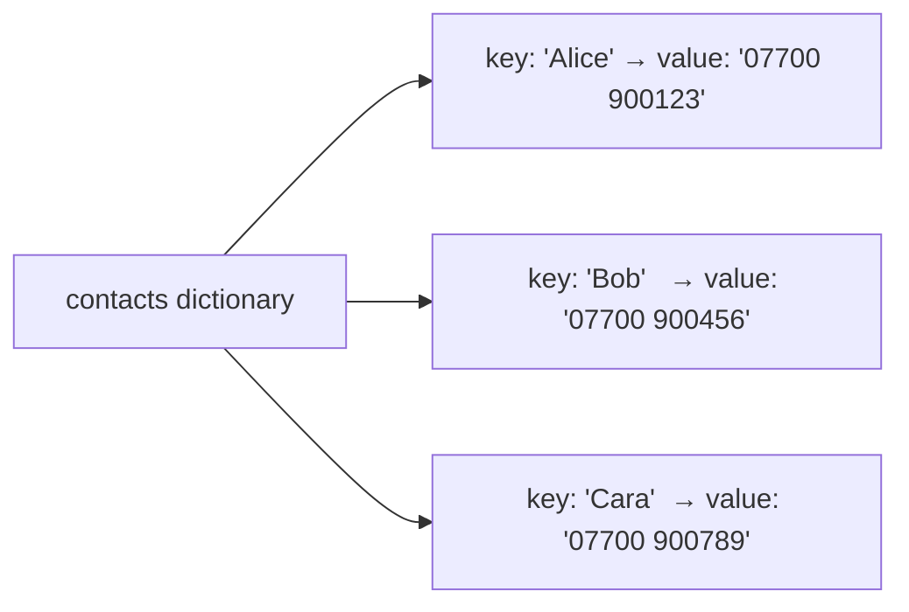
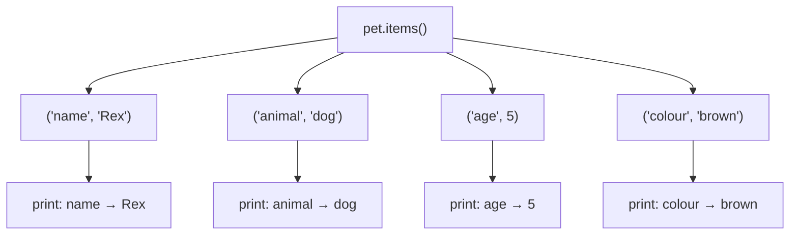

## Day 2 — Dictionaries: Look Things Up Fast

> **Goal:** Create and use Python dictionaries to pair names with values, and build a pet fact book that users can look up by name.

---

### What is a dictionary?

Think of a **contact book**. You look up a person by their name and find their phone number.

```
Alice  →  07700 900123
Bob    →  07700 900456
Cara   →  07700 900789
```

A Python **dictionary** works the same way. You give it a **key** (like a name) and it instantly gives you the matching **value** (like a phone number).

```python
contacts = {
    "Alice": "07700 900123",
    "Bob":   "07700 900456",
    "Cara":  "07700 900789",
}

print(contacts["Alice"])   # 07700 900123
```



---

### Creating a dictionary

Use curly braces `{}` with `key: value` pairs, separated by commas.

```python
pet = {
    "name":   "Rex",
    "animal": "dog",
    "age":    4,
}

print(pet)
```

Output:

```
{'name': 'Rex', 'animal': 'dog', 'age': 4}
```

Keys are usually strings. Values can be anything — strings, numbers, lists, even other dictionaries.

---

### Getting a value by key

```python
pet = {"name": "Rex", "animal": "dog", "age": 4}

print(pet["name"])    # Rex
print(pet["age"])     # 4
```

If you ask for a key that doesn't exist, Python raises a `KeyError`:

```python
print(pet["colour"])  # KeyError: 'colour'
```

Use `.get()` to avoid that — it returns `None` (or a default you choose) instead of crashing:

```python
print(pet.get("colour"))           # None
print(pet.get("colour", "unknown"))  # unknown
```

---

### Adding and updating a key

```python
pet["colour"] = "brown"   # adds a new key
pet["age"]    = 5          # updates an existing key

print(pet)
# {'name': 'Rex', 'animal': 'dog', 'age': 5, 'colour': 'brown'}
```

---

### Checking if a key exists

```python
if "name" in pet:
    print("We know the name!")

if "breed" not in pet:
    print("Breed is not recorded.")
```

---

### Looping over a dictionary

#### Loop over keys only

```python
for key in pet:
    print(key)
```

Output:

```
name
animal
age
colour
```

#### Loop over key–value pairs with `.items()`

```python
for key, value in pet.items():
    print(key, "→", value)
```

Output:

```
name → Rex
animal → dog
age → 5
colour → brown
```



---

### Lists inside dictionaries

Values can be lists — great for storing multiple facts about one thing.

```python
cat = {
    "name":  "Mochi",
    "facts": ["can sleep 16 hours a day", "purrs at 25 Hz", "has 32 muscles in each ear"],
}

for fact in cat["facts"]:
    print("-", fact)
```

Output:

```
- can sleep 16 hours a day
- purrs at 25 Hz
- has 32 muscles in each ear
```

---

### Dictionary operations at a glance

| Operation                 | Example                           | What it does                          |
| ------------------------- | --------------------------------- | ------------------------------------- |
| `dict[key]`               | `pet["name"]`                     | Get value (error if missing)          |
| `dict.get(key)`           | `pet.get("breed")`                | Get value safely (None if missing)    |
| `dict.get(key, default)`  | `pet.get("breed", "unknown")`     | Get value or return a default         |
| `dict[key] = value`       | `pet["colour"] = "brown"`         | Add or update a key                   |
| `key in dict`             | `"name" in pet`                   | Check if key exists                   |
| `for k in dict:`          | `for k in pet:`                   | Loop over keys                        |
| `for k, v in dict.items():` | `for k, v in pet.items():`      | Loop over key–value pairs             |
| `len(dict)`               | `len(pet)`                        | Count keys                            |

---

### Hands-on exercise

**Build a pet fact book** — about 45 min.

You'll store facts about three animals in a dictionary, then let the user look up any animal by name. Save the file as `~/projects/week5/pet_facts.py`.

Open the terminal:

```bash
cd ~/projects/week5
code .
```

Create a new file called `pet_facts.py`.

#### Step 1 — Build the fact book as a dictionary of dictionaries

```python
# pet_facts.py

fact_book = {
    "dog": {
        "scientific_name": "Canis lupus familiaris",
        "lifespan":        "10–13 years",
        "fun_facts": [
            "Dogs can smell about 100,000 times better than humans.",
            "A dog's nose print is unique, like a human fingerprint.",
            "Dogs dream just like humans do.",
        ],
    },
    "cat": {
        "scientific_name": "Felis catus",
        "lifespan":        "12–18 years",
        "fun_facts": [
            "Cats can rotate their ears 180 degrees.",
            "A group of cats is called a clowder.",
            "Cats spend about 70% of their lives sleeping.",
        ],
    },
    "penguin": {
        "scientific_name": "Spheniscidae",
        "lifespan":        "15–20 years",
        "fun_facts": [
            "Penguins propose to their mates with a pebble.",
            "Penguins can swim at up to 25 km/h.",
            "Emperor penguins can hold their breath for 20 minutes.",
        ],
    },
}
```

#### Step 2 — Show the available animals

```python
print("=== Pet Fact Book ===")
print("Animals I know about:")
for animal in fact_book:
    print(f"  - {animal}")
print()
```

Run it now to see the list printed:

```bash
python3 pet_facts.py
```

#### Step 3 — Let the user look up an animal

```python
while True:
    query = input("Look up an animal (or type 'quit'): ").strip().lower()

    if query == "quit":
        print("Thanks for using the Fact Book!")
        break

    elif query in fact_book:
        info = fact_book[query]
        print(f"\n--- {query.capitalize()} ---")
        print(f"Scientific name: {info['scientific_name']}")
        print(f"Lifespan:        {info['lifespan']}")
        print("Fun facts:")
        for fact in info["fun_facts"]:
            print(f"  * {fact}")
        print()

    else:
        print(f"Sorry, I don't have facts about '{query}' yet.")
        print("Try: dog, cat, or penguin\n")
```

#### Step 4 — Run the complete program

```bash
python3 pet_facts.py
```

Try looking up `dog`, then `penguin`, then a made-up animal like `dragon`, then `quit`.

#### Complete program (all steps together)

```python
# pet_facts.py

fact_book = {
    "dog": {
        "scientific_name": "Canis lupus familiaris",
        "lifespan":        "10–13 years",
        "fun_facts": [
            "Dogs can smell about 100,000 times better than humans.",
            "A dog's nose print is unique, like a human fingerprint.",
            "Dogs dream just like humans do.",
        ],
    },
    "cat": {
        "scientific_name": "Felis catus",
        "lifespan":        "12–18 years",
        "fun_facts": [
            "Cats can rotate their ears 180 degrees.",
            "A group of cats is called a clowder.",
            "Cats spend about 70% of their lives sleeping.",
        ],
    },
    "penguin": {
        "scientific_name": "Spheniscidae",
        "lifespan":        "15–20 years",
        "fun_facts": [
            "Penguins propose to their mates with a pebble.",
            "Penguins can swim at up to 25 km/h.",
            "Emperor penguins can hold their breath for 20 minutes.",
        ],
    },
}

print("=== Pet Fact Book ===")
print("Animals I know about:")
for animal in fact_book:
    print(f"  - {animal}")
print()

while True:
    query = input("Look up an animal (or type 'quit'): ").strip().lower()

    if query == "quit":
        print("Thanks for using the Fact Book!")
        break

    elif query in fact_book:
        info = fact_book[query]
        print(f"\n--- {query.capitalize()} ---")
        print(f"Scientific name: {info['scientific_name']}")
        print(f"Lifespan:        {info['lifespan']}")
        print("Fun facts:")
        for fact in info["fun_facts"]:
            print(f"  * {fact}")
        print()

    else:
        print(f"Sorry, I don't have facts about '{query}' yet.")
        print("Try: dog, cat, or penguin\n")
```

> **Bonus challenge:** Add a fourth animal of your choice. Pick any animal, look up two or three real facts about it, and add it to `fact_book` using the same structure.

---

### What you learned today

- A dictionary stores key–value pairs — you look up a value by giving its key
- Keys are usually strings; values can be anything, including lists or other dictionaries
- Use `dict[key]` to get a value, or `dict.get(key)` to get `None` instead of an error
- `dict[key] = value` adds a new key or updates an existing one
- Loop over a dictionary with `for key in dict:` or `for key, value in dict.items():`
- Dictionaries inside dictionaries let you organise rich information neatly

---

### Tip and trick for deeper understanding

#### Trick 1: Use `.get()` to count things without crashing
A really common dictionary trick is using it as a **counter** — tallying how many times each item appears in a list. The `.get(key, 0)` pattern is perfect for this: it returns the current count, or `0` if the key has never been seen yet, so you never get a `KeyError`.

```python
votes = ["cat", "dog", "cat", "cat", "dog", "fish"]

tally = {}
for animal in votes:
    tally[animal] = tally.get(animal, 0) + 1

print(tally)
# {'cat': 3, 'dog': 2, 'fish': 1}
```

This pattern shows up everywhere — counting words in a story, tracking game scores, tallying survey answers. One dictionary replaces what would otherwise take ten lines of code.

#### Trick 2: Replace long if/elif chains with a dictionary lookup
If you have lots of `if/elif` blocks that map one value to another, a dictionary does the same job more cleanly. You store all the mappings once, then look up the answer in one line instead of running through every condition.

```python
# The long way:
day = "Monday"
if day == "Monday":
    print("Math class")
elif day == "Tuesday":
    print("Science class")
elif day == "Wednesday":
    print("Art class")

# The dictionary way — same result, much shorter:
schedule = {
    "Monday":    "Math class",
    "Tuesday":   "Science class",
    "Wednesday": "Art class",
}
print(schedule.get(day, "No class today"))
```

Using `.get()` here also handles unknown days gracefully without an `else` clause.

#### Quick challenge (10 minutes)

```python
# 1. Create a list of five favourite foods — repeat at least one
foods = ["pizza", "sushi", "pizza", "tacos", "sushi", "pizza"]

# 2. Use the counting trick above to tally how many times each appears
# 3. Print the results using a for loop with .items()
#    so the output looks like:  pizza → 3
```

---

### Day 2 tip

> Whenever you find yourself making lots of separate variables that belong together — like `dog_name`, `dog_age`, `dog_colour` — that's a sign you want a dictionary instead. One variable, all the facts.
