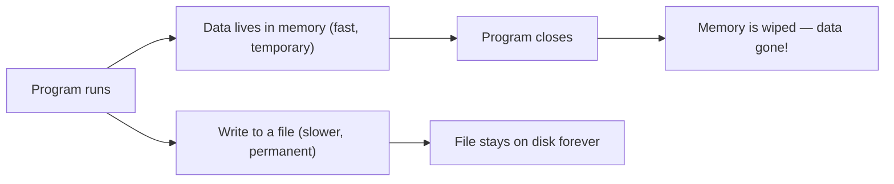
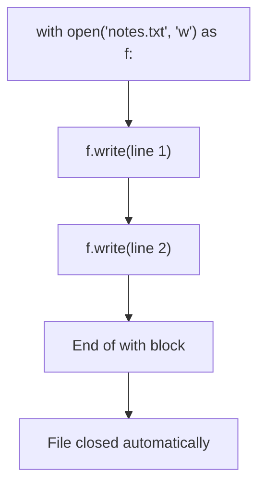
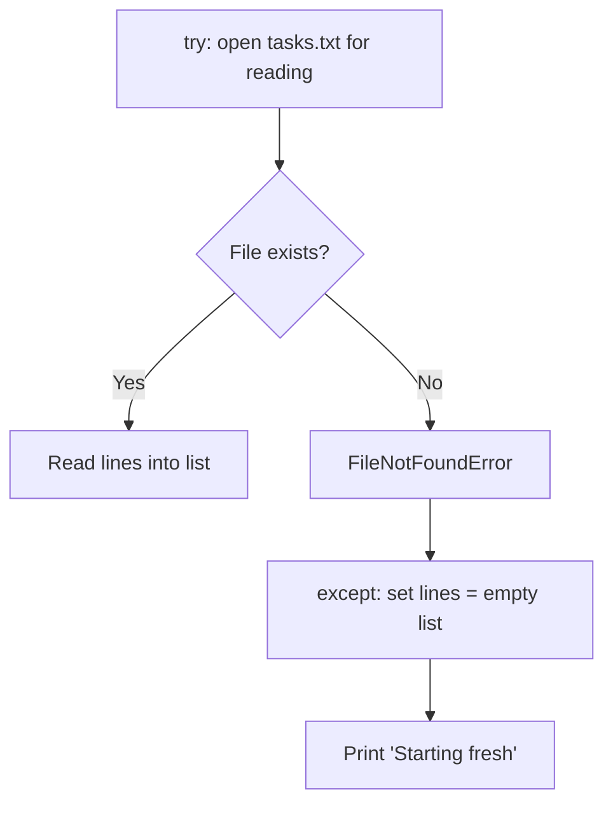

## Day 3 — Files: Save Data That Sticks

> **Goal:** Read from and write to text files so your program's data survives when you close the terminal.

---

### Why do we need files?

Yesterday's to-do list program had a problem. Every time you closed it, all your tasks were gone. That's because the list only lived in **memory** (RAM) — and memory is wiped when a program stops.

A **file** lives on your hard drive. It stays there when the program is closed, when the computer restarts, and even when you unplug everything. Saving to a file means your data **persists**.



---

### Opening a file — the `open` function

Python's built-in `open()` function connects your program to a file on disk.

```python
f = open("notes.txt", "w")   # open for writing
f.write("Hello, file!\n")
f.close()                     # always close when done
```

The second argument to `open` is the **mode**:

| Mode | What it does                                     |
| ---- | ------------------------------------------------ |
| `"r"` | Read (default). File must exist.               |
| `"w"` | Write. Creates the file if missing. Overwrites if it exists. |
| `"a"` | Append. Adds to the end without deleting what's there. |

---

### The `with` statement — the safe way to open files

Using `with` automatically closes the file for you, even if an error happens inside. Always prefer this.

```python
with open("notes.txt", "w") as f:
    f.write("Hello, file!\n")
    f.write("Second line.\n")
# File is closed automatically here
```



---

### Writing to a file

```python
with open("shopping.txt", "w") as f:
    f.write("apples\n")
    f.write("bread\n")
    f.write("milk\n")
```

Check the file was created:

```bash
cat ~/projects/week5/shopping.txt
```

Output:

```
apples
bread
milk
```

> `\n` is a newline character — it moves to the next line in the file. Without it, all text runs together.

---

### Reading a file

#### Read the whole file at once

```python
with open("shopping.txt", "r") as f:
    contents = f.read()

print(contents)
```

#### Read line by line — the cleanest way for most programs

```python
with open("shopping.txt", "r") as f:
    for line in f:
        print(line.strip())   # .strip() removes the newline at the end
```

Output:

```
apples
bread
milk
```

> `.strip()` is important. Without it, each line already has a `\n` at the end, so `print` adds another — you get a blank line between every item.

#### Read all lines into a list

```python
with open("shopping.txt", "r") as f:
    lines = f.readlines()

print(lines)
# ['apples\n', 'bread\n', 'milk\n']
```

Use a list comprehension to strip the newlines:

```python
with open("shopping.txt", "r") as f:
    lines = [line.strip() for line in f]

print(lines)
# ['apples', 'bread', 'milk']
```

---

### Appending to a file

Mode `"w"` **overwrites** the file every time. Use `"a"` to **add** to the end instead.

```python
with open("shopping.txt", "a") as f:
    f.write("butter\n")
```

The file now has four lines. The first three are still there.

---

### Handling a missing file

If you try to open a file in read mode and it doesn't exist, Python raises a `FileNotFoundError`. Use a `try/except` to handle it gracefully.

```python
try:
    with open("tasks.txt", "r") as f:
        lines = [line.strip() for line in f]
except FileNotFoundError:
    lines = []
    print("No saved tasks found. Starting fresh.")
```



---

### Hands-on exercise

**Upgrade the to-do list to save and load from a file** — about 50 min.

You'll update `todo.py` from Day 1 so tasks are saved to `tasks.txt` every time you add or remove one, and loaded back when the program starts.

Open the terminal:

```bash
cd ~/projects/week5
code .
```

Open `todo.py`. You're going to change it step by step.

#### Step 1 — Load tasks from the file at startup

Replace the line `tasks = []` at the top with a `load_tasks` function:

```python
# todo.py  — with file saving

FILENAME = "tasks.txt"

def load_tasks():
    """Read tasks from file. Return empty list if file doesn't exist."""
    try:
        with open(FILENAME, "r") as f:
            return [line.strip() for line in f if line.strip()]
    except FileNotFoundError:
        return []

def save_tasks(tasks):
    """Write all tasks to the file, one per line."""
    with open(FILENAME, "w") as f:
        for task in tasks:
            f.write(task + "\n")
```

> Notice `if line.strip()` in the list comprehension — this skips any blank lines in the file.

#### Step 2 — Load tasks when the program starts

```python
tasks = load_tasks()

print("=== My To-Do List ===")
print("Commands: add  |  view  |  remove  |  quit")
if tasks:
    print(f"Loaded {len(tasks)} saved task(s).")
print()
```

#### Step 3 — Call `save_tasks` after every change

In the `"add"` block, after `tasks.append(new_task)`:

```python
            tasks.append(new_task)
            save_tasks(tasks)
            print(f"Added and saved: '{new_task}'")
```

In the `"remove"` block, after `tasks.pop(index)`:

```python
                    removed = tasks.pop(index)
                    save_tasks(tasks)
                    print(f"Removed and saved: '{removed}'")
```

#### Step 4 — Run and test persistence

```bash
python3 todo.py
```

Add two tasks, then type `quit`. Now run the program again:

```bash
python3 todo.py
```

Your tasks are back! Type `view` to confirm they loaded.

#### Complete updated program

```python
# todo.py  — with file saving

FILENAME = "tasks.txt"


def load_tasks():
    """Read tasks from file. Return empty list if file doesn't exist."""
    try:
        with open(FILENAME, "r") as f:
            return [line.strip() for line in f if line.strip()]
    except FileNotFoundError:
        return []


def save_tasks(tasks):
    """Write all tasks to the file, one per line."""
    with open(FILENAME, "w") as f:
        for task in tasks:
            f.write(task + "\n")


tasks = load_tasks()

print("=== My To-Do List ===")
print("Commands: add  |  view  |  remove  |  quit")
if tasks:
    print(f"Loaded {len(tasks)} saved task(s).")
print()

while True:
    command = input("What do you want to do? ").strip().lower()

    if command == "quit":
        print("Goodbye! Your tasks are saved.")
        break

    elif command == "view":
        if len(tasks) == 0:
            print("Your list is empty. Add something!")
        else:
            print("\nYour tasks:")
            for i in range(len(tasks)):
                print(f"  {i + 1}. {tasks[i]}")
            print()

    elif command == "add":
        new_task = input("Type your new task: ").strip()
        if new_task:
            tasks.append(new_task)
            save_tasks(tasks)
            print(f"Added and saved: '{new_task}'")
        else:
            print("No task entered — try again.")

    elif command == "remove":
        if len(tasks) == 0:
            print("Nothing to remove!")
        else:
            print("\nYour tasks:")
            for i in range(len(tasks)):
                print(f"  {i + 1}. {tasks[i]}")
            choice = input("Enter the number to remove: ").strip()
            if choice.isdigit():
                index = int(choice) - 1
                if 0 <= index < len(tasks):
                    removed = tasks.pop(index)
                    save_tasks(tasks)
                    print(f"Removed and saved: '{removed}'")
                else:
                    print("That number is not on the list.")
            else:
                print("Please enter a number.")

    else:
        print("Unknown command. Try: add, view, remove, quit")
```

#### Step 5 — Check the saved file directly

```bash
cat ~/projects/week5/tasks.txt
```

You'll see your tasks stored as plain text, one per line. Any text editor — or any program — can read this file.

> **Bonus challenge:** Open `tasks.txt` in VS Code and manually add a task by typing it directly in the file. Then run `todo.py` — does it load the manually added task?

---

### What you learned today

- Files save data permanently; memory is wiped when a program closes
- `open(filename, mode)` connects your code to a file; always use `with` so the file closes safely
- Mode `"w"` writes (overwrites), `"a"` appends, `"r"` reads
- Loop over a file with `for line in f:` and use `.strip()` to remove newlines
- `try/except FileNotFoundError` handles missing files gracefully
- Functions make file logic reusable — `load_tasks()` and `save_tasks()` can be called anywhere

---

### Tip and trick for deeper understanding

#### Trick 1: `repr()` reveals hidden characters in your strings
`.strip()` removes whitespace from both ends — spaces, tabs, and `\n` all at once. But how do you know whether a string still has hidden junk in it? Use `repr()` to see the string exactly as Python stores it, with special characters shown.

```python
messy = "   hello world   \n"
clean = messy.strip()

print(clean)         # hello world
print(repr(clean))   # 'hello world'   ← no extra spaces or \n
print(repr(messy))   # '   hello world   \n'  ← now you can see the problem
```

Whenever a file comparison or if-check isn't working the way you expect, wrap the string in `repr()` and print it — nine times out of ten there's a hidden newline or space causing the issue.

#### Trick 2: Save a list of strings to a file in one step with `join`
Instead of writing a for loop to write each task on its own line, you can convert the whole list into one big string in a single line using `"\n".join(list)`.

```python
tasks = ["study Python", "walk the dog", "read a book"]

with open("tasks.txt", "w") as f:
    f.write("\n".join(tasks) + "\n")
```

`"\n".join(tasks)` puts a newline between every item. This is the compact, professional way to save a list. To load it back, `f.read().splitlines()` does the reverse — splits on newlines and gives you a clean list with no `.strip()` loop needed.

```python
with open("tasks.txt", "r") as f:
    tasks = f.read().splitlines()   # no \n on any item
```

#### Quick challenge (10 minutes)

```python
# 1. Create a file called greetings.txt and write three names to it,
#    one per line, using "\n".join()
names = ["Alice", "Bob", "Cara"]

# 2. Read it back with splitlines() and print each name with a greeting
#    so the output looks like:  Hello, Alice!

# 3. Append a fourth name using mode "a", then read and print all four
```

---

### Day 3 tip

> When you write to a file in mode `"w"`, it deletes everything already in the file before writing. That's why `save_tasks` rewrites the whole list every time. For a to-do list this is fine. For a log file you'd use `"a"` (append) instead so old entries are never lost.
