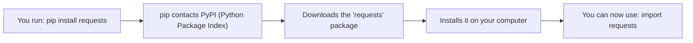
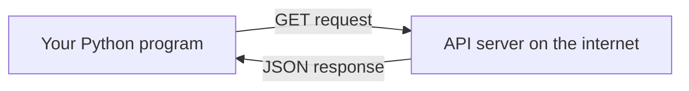
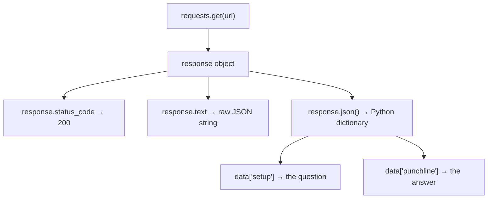

## Day 4 — pip and APIs: Reach the Internet

> **Goal:** Install a Python library with pip, call a real public API, parse the JSON response, and build a joke-of-the-day fetcher.

---

### What is pip?

Python comes with a huge standard library built in. But thousands of extra packages exist that you can download and use for free. **pip** is the tool that fetches and installs them.

Think of pip like an app store — but for Python packages.

```bash
pip install requests
```

That one command downloads the `requests` package from the internet and makes it available in your Python programs.



---

### Installing `requests`

Open the terminal:

```bash
pip install requests
```

You should see output like:

```
Successfully installed requests-2.x.x ...
```

> If you see "Requirement already satisfied" — great, it's already installed.

Confirm the install worked:

```bash
python3 -c "import requests; print('requests version:', requests.__version__)"
```

---

### What is an API?

**API** stands for *Application Programming Interface*. When a website has an API, it means you can send it a request from your program and it sends back data.

Most APIs reply with **JSON** — a format that looks almost exactly like a Python dictionary.

```
Your Python program  →  sends a request  →  API server
Your Python program  ←  receives JSON    ←  API server
```



---

### A first API call

The **Official Joke API** is free, needs no login, and always returns a random joke.

URL: `https://official-joke-api.appspot.com/random_joke`

Try visiting that URL in your browser right now. You'll see something like:

```json
{
  "id": 1,
  "type": "general",
  "setup": "What do you call a fake noodle?",
  "punchline": "An impasta!"
}
```

That's JSON. It looks like a Python dictionary — because it basically is one.

---

### Making a request with `requests`

```python
import requests

url = "https://official-joke-api.appspot.com/random_joke"
response = requests.get(url)

print(response.status_code)   # 200 means success
print(response.text)          # Raw JSON text
```

**Status codes:**

| Code | Meaning          |
| ---- | ---------------- |
| 200  | OK — success     |
| 404  | Not found        |
| 500  | Server error     |

---

### Parsing JSON

`response.json()` converts the JSON text into a **Python dictionary** automatically.

```python
import requests

url = "https://official-joke-api.appspot.com/random_joke"
response = requests.get(url)

data = response.json()   # now it's a Python dictionary

print(data)
# {'id': 1, 'type': 'general', 'setup': '...', 'punchline': '...'}

print(data["setup"])
print(data["punchline"])
```



---

### Handling errors politely

Networks can be unreliable. Always check the status code before using the data.

```python
import requests

url = "https://official-joke-api.appspot.com/random_joke"

try:
    response = requests.get(url, timeout=5)   # wait max 5 seconds
    response.raise_for_status()               # raises an error if code is not 200
    data = response.json()
    print(data["setup"])
    print(data["punchline"])
except requests.exceptions.ConnectionError:
    print("No internet connection. Check your WiFi.")
except requests.exceptions.Timeout:
    print("The request took too long. Try again.")
except requests.exceptions.HTTPError as e:
    print(f"The server returned an error: {e}")
```

> `timeout=5` means "give up after 5 seconds". Without a timeout, your program could hang forever waiting for a response that never comes.

---

### Hands-on exercise

**Build a joke-of-the-day fetcher** — about 45 min.

Save the file as `~/projects/week5/joke_fetcher.py`.

Open the terminal:

```bash
cd ~/projects/week5
code .
```

Create a new file called `joke_fetcher.py`.

#### Step 1 — Fetch one joke and print it nicely

```python
# joke_fetcher.py

import requests

JOKE_URL = "https://official-joke-api.appspot.com/random_joke"


def get_joke():
    """Fetch a random joke from the API. Return (setup, punchline) or None."""
    try:
        response = requests.get(JOKE_URL, timeout=5)
        response.raise_for_status()
        data = response.json()
        return data["setup"], data["punchline"]
    except requests.exceptions.ConnectionError:
        print("Error: No internet connection.")
        return None
    except requests.exceptions.Timeout:
        print("Error: The request timed out.")
        return None
    except (requests.exceptions.HTTPError, KeyError) as e:
        print(f"Error: Something went wrong — {e}")
        return None
```

Run it to make sure the function exists without errors:

```bash
python3 joke_fetcher.py
```

Nothing prints yet — we haven't called the function.

#### Step 2 — Print a single joke with a nice border

```python
def print_joke(setup, punchline):
    """Print a joke in a box."""
    width = 50
    print("=" * width)
    print("  RANDOM JOKE")
    print("=" * width)
    print(f"  Q: {setup}")
    print()
    print(f"  A: {punchline}")
    print("=" * width)


# Fetch and print one joke
result = get_joke()
if result:
    setup, punchline = result
    print_joke(setup, punchline)
```

Run it:

```bash
python3 joke_fetcher.py
```

You should see a random joke in a box!

#### Step 3 — Let the user ask for more jokes

Replace the two lines at the bottom with a loop:

```python
print("=== Joke Fetcher ===")
print("Press Enter for a joke, or type 'quit' to exit.\n")

while True:
    user_input = input("Ready? ").strip().lower()

    if user_input == "quit":
        print("Thanks for laughing with me!")
        break

    result = get_joke()
    if result:
        setup, punchline = result
        print()
        print_joke(setup, punchline)
        print()
```

Run it again and press Enter a few times to get several different jokes.

#### Complete program

```python
# joke_fetcher.py

import requests

JOKE_URL = "https://official-joke-api.appspot.com/random_joke"


def get_joke():
    """Fetch a random joke from the API. Return (setup, punchline) or None."""
    try:
        response = requests.get(JOKE_URL, timeout=5)
        response.raise_for_status()
        data = response.json()
        return data["setup"], data["punchline"]
    except requests.exceptions.ConnectionError:
        print("Error: No internet connection.")
        return None
    except requests.exceptions.Timeout:
        print("Error: The request timed out.")
        return None
    except (requests.exceptions.HTTPError, KeyError) as e:
        print(f"Error: Something went wrong — {e}")
        return None


def print_joke(setup, punchline):
    """Print a joke in a box."""
    width = 50
    print("=" * width)
    print("  RANDOM JOKE")
    print("=" * width)
    print(f"  Q: {setup}")
    print()
    print(f"  A: {punchline}")
    print("=" * width)


print("=== Joke Fetcher ===")
print("Press Enter for a joke, or type 'quit' to exit.\n")

while True:
    user_input = input("Ready? ").strip().lower()

    if user_input == "quit":
        print("Thanks for laughing with me!")
        break

    result = get_joke()
    if result:
        setup, punchline = result
        print()
        print_joke(setup, punchline)
        print()
```

#### Step 4 — Explore the API response yourself

The joke API has a few other endpoints you can try in your browser:

| URL                                                              | What it returns         |
| ---------------------------------------------------------------- | ----------------------- |
| `https://official-joke-api.appspot.com/random_joke`             | One random joke          |
| `https://official-joke-api.appspot.com/jokes/ten`               | Ten random jokes         |
| `https://official-joke-api.appspot.com/jokes/programming/random` | One programming joke    |

Try visiting `https://official-joke-api.appspot.com/jokes/ten` in Firefox. The response is a **list** of joke dictionaries. To print them all in Python you would loop over the list:

```python
response = requests.get("https://official-joke-api.appspot.com/jokes/ten", timeout=5)
jokes = response.json()   # this is a list, not a single dictionary

for joke in jokes:
    print(joke["setup"])
    print(joke["punchline"])
    print()
```

> **Bonus challenge:** Update `joke_fetcher.py` to let the user choose a joke type by typing `"programming"` or `"general"` before fetching.

---

### What you learned today

- `pip install package_name` downloads and installs a package from the internet
- `import requests` makes the requests library available in your program
- `requests.get(url)` sends a GET request and returns a response object
- `response.status_code` tells you if the request succeeded (200 = OK)
- `response.json()` converts JSON text into a Python dictionary or list
- Always add a `timeout` and handle connection errors so your program doesn't hang
- APIs are everywhere — once you know how to call one, you can call any of them

---

### Tip and trick for deeper understanding

#### Trick 1: Always look at the raw response before writing parsing code
When you call a new API for the first time, print `response.text` or paste the URL into your browser before writing any parsing code. This shows you the exact key names, data types, and nesting. Five seconds of looking saves minutes of guessing — and prevents `KeyError` surprises.

```python
import requests

response = requests.get("https://official-joke-api.appspot.com/random_joke", timeout=5)
print(response.text)
# {"id":1,"type":"general","setup":"What do you call a fake noodle?","punchline":"An impasta!"}
```

Once you can see the actual keys (`"setup"`, `"punchline"`) you can write `data["setup"]` with confidence instead of guessing `data["question"]` and getting a crash.

#### Trick 2: Use `pprint` to make nested JSON readable
The standard `print()` dumps dictionaries and lists on one long line, which is hard to scan. The `pprint` (pretty-print) module formats them with indentation so the structure jumps out immediately — no extra install needed.

```python
from pprint import pprint
import requests

response = requests.get("https://official-joke-api.appspot.com/jokes/ten", timeout=5)
jokes = response.json()   # a list of 10 joke dictionaries

pprint(jokes)
# [{'id': 1,
#   'punchline': 'An impasta!',
#   'setup': 'What do you call a fake noodle?',
#   'type': 'general'},
#  {'id': 2, ...}]
```

This is especially useful when you're seeing an unfamiliar API for the first time — `pprint` instantly shows you every key at every level of nesting.

#### Quick challenge (10 minutes)

```python
# 1. Fetch ten jokes from the API
import requests
response = requests.get("https://official-joke-api.appspot.com/jokes/ten", timeout=5)
jokes = response.json()

# 2. Use pprint to see the full structure of the first joke: pprint(jokes[0])

# 3. Loop over all 10 jokes and print just the setup for each one

# 4. Count how many unique "type" values appear
#    Hint: build a tally dictionary using the .get(key, 0) trick from Day 2
```

---

### Day 4 tip

> Before using any API in a real project, read its documentation to check the **rate limit** — the maximum number of requests per minute or day. The joke API is very generous. Some APIs are strict. Always be polite to the server!
