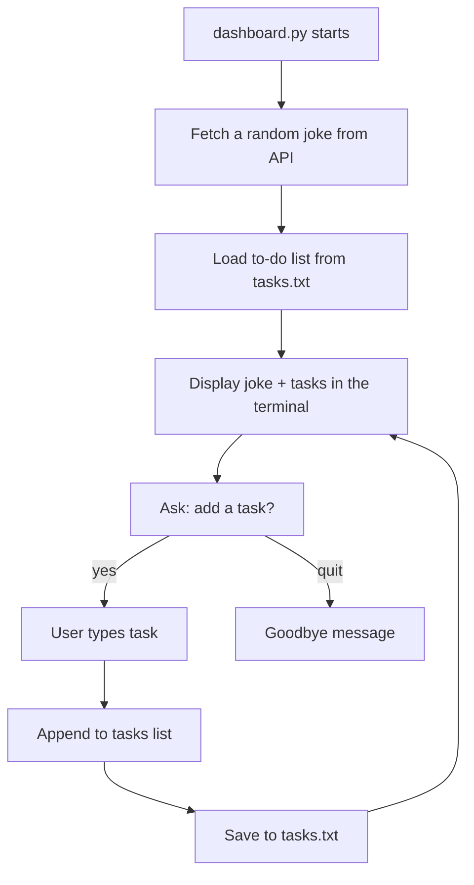
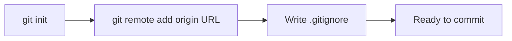
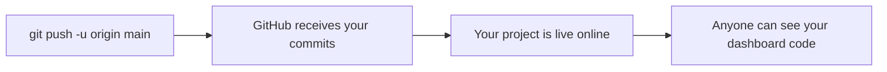

## Day 5 — Mini Project: Personal Dashboard

> **Goal:** Combine lists, files, and APIs into a single personal dashboard program, then commit every feature to GitHub.

---

### What are you building today?

This is project day. You're going to put everything from this week together into one program: a **Personal Dashboard** that runs in the terminal and gives you three things at once:

1. A **random joke** from the internet (Day 4 skill)
2. Your **to-do list** loaded from a file (Days 1 and 3 skills)
3. A way to **add a new task** and save it immediately (Days 1 and 3 skills)

Every feature will be its own commit on GitHub. By the end of today you'll have a real project with a clean commit history.



---

### Before you start — check your files

Make sure you have the files from earlier this week in `~/projects/week5/`:

```bash
ls ~/projects/week5/
```

You should see (at least):

```
todo.py
joke_fetcher.py
tasks.txt  (if you added tasks earlier)
```

If `tasks.txt` is missing that's fine — the dashboard will create it.

---

### Setting up Git for this project

First, initialise a Git repo in your `week5` folder and connect it to GitHub.

#### Step 1 — Create a repo on GitHub

1. Go to [https://github.com](https://github.com) and log in
2. Click the `+` icon → **New repository**
3. Name it: `python-dashboard`
4. Set to **Public**
5. Do NOT tick "Add a README file" — you'll push your own files
6. Click **Create repository**

GitHub shows you a page with setup commands. Copy the HTTPS URL — it looks like `https://github.com/your-username/python-dashboard.git`.

#### Step 2 — Initialise Git in your project folder

```bash
cd ~/projects/week5
git init
git branch -M main
git remote add origin https://github.com/YOUR-USERNAME/python-dashboard.git
```

Replace `YOUR-USERNAME` with your actual GitHub username.

#### Step 3 — Add a .gitignore file

```bash
echo "__pycache__/" > .gitignore
echo "*.pyc"       >> .gitignore
```

This tells Git to ignore compiled Python files.



---

### Feature 1 — The joke section

Create a new file called `dashboard.py`. You'll build it step by step, committing each feature.

```bash
cd ~/projects/week5
touch dashboard.py
code .
```

#### Write the joke function

```python
# dashboard.py

import requests

JOKE_URL  = "https://official-joke-api.appspot.com/random_joke"
TASK_FILE = "tasks.txt"


def get_joke():
    """Fetch a random joke. Returns (setup, punchline) or (None, None)."""
    try:
        r = requests.get(JOKE_URL, timeout=5)
        r.raise_for_status()
        data = r.json()
        return data["setup"], data["punchline"]
    except Exception:
        return None, None
```

Test it runs without errors:

```bash
python3 dashboard.py
```

Nothing prints yet — we haven't called anything. Good.

#### Commit Feature 1

```bash
git add dashboard.py .gitignore
git commit -m "feat: add joke-fetching function"
```

---

### Feature 2 — The task functions

Still inside `dashboard.py`, add these two functions **below** `get_joke`:

```python
def load_tasks():
    """Load tasks from file. Return empty list if file doesn't exist."""
    try:
        with open(TASK_FILE, "r") as f:
            return [line.strip() for line in f if line.strip()]
    except FileNotFoundError:
        return []


def save_tasks(tasks):
    """Save task list to file, one task per line."""
    with open(TASK_FILE, "w") as f:
        for task in tasks:
            f.write(task + "\n")
```

Test again:

```bash
python3 dashboard.py
```

No errors. Great.

#### Commit Feature 2

```bash
git add dashboard.py
git commit -m "feat: add load and save task functions"
```

---

### Feature 3 — The display function

Now add a function that prints a nice header and shows the joke and the task list:

```python
def show_dashboard(tasks):
    """Print the dashboard: joke at top, then task list."""
    width = 55

    # Header
    print()
    print("*" * width)
    print("  PERSONAL DASHBOARD")
    print("*" * width)

    # Joke section
    setup, punchline = get_joke()
    print()
    print("  TODAY'S JOKE")
    print("  " + "-" * 40)
    if setup:
        print(f"  Q: {setup}")
        print(f"  A: {punchline}")
    else:
        print("  (Could not fetch a joke — check your internet)")
    print()

    # Task section
    print("  YOUR TO-DO LIST")
    print("  " + "-" * 40)
    if tasks:
        for i, task in enumerate(tasks, start=1):
            print(f"  {i}. {task}")
    else:
        print("  (No tasks yet — add one below!)")
    print()
    print("*" * width)
    print()
```

> `enumerate(tasks, start=1)` is a handy shortcut — it gives you both the index and the item at once, starting the count at 1 instead of 0.

#### Commit Feature 3

```bash
git add dashboard.py
git commit -m "feat: add dashboard display function"
```

---

### Feature 4 — The main loop

Add the main program loop at the bottom of `dashboard.py`:

```python
def main():
    """Run the interactive dashboard."""
    tasks = load_tasks()
    show_dashboard(tasks)

    print("Commands: add  |  refresh  |  remove  |  quit")
    print()

    while True:
        command = input("What do you want to do? ").strip().lower()

        if command == "quit":
            print("See you next time!")
            break

        elif command == "refresh":
            tasks = load_tasks()
            show_dashboard(tasks)

        elif command == "add":
            new_task = input("New task: ").strip()
            if new_task:
                tasks.append(new_task)
                save_tasks(tasks)
                print(f"Saved: '{new_task}'")
                print("Type 'refresh' to see the updated dashboard.\n")
            else:
                print("Nothing entered.\n")

        elif command == "remove":
            if not tasks:
                print("No tasks to remove.\n")
            else:
                for i, task in enumerate(tasks, start=1):
                    print(f"  {i}. {task}")
                choice = input("Remove task number: ").strip()
                if choice.isdigit():
                    idx = int(choice) - 1
                    if 0 <= idx < len(tasks):
                        removed = tasks.pop(idx)
                        save_tasks(tasks)
                        print(f"Removed: '{removed}'\n")
                    else:
                        print("Number not on the list.\n")
                else:
                    print("Please enter a number.\n")

        else:
            print("Unknown command. Try: add, refresh, remove, quit\n")


if __name__ == "__main__":
    main()
```

> The `if __name__ == "__main__":` block means the dashboard only runs when you execute the file directly — not when another file imports it. This is a Python best practice.

#### Run the full dashboard

```bash
python3 dashboard.py
```

You should see the joke, your task list, and a command prompt.

Try: add two tasks, type `refresh` to see them on the dashboard, then remove one.

#### Commit Feature 4

```bash
git add dashboard.py
git commit -m "feat: add main interactive loop"
```

---

### Feature 5 — Push to GitHub

Send all your commits to GitHub:

```bash
git push -u origin main
```

You'll be asked for your GitHub username and password. For the password, use a **Personal Access Token** (not your account password). If you don't have one yet:

1. Go to GitHub → Settings → Developer settings → Personal access tokens → Tokens (classic)
2. Click "Generate new token (classic)"
3. Give it a note like "week5 project", set expiry to 90 days
4. Tick the `repo` scope
5. Copy the token — paste it as the password in the terminal

After pushing, visit your GitHub repo page. You'll see all four commits in the history.



#### Commit and push the task file too

```bash
git add tasks.txt
git commit -m "chore: add initial tasks file"
git push
```

---

### Complete `dashboard.py`

Here is the full file for reference:

```python
# dashboard.py

import requests

JOKE_URL  = "https://official-joke-api.appspot.com/random_joke"
TASK_FILE = "tasks.txt"


def get_joke():
    """Fetch a random joke. Returns (setup, punchline) or (None, None)."""
    try:
        r = requests.get(JOKE_URL, timeout=5)
        r.raise_for_status()
        data = r.json()
        return data["setup"], data["punchline"]
    except Exception:
        return None, None


def load_tasks():
    """Load tasks from file. Return empty list if file doesn't exist."""
    try:
        with open(TASK_FILE, "r") as f:
            return [line.strip() for line in f if line.strip()]
    except FileNotFoundError:
        return []


def save_tasks(tasks):
    """Save task list to file, one task per line."""
    with open(TASK_FILE, "w") as f:
        for task in tasks:
            f.write(task + "\n")


def show_dashboard(tasks):
    """Print the dashboard: joke at top, then task list."""
    width = 55

    print()
    print("*" * width)
    print("  PERSONAL DASHBOARD")
    print("*" * width)

    setup, punchline = get_joke()
    print()
    print("  TODAY'S JOKE")
    print("  " + "-" * 40)
    if setup:
        print(f"  Q: {setup}")
        print(f"  A: {punchline}")
    else:
        print("  (Could not fetch a joke — check your internet)")
    print()

    print("  YOUR TO-DO LIST")
    print("  " + "-" * 40)
    if tasks:
        for i, task in enumerate(tasks, start=1):
            print(f"  {i}. {task}")
    else:
        print("  (No tasks yet — add one below!)")
    print()
    print("*" * width)
    print()


def main():
    """Run the interactive dashboard."""
    tasks = load_tasks()
    show_dashboard(tasks)

    print("Commands: add  |  refresh  |  remove  |  quit")
    print()

    while True:
        command = input("What do you want to do? ").strip().lower()

        if command == "quit":
            print("See you next time!")
            break

        elif command == "refresh":
            tasks = load_tasks()
            show_dashboard(tasks)

        elif command == "add":
            new_task = input("New task: ").strip()
            if new_task:
                tasks.append(new_task)
                save_tasks(tasks)
                print(f"Saved: '{new_task}'")
                print("Type 'refresh' to see the updated dashboard.\n")
            else:
                print("Nothing entered.\n")

        elif command == "remove":
            if not tasks:
                print("No tasks to remove.\n")
            else:
                for i, task in enumerate(tasks, start=1):
                    print(f"  {i}. {task}")
                choice = input("Remove task number: ").strip()
                if choice.isdigit():
                    idx = int(choice) - 1
                    if 0 <= idx < len(tasks):
                        removed = tasks.pop(idx)
                        save_tasks(tasks)
                        print(f"Removed: '{removed}'\n")
                    else:
                        print("Number not on the list.\n")
                else:
                    print("Please enter a number.\n")

        else:
            print("Unknown command. Try: add, refresh, remove, quit\n")


if __name__ == "__main__":
    main()
```

---

### Check your commit history

```bash
git log --oneline
```

You should see four tidy commits:

```
abc1234  chore: add initial tasks file
def5678  feat: add main interactive loop
ghi9012  feat: add dashboard display function
jkl3456  feat: add load and save task functions
mno7890  feat: add joke-fetching function
```

That is a professional commit history. Each commit says exactly what changed and why.

---

### Bonus challenges

> Try one or more of these to push yourself further:

1. **Add the date.** Show today's date at the top of the dashboard. Hint: `import datetime` and `datetime.date.today()`.
2. **Colour the output.** Install `pip install colorama` and use `Fore.GREEN`, `Fore.CYAN` to add colour to the headers.
3. **Add a weather section.** The free API at `https://wttr.in/?format=3` returns a one-line weather summary. Can you add it to the dashboard?
4. **Write a README.** Create a `README.md` in `week5/` explaining what your dashboard does. Commit and push it.

---

### What you learned today

- Breaking a big program into small functions makes it easy to build, test, and commit one piece at a time
- `enumerate(list, start=1)` gives you an index and value together in a loop
- `if __name__ == "__main__":` is the standard way to write a Python program that is also importable as a module
- Committing each feature separately creates a clean, readable project history on GitHub
- You built a real, working program from scratch using: lists, files, API calls, loops, and functions — all in one week

---

### Tip and trick for deeper understanding

#### Trick 1: Sketch your functions before writing the code inside them
Before typing any logic for a new feature, write just the function name, parameters, and a docstring. Use `pass` as a placeholder so the file runs without errors. This forces you to think clearly about what each piece needs and what it gives back — and you can test the skeleton before filling it in.

```python
def get_weather():
    """Fetch a one-line weather summary from wttr.in. Returns a string or None."""
    pass   # write the real code here later

def format_header(title):
    """Return a bordered header string for the dashboard."""
    pass

# Call them now — they do nothing yet, but no errors either
print(get_weather())       # None
print(format_header("My Dashboard"))  # None
```

Once the skeleton works, fill in one function at a time and commit after each one. This is exactly how real developers build projects: plan the shape first, then add the details.

#### Trick 2: Add today's date and time with `datetime` — no install needed
Python's built-in `datetime` module lets you show the current date and time without installing anything. Adding the date to your dashboard header makes it feel like a real, living tool.

```python
import datetime

today = datetime.date.today()
now   = datetime.datetime.now()

print("Date:", today)                   # Date: 2026-06-12
print("Day:", today.strftime("%A"))     # Day: Friday
print("Time:", now.strftime("%H:%M"))   # Time: 14:35
```

`strftime` (string-format-time) is the formatting tool: `%A` is the full day name, `%d %B %Y` gives you `12 June 2026`, and `%H:%M` gives hours and minutes. Drop these two lines into `show_dashboard()` and the header always shows when the dashboard was last refreshed.

#### Quick challenge (10 minutes)

```python
# 1. Add a show_date() function to dashboard.py that prints today's date
#    and day name using datetime — call it at the top of show_dashboard()

# 2. Try fetching a one-line weather summary by adding this inside get_weather():
#    response = requests.get("https://wttr.in/?format=3", timeout=5)
#    return response.text.strip()

# 3. Commit both changes with a meaningful message:
#    git add dashboard.py
#    git commit -m "feat: add date and weather to dashboard header"
```

---

### Day 5 tip

> Professional developers commit small and often — not one giant commit at the end. A commit history is a story of how a project grew. Make your story easy to read.
