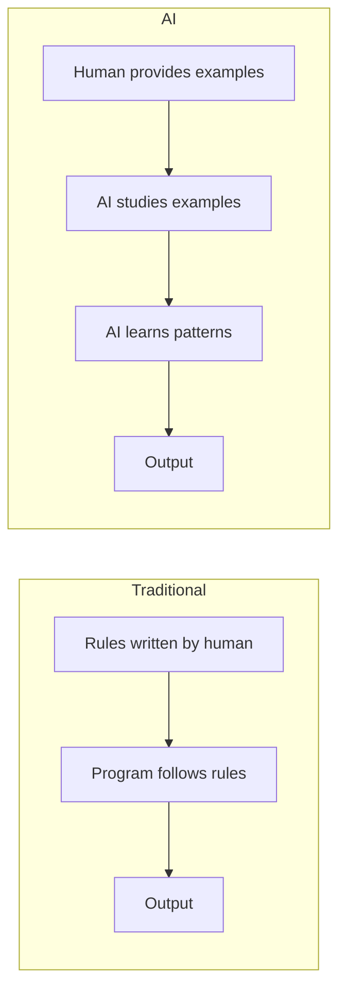
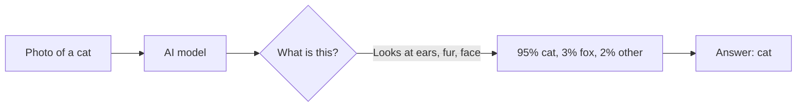
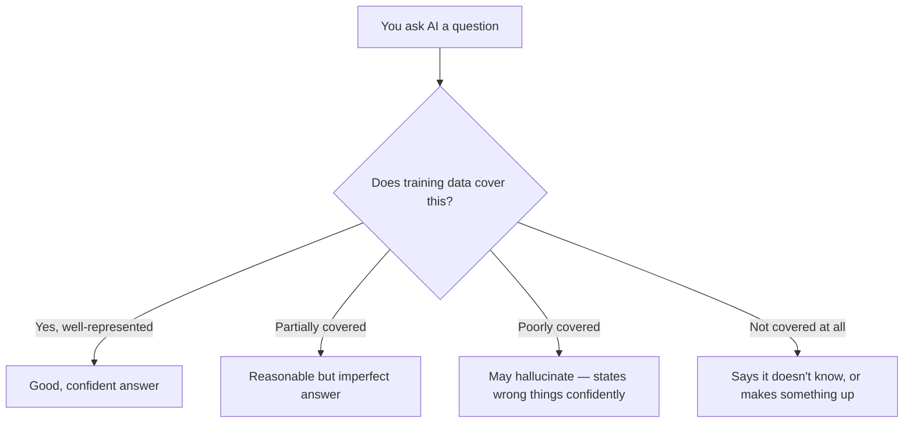

## Day 1 — What Is AI?

> **Goal:** By the end of today, you can clearly explain the difference between a traditional program and an AI system, and name three types of AI you use every day.

---

### What even is a program?

Before we talk about AI, let's remember what a regular program does.

A regular program follows **rules that a human wrote**. Every single step is spelled out in the code.

Imagine you write a program to decide whether a number is big or small:

```python
def is_big(number):
    if number > 100:
        return "big"
    else:
        return "small"
```

Simple! The programmer wrote the rule: *if it's over 100, it's big*. The computer just follows that rule. It never figures anything out — it just obeys.

This works great for problems where you know all the rules. But what about harder problems?

---

### The problem with rules

Imagine writing a program that looks at a photo and decides: **is this a cat or a dog?**

You might try:
- If it has pointy ears → cat
- If it has floppy ears → dog

But some cats have floppy ears. Some dogs have pointy ears. What about a photo taken from behind? What if the animal is partly hidden? What if the lighting is dark?

You would need thousands of rules. And even then, you would still get it wrong sometimes.

**This is where AI comes in.**

---

### Traditional programming vs AI

Here is the big difference:

| Traditional program           | AI / Machine learning                         |
| ----------------------------- | --------------------------------------------- |
| Human writes the rules        | Human provides the examples, AI finds the rules |
| Rules are exact               | AI builds up a fuzzy feel for patterns         |
| Great for predictable tasks   | Great for messy, real-world tasks              |
| Calculator, form validation   | Photo recognition, voice assistants, translation |



> Think of it this way: teaching a traditional program is like giving someone a recipe. Teaching an AI is like letting someone eat at a restaurant a thousand times until they just *know* what good food tastes like.

---

### Three types of AI you already use

You have probably used AI today without thinking about it. Here are three types:

#### 1. Image recognition

Your phone unlocks when it sees your face. Photo apps group pictures of the same person together. Google Lens can identify a flower from a photo.

These all use **image recognition AI** — a model that has been shown millions of photos and learned to label what is in them.



#### 2. Language models

When you type a search into Google, the AI tries to understand what you *mean*, not just the exact words you typed. When you use Claude, ChatGPT, or Gemini, you are talking to a **large language model** — an AI trained on enormous amounts of text.

These models can:
- Answer questions
- Write stories
- Summarise long documents
- Translate languages
- Help debug code

#### 3. Recommendation systems

Netflix knows you like action films. Spotify knows you prefer upbeat music on Monday mornings. YouTube keeps suggesting videos you end up watching.

These are **recommendation AI systems**. They watch your behaviour, compare you to millions of other users, and predict what you will enjoy next.

> "Other people who liked what you liked, also liked this — so you probably will too."

---

### What AI can do

- Recognise faces, objects, and handwriting in photos
- Understand and generate human language
- Play games (chess, Go) better than any human
- Detect spam emails
- Suggest the next word when you type
- Translate between 100+ languages in seconds
- Help doctors spot diseases in X-rays

---

### What AI cannot do

This part surprises people. AI has real limits:

- **It does not truly understand anything.** It finds patterns. It does not know what a cat *is* the way you do.
- **It can be confidently wrong.** AI sometimes makes up facts and states them as if they were real (this is called a *hallucination*).
- **It struggles with things it has never seen before.** If the training data did not include it, the AI has no good foundation to work from.
- **It cannot learn from your conversation in real time.** Each response is generated from the fixed patterns it learned during training.
- **It does not have feelings, opinions, or consciousness.** It produces text that *sounds* like it does — but it is pattern matching, not thinking.



---

### Real-world examples you know

| App / Service         | Type of AI used                   | What it does for you                     |
| --------------------- | --------------------------------- | ---------------------------------------- |
| Netflix               | Recommendation system             | Suggests shows you will enjoy            |
| Spotify               | Recommendation + audio analysis   | Builds playlists that match your taste   |
| Google Search         | Language model + ranking AI       | Understands your question, finds pages   |
| Google Photos         | Image recognition                 | Groups photos of the same person         |
| Gmail spam filter     | Classification AI                 | Moves junk mail out of your inbox        |
| Google Translate      | Language model                    | Translates text between languages        |
| Face ID (iPhone/Android) | Image recognition              | Unlocks your phone from your face        |
| Claude / ChatGPT      | Large language model              | Answers questions, writes, codes         |

---

### Hands-on exercise

**Time: 30–45 minutes**

**Activity: How does AI see a photo of a cat?**

You are going to draw the journey a photo takes when an AI tries to classify it.

**Part 1 — Draw the steps (15 min)**

Get paper and a pen. Draw a diagram that shows these steps:

1. A photo of a cat enters the system
2. The AI breaks the photo into tiny squares (called pixels)
3. It checks each area — are there pointy ears? Whiskers? A flat nose?
4. It compares what it sees against patterns it learned from millions of cat photos
5. It produces a list of scores: e.g. "cat 94%, dog 3%, rabbit 3%"
6. The highest score wins — the answer is: **cat**

Your diagram does not need to be beautiful — arrows and boxes are fine. Try to label each step.

**Part 2 — Discuss with your group (10 min)**

Talk through these questions:

- What would happen if the AI was trained on photos that only showed cats from the front — never from the side?
- What if all the cat photos in training were of white cats? What might go wrong?
- Can the AI *understand* what a cat is the way you do? Why or why not?

**Part 3 — Find AI in your day (10 min)**

Write down three apps or websites you used this week. For each one, write:
- What the app does
- Whether it uses AI (and what type, if you can guess)

Share your list with the group and compare. Were there any surprises?

---

### What you learned today

- Traditional programs follow rules humans write; AI learns patterns from examples
- Three common types of AI: image recognition, language models, recommendation systems
- You interact with AI every day through Netflix, Spotify, Google, and many other apps
- AI is powerful but has real limits — it can be confidently wrong, and it does not truly understand anything
- Image classification works by breaking a photo into patterns and comparing them to millions of training examples

---

### Tip and trick for deeper understanding

#### Trick 1: The map is not the territory
An AI does not actually know what a cat is — it holds a mathematical summary of patterns from millions of photos. Think of it like a very detailed map: the map can guide you accurately, but it is not the real road. This is why AI can confidently describe a photo of a cat without any understanding of what a living, breathing cat actually is.

#### Trick 2: Confidence is just another pattern
A traditional program either gives the right answer or crashes — it does not pretend. AI is different: it learned from text written by confident humans, so it learned to sound confident too. High confidence from an AI does not mean the answer is correct; it just means the AI found a strong pattern match in its training data.

#### Quick challenge (10 minutes)
Pick two tasks: one that a calculator handles perfectly (like adding large numbers) and one that AI handles better (like writing a birthday message for a specific person). Write two or three sentences explaining *why* each tool is the better fit for its task. Share your reasoning with a partner — do they agree?

---

### Day 1 tip

> AI is not magic. It is pattern-matching at a very large scale. When something seems amazing — like a phone recognising your face — there is a logical, understandable process behind it. This week we will pull back the curtain on that process, step by step.
