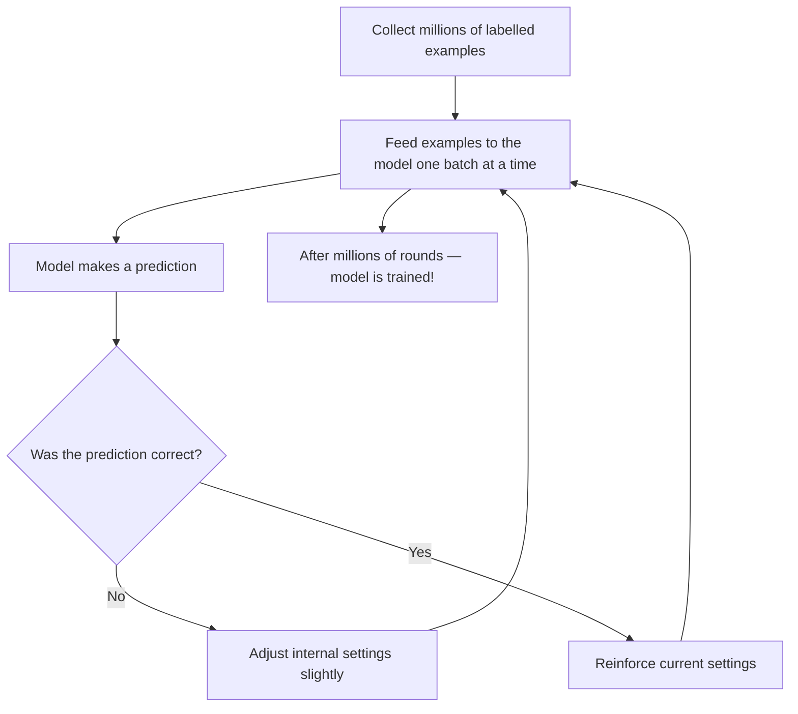
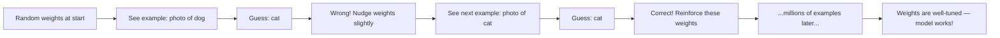
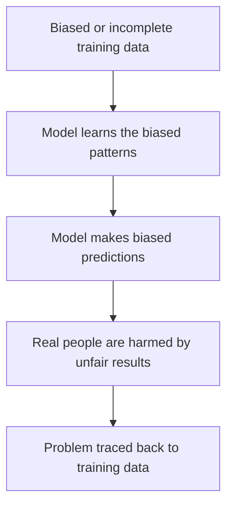

## Day 2 — How AI Learns

> **Goal:** By the end of today, you can explain what training data is, how AI finds patterns, and what goes wrong when the data is bad.

---

### A quick recap

Yesterday you learned that AI learns from *examples* instead of following rules written by a human. Today we go deeper: **exactly how does that learning happen?**

We will use a simple analogy to make it click — no maths needed.

---

### The apple analogy

Imagine you have a friend who has never seen an apple before. You want to teach them to recognise one.

**Option 1 — Teach with rules**

You say: "An apple is red or green or yellow, roundish, about the size of a fist, has a small stalk on top, and feels smooth."

Your friend learns the rules and goes to the supermarket. They find an apple — great! But then they also pick up a small red ball, because it matches your rules perfectly.

Rules alone are not enough.

**Option 2 — Teach with examples**

You show your friend 1 000 different apples. Big ones, small ones, red, green, yellow, bruised, shiny, on a tree, in a bag, in a painting.

You do not explain any rules. You just say "this is an apple" each time.

After 1 000 apples, your friend has built up a rich, fuzzy, complicated sense of what "apple" means. They will recognise one instantly — even a weird purple heirloom apple they have never seen before.

**That is how AI learns.** It is Option 2, but with millions of examples instead of 1 000.



---

### What is training data?

**Training data** is the collection of examples an AI learns from. Without training data, there is no AI.

Here are examples of training data for real AI systems:

| AI system           | What it was trained on                                           |
| ------------------- | ---------------------------------------------------------------- |
| Image recognition   | Millions of photos labelled with what is in them ("cat", "car") |
| Language model      | Billions of web pages, books, articles, and code                 |
| Spam filter         | Thousands of emails labelled "spam" or "not spam"               |
| Music recommender   | Millions of play histories from real users                       |
| Self-driving car    | Hours of road video, plus labels for pedestrians and signs       |

Training data needs to be:
- **Large** — a handful of examples is not enough; you need thousands or millions
- **Labelled** — someone (or a program) needs to tell the AI what each example *means*
- **Diverse** — it needs to cover the full range of situations the AI will face in real life

---

### How the AI actually finds patterns

When the AI studies training data, it does one thing over and over:

1. Make a guess
2. Check if the guess was right
3. Adjust slightly to do better next time
4. Repeat — millions of times

Deep inside the AI, there are billions of tiny numbers called **weights**. At the start, they are random. Every time the AI gets something wrong, those numbers nudge a tiny bit in a better direction.

After enough rounds, the numbers settle into a state where the AI gets most things right. That settled state is the **trained model** — the thing you actually use when you talk to Claude or unlock your phone with your face.

You do not need to know the maths. The key idea is: **the model is just a huge collection of numbers that have been tuned by seeing lots of examples.**



> Think of it like tuning a guitar. You pluck a string, hear it is slightly off, turn the peg a tiny bit, and try again. After many small adjustments, the string is perfectly in tune.

---

### What happens with bad or biased data?

Here is a very important idea: **the AI can only be as good as the data it was trained on.**

If the training data is bad, the model will be bad — no matter how clever the technology.

#### Example 1 — Missing groups of people

Imagine you build a face recognition AI. You train it on 100 000 photos — but 95% of them are photos of people with light skin. The AI will work well for light-skinned faces and poorly for darker-skinned faces.

Not because the technology is broken. Because the training data was missing a huge group of people.

This actually happened with real face recognition systems. It caused serious unfair outcomes for real people.

#### Example 2 — Learning from history

An AI is trained on 10 years of hiring records from a company. Over those 10 years, the company hired mostly men for technical roles. The AI learns this pattern and starts recommending men over women — even when the women are more qualified.

The AI did not invent the bias. It learned it from historical data that was already biased.

This also happened with a real AI hiring tool used by a major tech company.

#### Example 3 — Internet data

Large language models are trained on huge amounts of text from the internet. The internet contains misinformation, offensive content, and strong biases. If you are not careful about what goes in, those problems appear in the model's outputs.



> Garbage in, garbage out. This phrase has been used in computing since the 1960s. It applies to AI more than anything else.

---

### Labelling data is real work

Someone has to tell the AI what each example means. This is called **labelling** or **annotating** the data.

For a cat vs dog classifier, a human had to look at each of the millions of training photos and write "cat" or "dog".

For a language model, humans read AI outputs and rated them as helpful or unhelpful to help the model improve.

Labelling is:
- Time-consuming (millions of examples take enormous effort)
- Done by real workers around the world, often paid low wages
- Sometimes inconsistent — different people label the same thing differently
- A big hidden part of AI that most people never think about

---

### Hands-on exercise

**Time: 35–45 minutes**

**Activity: Play "Teach the AI"**

This game simulates what it feels like for an AI to learn from examples.

**Part 1 — Be the AI (20 min)**

Work in pairs. One person is the **Teacher**. The other person is the **AI**.

The Teacher secretly picks a pattern. Here are some ideas:

- All words that start with the letter S
- All numbers that are divisible by 3
- All things you find in a kitchen
- All words with more than 6 letters
- All animals that live in water
- All things that are blue

The Teacher then gives the AI **five examples** of the pattern, one at a time, without explaining the rule. After each example, the AI can only say "I think I understand" or "I am not sure yet."

After 5 examples, the AI guesses the rule out loud.

Then the Teacher gives 3 more tricky examples that test edge cases. Was the AI right?

Swap roles and try again with a new pattern.

**Part 2 — Reflect (10 min)**

Discuss these questions with your pair:
- How many examples did you need before you felt confident about the rule?
- Were any of the examples misleading or confusing?
- What would happen if the Teacher accidentally included a wrong example?
- How is this similar to how a real AI learns from training data?

**Part 3 — Write it down (10 min)**

Open VS Code (`Ctrl + Alt + T`, then type `code`). Create a new file called `day2-notes.md`. Write:

```markdown
# Day 2 — How AI Learns

## My pattern game results

- Pattern I tried to learn: 
- How many examples I needed before guessing correctly: 
- What made it tricky: 

## One thing bad training data could cause

[Write one real-world example of how bad training data could hurt someone]

## One question I still have about how AI learns

[Write it here]
```

Fill it in and save.

---

### What you learned today

- AI learns from training data — millions of labelled examples, not rules written by a human
- The model improves by making guesses, checking results, and adjusting tiny internal numbers called weights
- The more diverse and accurate the training data, the better the model
- Bad training data produces a bad model — bias and missing groups cause unfair real-world outcomes
- Human labellers do the hidden but essential work of annotating training data

---

### Tip and trick for deeper understanding

#### Trick 1: The AI does not know what it does not know
If an AI was only trained on photos of golden retrievers, it will still confidently label every other dog breed — it just finds the closest pattern it has. Unlike a human who can say "I have never seen that before," a basic AI has no way to signal that a situation is completely new to it. This is why diverse training data is so important: the gaps in the data become hidden blind spots.

#### Trick 2: Numbers do not have values
The weights inside an AI model are just numbers — billions of them. Numbers do not understand fairness, kindness, or harm. If historical data reflects unfair treatment of a group of people, those numbers will faithfully encode that unfairness without any moral awareness at all. This is why fixing bias requires humans to actively look for it; the AI will never flag it on its own.

#### Quick challenge (10 minutes)
Think of a real AI system you use — a music recommender, a spam filter, or a search engine. Imagine you are building it from scratch. Write two short lists: one for "training data that would make it work well" and one for "training data that could make it go wrong or be unfair." Compare your lists with a partner.

---

### Day 2 tip

> Every time you use an AI tool and notice it getting something wrong, ask yourself: what training data might have caused that? This is the question real AI engineers ask every single day.
