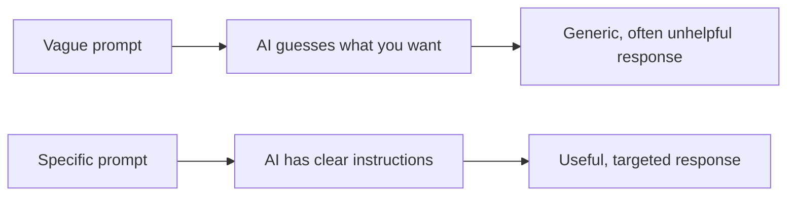
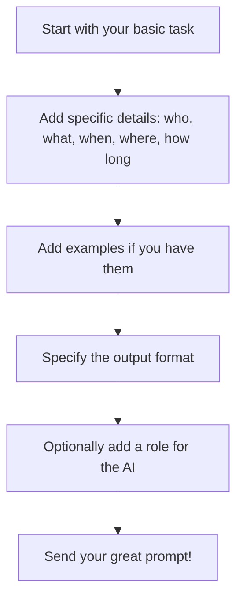

## Day 3 — Prompt Engineering

> **Goal:** By the end of today, you can write a clear, specific prompt that gets much better results from an AI than a vague one.

---

### What is a prompt?

A **prompt** is the message you send to an AI to get a response. It is your side of the conversation.

Every time you type something into Claude, ChatGPT, Gemini, or any other AI tool — that text is a prompt.

The AI does not know what is in your head. It only knows what you typed. So **how you write your prompt has an enormous effect on the quality of the answer you get back**.

This is such an important skill that it has its own name: **prompt engineering**.

---

### Why prompts matter so much

Think about asking a person for help.

- "Make me something" → your friend has no idea what to do
- "Make me a sandwich" → better, but still vague
- "Can you make me a ham and cheese sandwich on brown bread, no butter, with the crusts cut off?" → your friend knows exactly what you want

AI works the same way. Vague prompt = vague answer. Specific prompt = specific answer.



---

### Vague vs good vs great

Let's look at a real example. The task is: **get help writing a birthday message for a friend**.

#### Vague prompt

```
Write a birthday message.
```

The AI has no idea who this is for, what tone you want, how long it should be, or anything else. You will get a very generic response.

**Typical AI response to this:**

> Happy Birthday! Wishing you a wonderful day filled with joy and happiness. May all your dreams come true!

That is fine but completely forgettable.

---

#### Good prompt

```
Write a birthday message for my friend Jamie who is turning 13.
Make it friendly and fun, about 3 sentences long.
```

Now the AI knows: the name, the age, the tone, and the length.

**Typical AI response:**

> Happy 13th birthday, Jamie! Welcome to your teenage years — the world better watch out! Hope your day is as awesome as you are.

Much better! It feels personal and has the right energy.

---

#### Great prompt

```
Write a birthday message for my friend Jamie who is turning 13 tomorrow.
Jamie loves football and is obsessed with Manchester City.
Make it funny and a bit over-the-top, like a football commentary.
Keep it to 3–4 sentences.
```

Now the AI has: the name, the age, the context, the hobby, the tone, and the format.

**Typical AI response:**

> And JAMIE turns 13 — what a moment! The crowd goes wild as this legendary midfielder enters the teenage years! Manchester City fans everywhere are celebrating — because this birthday is bigger than any trophy. Happy birthday, Jamie — you absolute legend!

That is the one Jamie will remember.

---

### The four techniques of prompt engineering

#### 1. Be specific

Replace vague words with exact details. Instead of "write a story", say "write a 200-word story about a girl who discovers she can talk to plants, set in a rainy city".

#### 2. Give examples

If you want a certain style or format, show it. Say "I want something like this example: [paste the example]". AI is very good at matching a style you demonstrate.

#### 3. Specify the format

Tell the AI exactly what shape you want the answer in:
- "Give me a bullet list"
- "Answer in exactly 3 sentences"
- "Write it as a table with two columns"
- "Format it as a Python function"

#### 4. Give a role

You can tell the AI to act as a specific kind of expert:
- "You are a friendly science teacher explaining to a 12-year-old"
- "You are a professional chef who loves spicy food"
- "You are a strict code reviewer who only points out bugs"

The AI adjusts its tone, vocabulary, and focus based on the role you give it.



---

### Common prompt mistakes

| Mistake                        | Why it hurts                                      | Fix                                              |
| ------------------------------ | ------------------------------------------------- | ------------------------------------------------ |
| Too vague                      | AI guesses and guesses wrong                      | Add specific details                             |
| Asking everything at once      | AI tries to do too many things, does none well    | Break into smaller prompts                       |
| No format request              | AI picks a format you may not want                | Say "give me a list" or "write a paragraph"      |
| Assuming AI knows context      | AI only knows what you type                       | Include all the relevant background              |
| Accepting the first response   | You can always ask for a better version           | Say "try again, but make it shorter/funnier/etc" |

---

### Prompting is a conversation

You do not have to get it perfect on the first try. AI conversations work in turns — you can refine, redirect, and improve.

Try these follow-up strategies:

- "That's good but make it shorter"
- "Change the tone — make it more serious"
- "Can you give me three different versions?"
- "You misunderstood — I meant X, not Y"
- "Explain that last part in simpler language"

---

### Hands-on exercise

**Time: 45–60 minutes**

**Activity: Write three versions of the same prompt**

You need a device with internet access. Go to [claude.ai](https://claude.ai) (free, no account needed for basic use) or another AI tool your teacher has set up.

**Choose one task from this list:**

- Get help planning a fun weekend activity for a group of 4 friends
- Get a short explanation of how black holes work
- Get ideas for a short story about a robot that feels lonely
- Get help writing an email to a teacher asking for an extension on homework

**Step 1 — Write a vague prompt (5 min)**

Write the most basic, shortest version of your request. Send it and paste the response into your notes file.

**Step 2 — Write a good prompt (10 min)**

Add names, context, tone, and length. Send it and paste the response.

**Step 3 — Write a great prompt (15 min)**

Apply all four techniques: specific details, an example if you have one, a format request, and a role for the AI. Send it and paste the response.

**Step 4 — Compare all three (10 min)**

In VS Code, create `day3-notes.md` and fill in this template:

```markdown
# Day 3 — Prompt Engineering

## My task

[Describe the task you chose in one sentence]

## Vague prompt

[Paste your vague prompt here]

**Response I got:**
[Paste the AI's response here]

## Good prompt

[Paste your good prompt here]

**Response I got:**
[Paste the AI's response here]

## Great prompt

[Paste your great prompt here]

**Response I got:**
[Paste the AI's response here]

## What I noticed

- The biggest difference between vague and great was: [one sentence]
- The technique that helped most: [be specific / give examples / format / role]
- One thing that surprised me: [one sentence]
```

**Step 5 — Share with the group (10 min)**

Each person reads out their vague prompt and their great prompt. Discuss: what changes made the biggest difference?

---

### What you learned today

- A prompt is the message you send to an AI — the quality of the prompt directly affects the quality of the response
- Vague prompts produce generic answers; specific prompts produce useful answers
- The four key techniques: be specific, give examples, specify format, give the AI a role
- Prompting is a conversation — you can always follow up, refine, and redirect
- Prompt engineering is a real skill used by developers, writers, and researchers every day

---

### Tip and trick for deeper understanding

#### Trick 1: The AI is always playing a role — even when you do not ask
Even without a "You are a..." instruction, the AI is already playing a default role: "a helpful assistant who writes text on the internet." When you add a specific role, you are not switching it on — you are overwriting that default with something more precise. The more specific the role, the more the AI narrows its focus and adjusts its tone, vocabulary, and level of detail to match.

#### Trick 2: Every conversation starts completely blank
The AI has no memory of conversations you had yesterday, last week, or even five minutes ago in a different tab. It only knows what is inside the current conversation. This means the more useful context and background you put into your prompt, the better — the AI cannot fill in gaps from memory, so you have to provide everything it needs to give you a good answer.

#### Quick challenge (10 minutes)
Take any simple prompt — for example, "Explain gravity." Send it once with no role instruction. Then send the same prompt again but add "You are a primary school science teacher explaining to a 10-year-old." Compare the two responses and write one sentence about the most noticeable difference. Which version would you rather read?

---

### Day 3 tip

> Save your best prompts. When you find a prompt that works really well for a task you do often — keep it in a file. Professional AI users build up libraries of prompts they can reuse and adapt. Start yours today.
