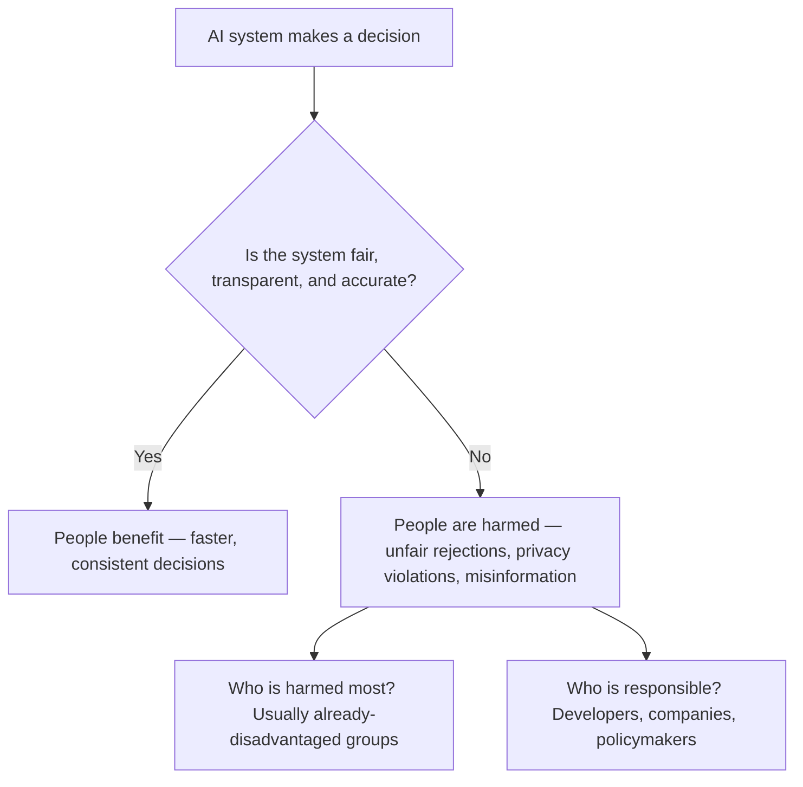
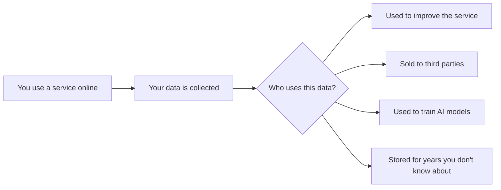

## Day 4 — AI Ethics

> **Goal:** By the end of today, you can identify bias, privacy, and fairness problems in real AI scenarios, and explain who is harmed and what should change.

---

### What is ethics?

**Ethics** is the study of what is right and wrong.

We have ethics in everyday life:
- Is it okay to copy someone's homework? (no — it is cheating and unfair)
- Is it okay to share a friend's secret? (usually no — it breaks trust)
- Is it okay to take something that is not yours? (no — that is stealing)

**AI ethics** asks the same kinds of questions, but about software:
- Is it fair for an AI to reject a job application because of the person's name?
- Is it okay for an app to collect your personal data without telling you?
- Should AI be allowed to generate fake videos of real people?

These questions are not just theoretical. They affect real people right now.

---

### Why AI ethics matters more than you think

AI systems are making decisions that affect people's lives:
- Whether your loan application is approved
- Whether you get called in for a job interview
- Whether a doctor's AI flags your scan as normal or worrying
- Whether your face gets matched to a criminal database

When these systems work well, they can be faster and less biased than humans. When they go wrong, they can cause enormous harm — often to people who have no way to challenge the decision.



---

### Issue 1 — Bias in AI

You already saw this in Day 2. Let's go deeper.

**What is bias in AI?**

Bias in AI means the AI gives unfair results to some groups of people compared to others. It usually comes from:
- Training data that did not include all groups equally
- Historical data that reflects past discrimination
- Features that accidentally act as stand-ins for protected characteristics (like someone's postcode being a signal for their race)

**Why is this hard to fix?**

The bias is often invisible. The AI does not say "I am discriminating against this group." It just produces outputs. You have to actively look for bias — and many companies do not look.

**Real examples:**

- In the US, a healthcare AI was used to decide which patients got extra care. It consistently recommended less care for Black patients than white patients with the same health problems — because it used historical spending data, and Black patients had historically been given less expensive treatments.
- A facial recognition system used by several police departments had a much higher error rate for Black women than for white men — because the training data was mostly photos of white men.
- Amazon built an AI hiring tool and had to scrap it after discovering it penalised CVs from women's colleges and devalued experience in roles traditionally held by women.

---

### Issue 2 — Privacy

AI models need enormous amounts of data. Where does that data come from?

- Publicly scraped websites and social media posts (often without the author's knowledge)
- Photos uploaded to apps
- Voice recordings from smart speakers
- Location data from your phone
- Conversations with AI assistants — which are sometimes reviewed by human workers

**Questions to think about:**
- If you post a photo on Instagram, do you expect it to appear in an AI's training data?
- If you ask an AI a private question, who can see that question?
- Should a company be able to train its AI on your conversations without telling you?

Many countries are now writing laws to try to answer these questions. In the EU, the GDPR gives people more control over their data. AI-specific laws are still being developed.



> Think about this: when you use a free app, you are often not the customer. You are the product. Your data is what the company is selling.

---

### Issue 3 — Fairness

Fairness goes beyond bias. It asks: **is it appropriate for AI to make this decision at all?**

Some examples where this question is live right now:

- Should AI decide who gets bail before a court hearing? (Some US courts use this — many people think humans should make this decision)
- Should AI decide who gets a mortgage? (Happens regularly — but when it goes wrong, the person has little recourse)
- Should AI grade student essays? (Some schools use this — but it may reward certain writing styles over others)
- Should AI diagnose mental health conditions from social media? (Companies are trying this — but the stakes of being wrong are very high)

In each case, ask:
1. Who is making the decision?
2. Who is affected by the decision?
3. What happens if the decision is wrong?
4. Can the decision be appealed or explained?

---

### Issue 4 — Responsible use

There are some ways of using AI that are clearly harmful, even if the AI itself is working correctly.

**Plagiarism**

Using AI to write your homework and submitting it as your own work. This is dishonest and also means you do not actually learn. Most schools now have clear rules about this.

**Deepfakes**

AI-generated videos or audio that make it look like a real person said or did something they never said or did. These can be used to spread false information, damage someone's reputation, or harass people. Creating deepfakes of real people without their consent is harmful and increasingly illegal.

**Misinformation**

AI can generate convincing-sounding text that is completely false. Bad actors use this to flood the internet with fake news articles, fake scientific studies, and fake social media posts. This makes it harder for everyone to know what is true.

**Summary of responsible use principles:**

| Principle             | What it means                                                              |
| --------------------- | -------------------------------------------------------------------------- |
| Be honest             | Do not pass off AI work as entirely your own when honesty matters          |
| Do no harm            | Do not use AI to create content that could hurt real people                |
| Respect privacy       | Do not use AI to gather information about people without their knowledge   |
| Stay critical         | Do not trust AI output without checking it — it can be wrong               |
| Think about impact    | Ask who could be harmed before deploying an AI system                      |

---

### Hands-on exercise

**Time: 45–60 minutes**

**Activity: Analyse three real scenarios**

For each scenario below, your group will discuss and then write answers to the four questions.

Work through each scenario together. One person can be the note-taker. After all three, share your most interesting finding with another group if possible.

---

#### Scenario 1 — The hiring tool

A tech company builds an AI to screen job applications. The AI was trained on 10 years of applications that the company previously accepted or rejected. The company hired mostly men in that period.

Now the AI automatically rejects many applications from women — even highly qualified women — before a human ever looks at them.

**Discuss:**
1. What is the problem with this AI?
2. Who is being harmed?
3. Why did this happen? (Think about the training data)
4. What should the company do now?

---

#### Scenario 2 — Face recognition at school

A school installs a face recognition camera at the entrance. The system is meant to flag anyone who is not a registered student or staff member. The school advertises this as a safety measure.

But researchers test the system and find it has a 30% error rate for students with darker skin tones, compared to a 2% error rate for lighter-skinned students. Some students are regularly stopped and questioned when the system misidentifies them.

**Discuss:**
1. What is the problem with this system?
2. Who is being harmed, and how?
3. Is the error rate the only problem, or is there a bigger issue with using this technology in a school at all?
4. What should the school do?

---

#### Scenario 3 — AI homework helper

A student uses an AI to write all their history essays. They submit them as their own work. Their teacher gives them good marks. At the end of term, they have learned very little history.

A different student uses AI to help them understand a topic they are confused about, then writes the essay themselves using what they understood.

**Discuss:**
1. What is the ethical difference between these two uses of AI?
2. Is it the AI that is doing something wrong, or the person using it?
3. How should schools update their rules to reflect the existence of AI writing tools?
4. In what ways could AI be used to help learning without replacing it?

---

**Write-up (10 min)**

Open VS Code and create `day4-notes.md`. For each scenario, write:
- The problem in one sentence
- Who is harmed
- One change that would make the situation fairer

```markdown
# Day 4 — AI Ethics

## Scenario 1 — Hiring tool

- Problem: 
- Who is harmed: 
- One change: 

## Scenario 2 — Face recognition

- Problem: 
- Who is harmed: 
- One change: 

## Scenario 3 — AI homework

- Problem: 
- Who is harmed: 
- One change: 

## My personal view

One AI ethics issue that worries me most is:
[write it here]
```

---

### What you learned today

- AI ethics asks whether AI is being used fairly, honestly, and without causing harm
- Bias in AI comes from training data and can cause real unfair outcomes for real people
- Privacy is a concern because AI systems are trained on vast amounts of data, often without people's knowledge
- Fairness asks not just whether the AI is accurate, but whether it should be making that decision at all
- Responsible use means being honest, doing no harm, staying critical of AI output, and thinking about impact

---

### Tip and trick for deeper understanding

#### Trick 1: Invisible decisions are the hardest to challenge
When a human makes an unfair decision — rejecting a job application, for example — you can sometimes appeal, ask for reasons, or spot bias in their words. An AI decision can be nearly impossible to challenge because there is no reasoning to read, just a number that crossed a threshold. This invisibility is one reason why many researchers and lawmakers argue that humans must always stay in the loop for high-stakes decisions.

#### Trick 2: Fairness is a human choice, not a maths problem
There are different mathematical definitions of fairness, and they cannot all be satisfied at the same time. A system that is equally accurate for every group might still approve very different percentages of people from different groups. Making AI fair requires deciding which type of fairness matters most in a given situation — and that is a values question that humans must answer, not something an algorithm can figure out on its own.

#### Quick challenge (10 minutes)
Pick one AI system you encounter in daily life — a recommendation feed, a school tool, or a news filter. Write two questions you would ask its creators to check whether it is being used ethically. Use the four questions from today's lesson as a guide: who built it, what was it trained on, who is affected, and can decisions be challenged?

---

### Day 4 tip

> When you see a news story about AI in the future — ask four questions: Who built it? What data was it trained on? Who is affected by its decisions? And is there a way to challenge those decisions? Those four questions will take you far.
