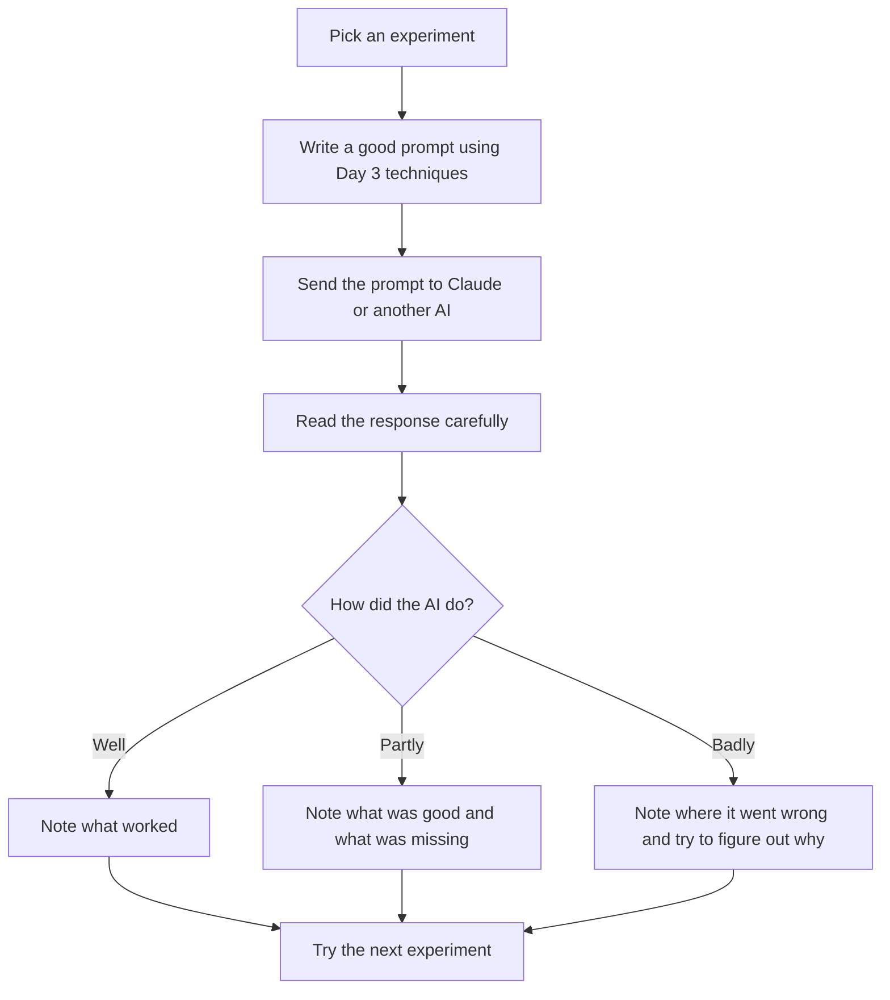
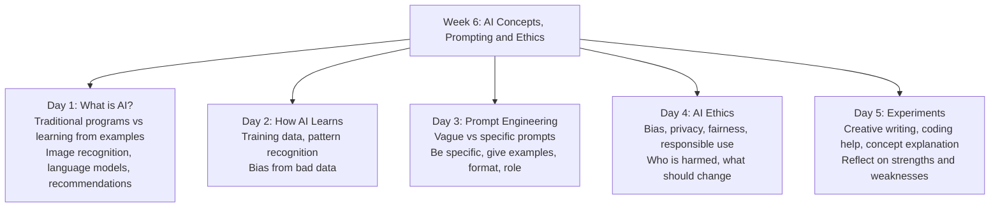

## Day 5 — Experiment Day + Week 6 Review

> **Goal:** By the end of today, you have freely explored a real AI tool, reflected honestly on where it succeeds and fails, and written a personal journal entry about how you plan to use AI responsibly.

---

### What today looks like

Today is different from the other days this week. There are no new concepts to learn. Instead, you will:

1. **Explore** — use a real AI tool and try a variety of tasks
2. **Reflect** — notice what the AI does well and where it falls short
3. **Write** — journal your thoughts and plans for using AI
4. **Review** — look back over the whole week and check what stuck

There is no wrong way to do today. Be curious. Try things that might not work. The point is to build your own experience and opinion.

---

### Before you start — a quick week recap

Let's check you have the key ideas from this week. Read each statement and decide: do you feel confident about it?

| Concept                                                              | Confident? |
| -------------------------------------------------------------------- | ---------- |
| I can explain the difference between traditional programs and AI     |            |
| I know what training data is and why it matters                      |            |
| I can describe what happens when AI training data is biased          |            |
| I can write a vague prompt and then improve it into a great one      |            |
| I know the four prompt engineering techniques                        |            |
| I can name two real ethical issues with AI and explain who is harmed |            |
| I understand what a hallucination is                                 |            |

Mark each one. If any feel shaky, flip back to that day's file for a quick re-read before you start experimenting.

---

### The four experiments

You need a device with internet access. Go to [claude.ai](https://claude.ai) — it is free to use for basic conversations, no account required.

For each experiment below, write your prompt and the response in your notes file. Then rate the response: did it do well, partly well, or badly?



---

#### Experiment 1 — Creative writing

Ask the AI to write a short story. Use your best Day 3 prompt skills:
- Give it a character, a setting, a problem, and a tone
- Specify the length (e.g. "about 150 words")
- Try giving it a role: "You are a storyteller who writes for 12-year-olds"

After you read the response, ask yourself:
- Is the story creative and original, or does it feel generic?
- Did it stick to the length and tone you asked for?
- Would you enjoy reading this?

---

#### Experiment 2 — Explaining a concept

Pick something from school that you find confusing or interesting. Ask the AI to explain it.

Good topics to try:
- How do earthquakes happen?
- What is the difference between speed and velocity?
- Why is the sky blue?
- How does your immune system fight a cold?
- What was the cause of World War I?

After you read the response, check:
- Is the explanation clear and easy to understand?
- Does it feel accurate? (If you are not sure, look it up separately to check)
- Did it pitch it at the right level, or was it too simple or too complicated?

> Important: AI can get facts wrong. Especially on history, science, and current events. **Always check important facts from a second source.**

---

#### Experiment 3 — Coding help

Ask the AI to help you write a small Python program. For example:

- "Write a Python program that asks my name and says hello to me"
- "Write a Python program that picks a random number between 1 and 10"
- "Explain what this Python code does: `print('hello' * 3)`"

After you read the response:
- Open a terminal (`Ctrl + Alt + T`) and try running the code
- Did it work? If not, paste the error message back to the AI and ask it to fix the code
- How many tries did it take to get working code?

---

#### Experiment 4 — Image or document description (optional)

If you are using Claude and you have a photo or a document handy, try uploading it and asking the AI to describe it or answer questions about it.

For example:
- Upload a photo from your camera roll and ask "What is in this photo?"
- Screenshot a paragraph of text and ask "Summarise this in two sentences"

Notice: does the AI describe what it actually sees, or does it add things that are not there?

---

### Where AI does well and where it struggles

After your experiments, think about what patterns you noticed. Here is a reference chart:

| Task type                         | AI tends to do... |
| --------------------------------- | ----------------- |
| Creative writing with a clear brief | Well — it is trained on enormous amounts of text |
| Explaining common concepts        | Well — but check facts independently |
| Writing basic code                | Well for simple tasks, worse for complex ones |
| Checking its own errors           | Poorly — it often repeats the same mistake |
| Knowing what happened very recently | Poorly — it has a knowledge cutoff date |
| Giving personal advice            | Use with care — it does not know your real situation |
| Sounding confident                | Very well — even when it is completely wrong |
| Admitting uncertainty             | Improving, but it still sometimes hallucinates |

---

### Journal — three and three

This is the most important writing activity of the week.

Open VS Code and create `week6-journal.md`. Write honestly.

```markdown
# Week 6 Journal — AI Concepts, Prompting & Ethics

## Three things I would use AI for

These are tasks where I think AI would be genuinely helpful to me:

1. 
2. 
3. 

For each one, write one sentence about why AI is a good fit for that task.

## Three things I would NOT trust AI with alone

These are tasks where I would not rely on AI without checking, a human expert, or doing it myself:

1. 
2. 
3. 

For each one, write one sentence about the risk or the reason AI is not the right tool alone.

## One thing that surprised me about AI this week

[Write a short paragraph — at least 3 sentences]

## One question I still have about AI

[Write it here]

## How I want to use AI at school and in life

[Write 2–3 sentences about your personal approach]
```

Take your time with this. There are no right or wrong answers. The point is to think for yourself.

---

### Week 6 review

Let's quickly revisit the five big ideas from this week.



---

### Preview — what is coming in Week 7

You have spent this week building your mental model of AI. Next week, you start writing Python code that talks to a real AI model using an API.

**What you will do in Week 7:**

- Install the Anthropic Python library
- Send your first message to Claude from a Python script
- Build a small command-line chatbot
- Learn what an API key is and how to keep it secret
- Write programs that use AI as a tool to solve real problems

Everything you learned this week — what AI is, how it learns, how to write good prompts — feeds directly into Week 7. You will be writing the prompts in your code.

> Here is a sneak peek at what your first Week 7 script will look like:

```python
import anthropic

client = anthropic.Anthropic()

message = client.messages.create(
    model="claude-opus-4-5",
    max_tokens=1024,
    messages=[
        {"role": "user", "content": "Explain what a black hole is in two sentences."}
    ]
)

print(message.content[0].text)
```

That is real Python code talking to a real AI. You will write and run that in Week 7.

---

### Hands-on exercise

**Time: 45–60 minutes**

Today's entire lesson IS the exercise. Work through all four experiments above and complete the journal. Here is the full checklist:

- Complete all four experiments (or at least the first three)
- For each experiment, write down your prompt and rate the AI's response
- Write your `week6-journal.md` with all sections filled in
- Review the confidence checklist at the top of today's lesson and note anything still fuzzy
- (Optional) Share one interesting AI response with the group and explain what you noticed

---

### What you learned today

- Hands-on experimentation is the fastest way to build intuition about what AI can and cannot do
- AI does well at creative writing, explanations, and basic code — but always check important facts independently
- AI can sound very confident even when it is wrong — this is called hallucination
- Thinking about what you *would* and *would not* trust AI with is a sign of critical thinking
- You are now ready to write Python code that talks to a real AI model in Week 7

---

### Tip and trick for deeper understanding

#### Trick 1: Every prompt you send is a hypothesis
Just like a science experiment, each prompt is a prediction: "If I ask it this way, it should respond like this." When the AI surprises you — giving something better or worse than you expected — that is data. Treat your experiments today like a scientist rather than a passive user: notice what worked, what did not, and make a small adjustment to test your theory. This mindset will make you a much faster learner.

#### Trick 2: The AI is a mirror of human writing
The AI does not have ideas or creativity of its own — it reflects the patterns it found in an enormous amount of text written by humans. When its response seems insightful or original, it found a pattern in human insight and originality. This means exploring what an AI produces can actually teach you something interesting about how humans write, explain, and tell stories — not just about the topic you asked about.

#### Quick challenge (10 minutes)
Ask the AI the exact same question twice, one right after the other, without changing a single word. Are the two responses identical or meaningfully different? Write one sentence about what this tells you about how AI generates text. Then discuss with a partner: does this change how much you would trust a single AI response?

---

### Day 5 tip

> The best way to stay in control of AI is to stay curious and stay critical. Use it as a tool. Check its work. Think about who it might affect. And never stop asking whether it is the right tool for the job.
