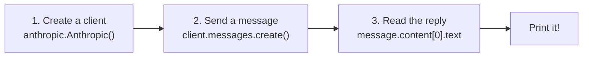
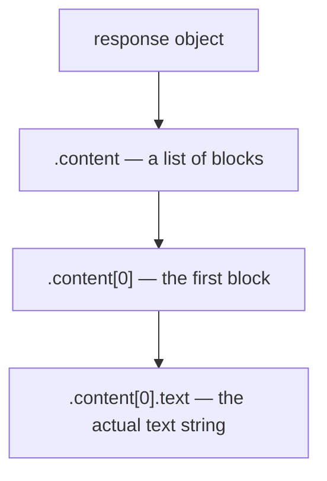

## Day 2 — First API Call to Claude

> **Goal:** Write a Python script that sends a question to Claude and prints the reply — your first real AI-powered program.

---

### How an API call works

Yesterday you set up your key. Today you actually use it.

When your Python program makes an API call, three things happen in order:



That is it. Three steps. Let's look at each one.

---

### The `anthropic` library

The `anthropic` package you installed yesterday gives you a Python object that handles all the network communication for you. You never need to write any code to open a connection or format a request — the library does all of that.

```python
import anthropic

client = anthropic.Anthropic()
```

When you call `anthropic.Anthropic()` with no arguments, it automatically looks for the environment variable `ANTHROPIC_API_KEY`. That is why you stored your key in `.env` yesterday — the client picks it up automatically once `load_dotenv()` has run.

> Always call `load_dotenv()` **before** creating your `anthropic.Anthropic()` client.

---

### `client.messages.create()` — sending a message

This is the main function you will use all week. Here are the key parameters:

| Parameter    | What you put there                                              | Required? |
| ------------ | --------------------------------------------------------------- | --------- |
| `model`      | Which Claude model to use — we use `"claude-opus-4-7"`          | Yes       |
| `max_tokens` | Maximum length of Claude's reply (1024 is a good starting point)| Yes       |
| `messages`   | A list of message dicts with `"role"` and `"content"`           | Yes       |

A single message looks like this:

```python
{"role": "user", "content": "What is the tallest mountain on Earth?"}
```

- `"role"` is always either `"user"` (that is you) or `"assistant"` (that is Claude).
- `"content"` is the text of the message.

The `messages` parameter is a **list** — even when there is only one message, you wrap it in square brackets `[ ]`.

---

### Reading the response

The function returns a response object. The actual text you want is inside:

```python
message.content[0].text
```

Why `[0]`? The response can contain multiple content blocks. For normal text replies there is always exactly one block at position `0`. Think of it like a list with one item — you always grab the first one.



---

### Your first complete program

Here is the complete structure, all in one place:

```python
from dotenv import load_dotenv
import anthropic

# 1. Load the API key from .env
load_dotenv()

# 2. Create the client
client = anthropic.Anthropic()

# 3. Send a message
message = client.messages.create(
    model="claude-opus-4-7",
    max_tokens=1024,
    messages=[
        {"role": "user", "content": "What is the tallest mountain on Earth?"}
    ]
)

# 4. Print the reply
print(message.content[0].text)
```

Run this and Claude will answer. That is a real AI API call.

---

### Using `input()` to ask the user a question

Instead of hardcoding the question in the script, you can ask the user to type one:

```python
question = input("Ask me anything: ")
```

`input()` pauses the program, shows the prompt text, and waits for the user to press Enter. Whatever they typed comes back as a string.

---

### Hands-on exercise

**Build `ask_claude.py` (45 min)**

This script takes a question from the user, sends it to Claude, and prints the answer. It is short — but it is a complete, real AI-powered program.

**Part 1 — Create the file**

In VS Code, open your `week-7-ai-chatbot` folder and create a new file called `ask_claude.py`.

Type this code out:

```python
# ask_claude.py
# Takes a question from the user, asks Claude, and prints the answer.

from dotenv import load_dotenv
import anthropic

def main():
    # Load the API key from .env
    load_dotenv()

    # Create the client
    client = anthropic.Anthropic()

    # Greet the user
    print("Welcome to Ask Claude!")
    print("----------------------")

    # Ask the user for a question
    question = input("What would you like to ask? ")

    # Show a message while we wait
    print("")
    print("Asking Claude...")
    print("")

    # Send the question to Claude
    response = client.messages.create(
        model="claude-opus-4-7",
        max_tokens=1024,
        messages=[
            {"role": "user", "content": question}
        ]
    )

    # Get the reply text
    answer = response.content[0].text

    # Print the answer
    print("Claude says:")
    print("------------")
    print(answer)

main()
```

**Part 2 — Run it**

```bash
python3 ask_claude.py
```

You will see:

```
Welcome to Ask Claude!
----------------------
What would you like to ask? 
```

Type a question — for example: `Why is the sky blue?`

Press Enter and wait a second or two. Claude will reply!

```
Asking Claude...

Claude says:
------------
The sky appears blue because of a phenomenon called Rayleigh scattering...
```

**You just talked to an AI with your own Python code.** Take a moment to appreciate that.

**Part 3 — Try different questions**

Run the script at least three more times with different questions. Try:

- `What is a black hole?`
- `Write a two-sentence joke about penguins.`
- `Explain what a variable is in Python, as if I am 12 years old.`

Notice how Claude gives a thoughtful, different answer each time.

**Part 4 — Count how many tokens were used (optional challenge)**

The response object contains more than just the text. Add these lines just before `main()` finishes:

```python
    print("")
    print(f"(Used {response.usage.input_tokens} input tokens "
          f"and {response.usage.output_tokens} output tokens)")
```

Run the script again. You will see how many tokens each message uses. Tokens are roughly equal to words — this is how Anthropic tracks how much of the API you use.

---

### What you learned today

- How to import and use the `anthropic` library
- What `client.messages.create()` does and which parameters it needs
- How the `messages` list works with `"role"` and `"content"`
- How to read Claude's reply from `response.content[0].text`
- How to use `input()` to get a question from the user
- That you can build a real AI program in fewer than 30 lines of Python

### Tip and trick for deeper understanding

#### Trick 1: `max_tokens` is a ceiling, not a target
`max_tokens` sets the *maximum* number of tokens Claude may use in its reply — it does not force Claude to use that many. If you set `max_tokens=1024` and Claude's answer only needs 80 tokens, the response will be short. But if you set it too low — like `max_tokens=10` — Claude's reply will be cut off mid-sentence. You can always check how many tokens were actually used by reading `response.usage.output_tokens` after the call.

#### Trick 2: The client reads your API key automatically — but only *after* `load_dotenv()`
When you create `anthropic.Anthropic()`, the SDK looks for an environment variable called `ANTHROPIC_API_KEY`. It does not open your `.env` file itself — it reads from the running program's environment. `load_dotenv()` is what copies the key from your `.env` file into that environment. Swap the order and the client will not find the key, which means every API call will silently fail.

```python
# RIGHT — load_dotenv first, then create the client
load_dotenv()
client = anthropic.Anthropic()

# WRONG — the client cannot find the key yet
client = anthropic.Anthropic()
load_dotenv()
```

#### Quick challenge (10 minutes)
1. Add `print(f"Tokens used: {response.usage.output_tokens}")` at the end of `ask_claude.py` and run it to see the count.
2. Change `max_tokens` to `15` and ask a question that needs a long answer — watch the reply get cut off.
3. Change `max_tokens` back to `1024`, then ask "Explain the entire history of the internet" to see the token count jump much higher.

---

### Day 2 tip

> If your script runs but nothing prints, check that `load_dotenv()` comes before `anthropic.Anthropic()`. If the client is created first, it cannot find the key and the API call silently fails.
