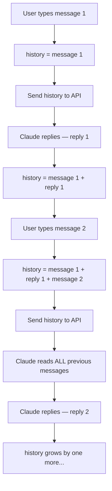
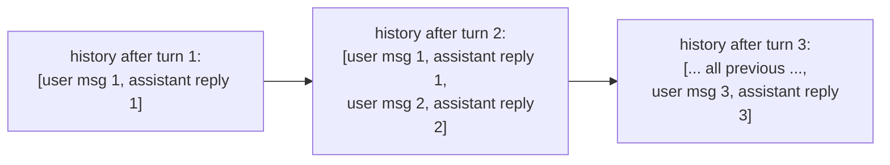

## Day 3 — Build a Chatbot with Conversation History

> **Goal:** Build `chatbot.py` — a multi-turn chatbot that remembers everything said earlier in the conversation.

---

### The problem: Claude does not remember

Every time you call `client.messages.create()`, the API starts fresh. It has no memory of previous calls. If you ask "What is Python?" and then ask "Tell me more about it", Claude has no idea what "it" refers to — because it never saw the first message.

The fix is simple: **you keep the history yourself** and send the whole conversation every single time.



Claude can answer "Tell me more about it" correctly because it can see message 1 in the history you sent.

---

### Building the history list

The `messages` parameter is just a Python list. You already know how to work with lists. Here is all you need:

```python
# Start with an empty list
history = []

# Add a user message
history.append({"role": "user", "content": "What is Python?"})

# Send the list to the API
response = client.messages.create(
    model="claude-opus-4-7",
    max_tokens=1024,
    messages=history
)

# Get the reply
reply = response.content[0].text

# Add Claude's reply to the history too
history.append({"role": "assistant", "content": reply})
```

Now `history` has two items — your message and Claude's reply. The next time you call the API, you pass this same list with all two items. The time after that it has four items. And so on.

The list grows like this:



---

### The chatbot loop

A chatbot is just a `while` loop that keeps running until the user types `"quit"`:

```python
while True:
    user_input = input("You: ")

    if user_input.lower() == "quit":
        print("Goodbye!")
        break

    # Add message to history, call API, print reply, add reply to history
    ...
```

`break` exits the loop immediately. `lower()` makes the comparison case-insensitive — so `"Quit"`, `"QUIT"`, and `"quit"` all work.

---

### Hands-on exercise

**Build `chatbot.py` (50 min)**

**Part 1 — Create the file**

Create a new file called `chatbot.py` in your `week-7-ai-chatbot` folder.

Type this complete program:

```python
# chatbot.py
# A multi-turn chatbot that remembers the full conversation.

from dotenv import load_dotenv
import anthropic

def main():
    # Load the API key from .env
    load_dotenv()

    # Create the client
    client = anthropic.Anthropic()

    # The conversation history — starts empty
    history = []

    # Welcome message
    print("=========================================")
    print("         Welcome to Your AI Chatbot!     ")
    print("=========================================")
    print("Chat with Claude. Type 'quit' to exit.")
    print("")

    # Main chat loop
    while True:
        # Get input from the user
        user_input = input("You: ")

        # Check if they want to quit
        if user_input.lower() == "quit":
            print("")
            print("Goodbye! Come back any time.")
            break

        # Skip empty messages
        if user_input.strip() == "":
            print("(Please type something!)")
            continue

        # Add the user's message to history
        history.append({"role": "user", "content": user_input})

        # Show a waiting message
        print("Claude: ", end="", flush=True)

        # Call the API with the full history
        response = client.messages.create(
            model="claude-opus-4-7",
            max_tokens=1024,
            messages=history
        )

        # Get the reply text
        reply = response.content[0].text

        # Print the reply
        print(reply)
        print("")

        # Add Claude's reply to history so the next turn remembers it
        history.append({"role": "assistant", "content": reply})

main()
```

**Part 2 — Run it**

```bash
python3 chatbot.py
```

You will see:

```
=========================================
         Welcome to Your AI Chatbot!     
=========================================
Chat with Claude. Type 'quit' to exit.

You: 
```

**Part 3 — Test that memory works**

Try this exact conversation to prove the memory is working:

```
You: My name is Alex and my favourite colour is green.
Claude: (introduces itself and acknowledges your name and colour)

You: What is my name?
Claude: Your name is Alex...

You: And what is my favourite colour?
Claude: Your favourite colour is green...
```

If Claude answers both follow-up questions correctly, your history is working.

**Part 4 — Test the "quit" command**

```
You: quit
```

The chatbot should print "Goodbye!" and exit cleanly.

**Part 5 — Test with an empty message**

Press Enter without typing anything. The chatbot should say "(Please type something!)" and wait for another message — it should not crash or call the API.

**Part 6 — Have a real conversation (fun part!)**

Now actually use your chatbot! Try asking it to:

- Help you write a short poem
- Explain a topic from school
- Give you ideas for a weekend project
- Tell you a riddle and then reveal the answer

Each reply builds on the ones before it. This is a real conversational AI running on your computer.

**Part 7 — Watch the history grow (optional challenge)**

Add this line just after the `history.append({"role": "assistant"...})` line:

```python
        print(f"  [History now has {len(history)} messages]")
```

Run the chatbot again and watch the history count go up by 2 with every turn (one for your message, one for Claude's reply).

Remove this debug line before Day 4.

---

### What you learned today

- Why Claude needs you to send the conversation history with every API call
- How to use a Python list to store the history
- How to use `list.append()` to add each message and reply
- How to use a `while True` loop for a chatbot
- How to use `break` to exit the loop
- How to handle edge cases like empty input with `continue`
- That `end=""` and `flush=True` in `print()` let you print without a newline right away

### Tip and trick for deeper understanding

#### Trick 1: The history list must always alternate between `"user"` and `"assistant"`
The Anthropic API expects messages to alternate: `user → assistant → user → assistant`. You cannot have two `"user"` messages in a row — the API will return an error. Your chatbot avoids this automatically because you always add a user message, wait for Claude's reply, and then add the assistant message before looping. Keep this rule in mind any time you add messages to history by hand.

#### Trick 2: Pre-load history to give Claude a "memory" before the chat starts
Want Claude to know something — like your name — without the user having to type it? Add a fake first turn to the `history` list *before* the loop begins. Claude treats it as if that conversation already happened, so it will use that information in every reply.

```python
history = [
    {"role": "user", "content": "My name is Alex and I love space."},
    {"role": "assistant", "content": "Got it! I'll remember that, Alex."},
]
# Now start the while True loop — Claude already "knows" Alex loves space
```

#### Quick challenge (10 minutes)
1. In `chatbot.py`, add 2 pre-loaded messages to `history` before the `while True` loop — a `"user"` message and an `"assistant"` reply.
2. Start the chatbot and immediately ask something that relates to what you pre-loaded (like "What do I love?") to prove Claude already knows.
3. Add the debug line `print(f"[History: {len(history)} messages]")` after each `history.append()` call and watch the count climb by 2 each turn, starting from your pre-loaded number.

---

### Day 3 tip

> The history list grows with every message. For a short chat that is fine. For a very long conversation the list can get huge and use more tokens (which costs more). Professional chatbots usually keep only the last N messages. You will not need to worry about that this week, but it is good to know.
