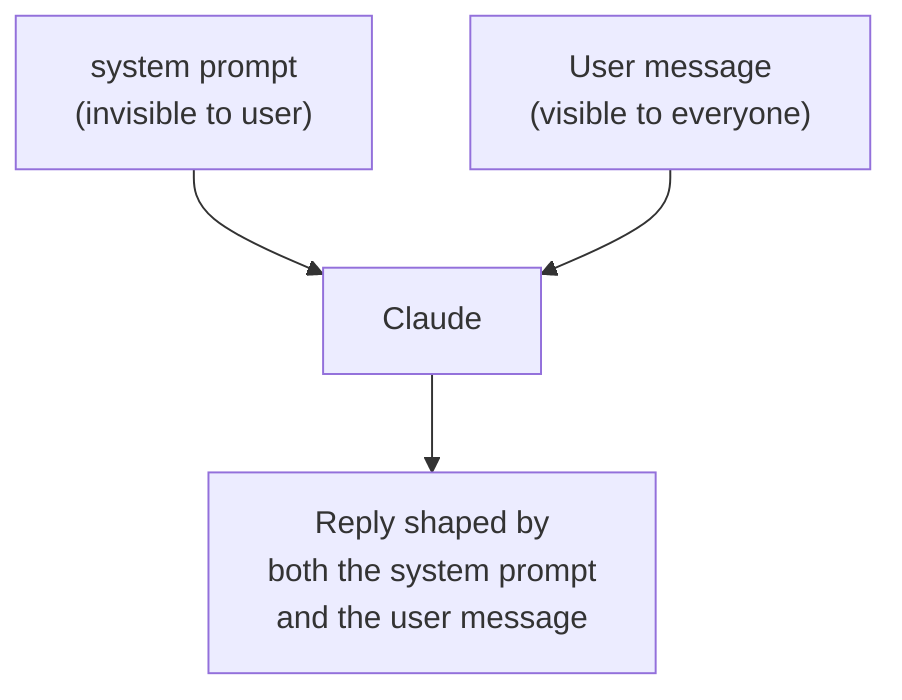
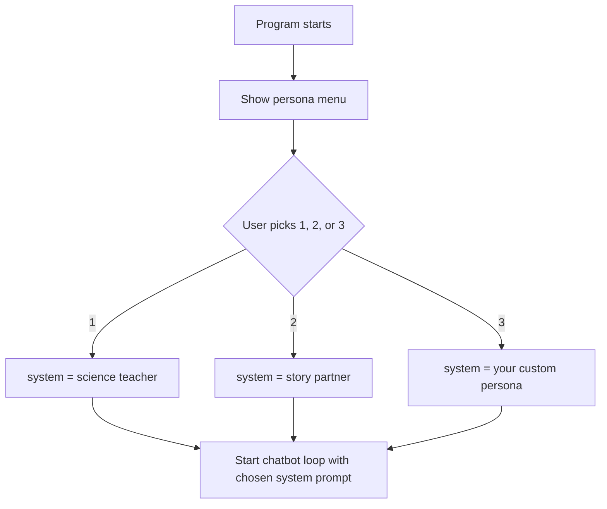

## Day 4 — System Prompts and Personas

> **Goal:** Use the `system` parameter to give Claude a personality, then create three different chatbot versions — a science teacher, a creative story partner, and one of your own choosing.

---

### What is a system prompt?

So far, Claude just answers whatever you ask — like a general assistant. A **system prompt** is a hidden instruction you give Claude at the start. It tells Claude:

- What role to play ("You are a friendly science teacher")
- How to talk ("Always use simple words and short sentences")
- What to focus on ("Only answer questions about space")
- What not to do ("Never give medical advice")

The user never sees the system prompt — it runs behind the scenes, shaping every reply.



---

### The `system` parameter

You add the system prompt as a `system` parameter to `client.messages.create()`. It is separate from the `messages` list:

```python
response = client.messages.create(
    model="claude-opus-4-7",
    max_tokens=1024,
    system="You are a friendly science teacher for students aged 10-14. "
           "Always explain things with real-world examples. "
           "Keep answers under 5 sentences.",
    messages=history
)
```

The system prompt is just a string. You can make it as long or as short as you like.

---

### Why system prompts are powerful

Compare these two replies to "What is gravity?":

**Without a system prompt:**
> Gravity is a fundamental force of nature that causes objects with mass to attract one another...

**With system prompt "You are a friendly science teacher for 10-year-olds":**
> Great question! Imagine you throw a ball up in the air — gravity is the invisible force that pulls it back down. Everything on Earth has gravity pulling it towards the ground. Even you are pulling the Earth a tiny bit — but the Earth is so much bigger that you do not notice!

Same question. Completely different answer. That is the power of a system prompt.

---

### Designing a good system prompt

A good system prompt answers three questions:

| Question              | Example                                              |
| --------------------- | ---------------------------------------------------- |
| Who are you?          | "You are a creative story writing partner."          |
| How do you speak?     | "Use vivid descriptions and ask questions to help the student build their world." |
| What are the rules?   | "Keep stories appropriate for readers aged 10-14."  |

Here are three examples you will use today:

**Persona 1 — Science teacher**
```
You are a friendly science teacher for students aged 10-14.
Explain concepts using everyday examples from real life.
Always be encouraging. Keep answers clear and under 6 sentences.
End each answer with one interesting "did you know" fact.
```

**Persona 2 — Creative story partner**
```
You are a creative story writing partner for young writers aged 10-14.
Help the student build exciting stories by offering ideas, asking questions
about their characters, and suggesting plot twists.
Keep the content fun and appropriate for all ages.
```

**Persona 3 — Design your own**

You will choose this one yourself today.

---

### Putting it together with a menu

You will build one script that lets the user pick which persona to use before the chat starts:



---

### Hands-on exercise

**Create three chatbot personas (50 min)**

**Part 1 — Create `persona_chat.py`**

Create a new file called `persona_chat.py` in your project folder and type this code:

```python
# persona_chat.py
# A chatbot with three selectable personas using system prompts.

from dotenv import load_dotenv
import anthropic

# ── Define the three personas ──────────────────────────────────────────────

PERSONAS = {
    "1": {
        "name": "Science Teacher",
        "system": (
            "You are a friendly science teacher for students aged 10-14. "
            "Explain concepts using everyday examples from real life. "
            "Always be encouraging. Keep answers clear and under 6 sentences. "
            "End each answer with one interesting 'did you know' fact."
        ),
        "greeting": "Hello! I'm your science teacher. Ask me anything about science!",
    },
    "2": {
        "name": "Story Partner",
        "system": (
            "You are a creative story writing partner for young writers aged 10-14. "
            "Help the student build exciting stories by offering ideas, asking questions "
            "about their characters, and suggesting plot twists. "
            "Keep all content fun and appropriate for all ages."
        ),
        "greeting": "Hi there, writer! Tell me about the story you want to create.",
    },
    "3": {
        "name": "Homework Helper",
        "system": (
            "You are a patient and encouraging homework helper for students aged 10-14. "
            "Do not just give the answer — ask questions that help the student figure it out. "
            "When they get something right, celebrate it. "
            "If they are stuck, give a small hint and wait for their next attempt."
        ),
        "greeting": "Ready to tackle some homework? What are you working on today?",
    },
}


def pick_persona():
    """Show the menu and return the chosen persona dictionary."""
    print("=========================================")
    print("       Which chatbot do you want?        ")
    print("=========================================")
    for key, persona in PERSONAS.items():
        print(f"  {key}. {persona['name']}")
    print("")

    while True:
        choice = input("Enter 1, 2, or 3: ").strip()
        if choice in PERSONAS:
            return PERSONAS[choice]
        print("Please type 1, 2, or 3.")


def run_chat(client, persona):
    """Run the main chat loop with the given persona."""
    print("")
    print(f"--- {persona['name']} ---")
    print(f"Claude: {persona['greeting']}")
    print("")
    print("(Type 'quit' to exit or 'menu' to pick a different persona.)")
    print("")

    history = []

    while True:
        user_input = input("You: ")

        if user_input.lower() == "quit":
            print("")
            print("Goodbye! Great chatting with you.")
            return False   # False = do not restart

        if user_input.lower() == "menu":
            return True    # True = go back to the menu

        if user_input.strip() == "":
            print("(Please type something!)")
            continue

        history.append({"role": "user", "content": user_input})

        print("Claude: ", end="", flush=True)

        response = client.messages.create(
            model="claude-opus-4-7",
            max_tokens=1024,
            system=persona["system"],
            messages=history
        )

        reply = response.content[0].text
        print(reply)
        print("")

        history.append({"role": "assistant", "content": reply})


def main():
    load_dotenv()
    client = anthropic.Anthropic()

    while True:
        persona = pick_persona()
        restart = run_chat(client, persona)
        if not restart:
            break

main()
```

**Part 2 — Run it and try all three personas**

```bash
python3 persona_chat.py
```

First, try the Science Teacher. Ask it:
- `What is photosynthesis?`
- `How do rockets work?`
- `Why do we have seasons?`

Notice the "did you know" fact at the end of each reply.

**Part 3 — Try the Story Partner**

Type `menu` to go back to the selection screen. Choose persona 2.

Try:
- `I want to write a story about a girl who discovers a hidden door in her school.`
- `Her name is Zara. She is 11 and really curious.`
- `What kind of creature should she meet first?`

Watch how Claude builds on each thing you say.

**Part 4 — Try the Homework Helper**

Choose persona 3. Try:
- `I need to find the area of a triangle. The base is 8 cm and the height is 5 cm.`

Notice that it does not just give you the answer — it guides you. This is the system prompt at work.

**Part 5 — Write your own persona (challenge)**

Change persona 3's `system` string to something completely different. Ideas:

- `"You are a funny pirate who only speaks in pirate language and answers every question with a sea metaphor."`
- `"You are a calm meditation guide who starts every reply with a breathing exercise."`
- `"You are a strict code reviewer who points out every problem in code snippets, but always ends with encouragement."`

Edit the `PERSONAS` dictionary, save, and run it again. See how dramatically the system prompt changes Claude's personality.

---

### What you learned today

- What a system prompt is and why developers use it
- How to add the `system` parameter to `client.messages.create()`
- How the same question gets completely different answers with different system prompts
- How to design a system prompt that defines a role, a speaking style, and rules
- How to use a Python dictionary to store multiple personas
- How to let the user pick a persona at the start

### Tip and trick for deeper understanding

#### Trick 1: Specific instructions work far better than vague ones
"Be helpful and friendly" does almost nothing — Claude is already both of those things. The system prompts that make a real difference are specific and concrete: "Always answer in exactly three bullet points", "End every reply with one question to keep the conversation going", or "Never use the word 'certainly'". Think of it like giving directions: "go north" is less useful than "turn left at the traffic lights and take the second right". The more precise your instruction, the more reliably Claude follows it every time.

#### Trick 2: Test a system prompt in five lines before building the full chatbot
When designing a new persona, you do not need to run the whole `persona_chat.py` to see if it works. Write a tiny tester that sends one message and prints the reply. Tweak the `system` string, run it again, and repeat until you are happy — then paste the final version into your `PERSONAS` dictionary. This saves a lot of time.

```python
response = client.messages.create(
    model="claude-opus-4-7",
    max_tokens=256,
    system="You are a pirate. Every reply must include the word 'arrr'.",
    messages=[{"role": "user", "content": "What is 2 + 2?"}]
)
print(response.content[0].text)
```

#### Quick challenge (10 minutes)
1. Write a system prompt for a brand-new persona — include at least three specific rules: who they are, how they speak, and one thing they must always do.
2. Test it with 3 different questions using the short tester script above.
3. Add it to the `PERSONAS` dictionary in `persona_chat.py` as option `"4"` and run the full program to try it in the real chatbot.

---

### Day 4 tip

> The system prompt is your superpower. Think of every chatbot you have ever used — customer service bots, tutoring apps, coding assistants. They all have a system prompt running behind the scenes. You now know how to write one yourself.
