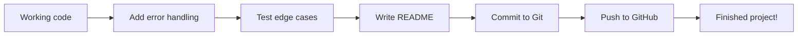
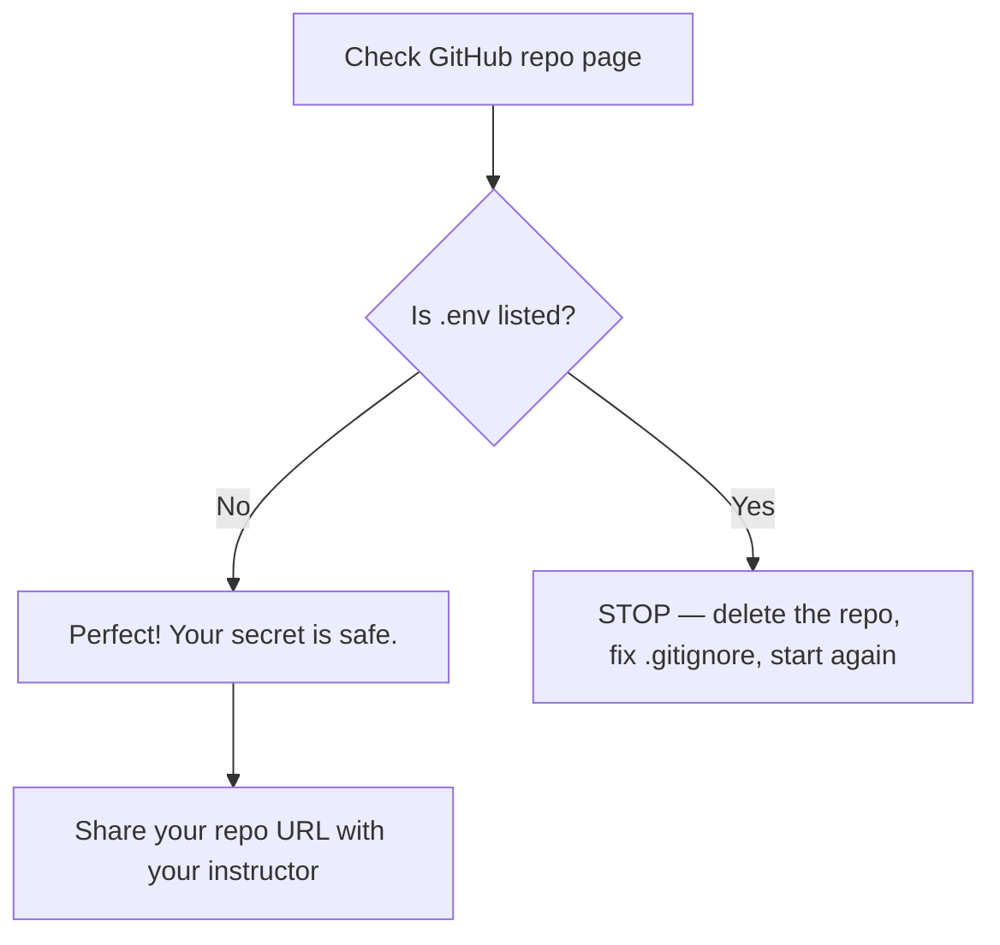

## Day 5 — Polish, Test, and Push to GitHub

> **Goal:** Add error handling, clean up your chatbot, write a README for it, and push the finished project to GitHub.

---

### Why polishing matters

A program that works on your computer when everything goes right is a good start. A program that also handles things going wrong — bad internet, wrong API key, empty input — is something you can actually share with people.

Today you go from "it works" to "it is finished".



---

### Error handling with `try` / `except`

When you call the Anthropic API, many things could go wrong:

- Your internet connection drops
- Your API key is wrong or expired
- You send too many requests too quickly
- The Anthropic service is temporarily down

Without error handling, your program crashes with a confusing Python traceback. With error handling, it prints a friendly message and keeps going.

The pattern looks like this:

```python
try:
    # The code that might fail
    response = client.messages.create(...)
except anthropic.APIConnectionError:
    print("Could not connect to the internet. Check your connection and try again.")
except anthropic.AuthenticationError:
    print("Bad API key. Check your .env file and make sure the key is correct.")
except anthropic.RateLimitError:
    print("Too many requests. Wait a moment and try again.")
except anthropic.APIStatusError as e:
    print(f"API error: {e.status_code} — {e.message}")
```

You can catch multiple different errors and give a helpful message for each one.

---

### The `finally` block (bonus concept)

If you want to run code no matter what — even if an error happened — use `finally`:

```python
try:
    response = client.messages.create(...)
    reply = response.content[0].text
    print(reply)
except anthropic.APIConnectionError:
    print("No internet connection.")
    reply = None
finally:
    # This always runs
    if reply:
        history.append({"role": "assistant", "content": reply})
```

---

### Testing edge cases

Before you call a program finished, test the ways people might break it:

| Edge case              | What you test                             | What should happen                     |
| ---------------------- | ----------------------------------------- | -------------------------------------- |
| Empty input            | Press Enter without typing               | Friendly message, do not call API      |
| Very long message      | Paste 500 words into the chat            | Claude still replies normally          |
| Type "quit" variations | Try `QUIT`, `Quit`, `  quit  `           | The chatbot exits each time            |
| No internet            | Disconnect from Wi-Fi and send a message | Error message, chatbot does not crash  |
| API key wrong          | Change `.env` to have a fake key         | Helpful authentication error message   |

---

### Writing a good commit message

You learned commit messages in Week 2. Here is a quick reminder of the format:

```
Short summary in present tense (max 72 characters)

Optional longer description explaining WHY the change was made,
not just what changed. Use blank line to separate from summary.
```

Good examples for today:
- `Add error handling to persona_chat.py`
- `Add README with setup instructions and usage examples`
- `Fix empty input not being skipped in chatbot loop`

Bad examples:
- `stuff`
- `changes`
- `fixed bug` (which bug? how?)

---

### Hands-on exercise

**Final polish of `persona_chat.py`, write a README, push to GitHub (55 min)**

**Part 1 — Add error handling to `persona_chat.py`**

Open `persona_chat.py`. Find the section in `run_chat()` where you call `client.messages.create()`. Replace it with this improved version:

```python
        history.append({"role": "user", "content": user_input})

        print("Claude: ", end="", flush=True)

        reply = None

        try:
            response = client.messages.create(
                model="claude-opus-4-7",
                max_tokens=1024,
                system=persona["system"],
                messages=history
            )
            reply = response.content[0].text
            print(reply)
            print("")

        except anthropic.APIConnectionError:
            print("(Could not connect. Check your internet and try again.)")
            print("")
            # Remove the message we added — the API never got it
            history.pop()

        except anthropic.AuthenticationError:
            print("(Bad API key. Check your .env file.)")
            print("")
            history.pop()

        except anthropic.RateLimitError:
            print("(Too many requests — wait a moment and try again.)")
            print("")
            history.pop()

        except anthropic.APIStatusError as e:
            print(f"(API error {e.status_code}. Try again.)")
            print("")
            history.pop()

        else:
            # Only add Claude's reply to history if no error happened
            history.append({"role": "assistant", "content": reply})
```

**Part 2 — Add a graceful start-up check**

Add this function above `main()` to check that the API key is loaded before starting:

```python
def check_setup():
    """Check that the API key is available. Return True if ready."""
    import os
    key = os.environ.get("ANTHROPIC_API_KEY")
    if not key:
        print("ERROR: ANTHROPIC_API_KEY not found.")
        print("Make sure your .env file exists and contains your API key.")
        print("See Day 1 instructions to set this up.")
        return False
    return True
```

Then call it at the start of `main()`:

```python
def main():
    load_dotenv()

    if not check_setup():
        return   # Stop the program early if the key is missing

    client = anthropic.Anthropic()
    # ... rest of main ...
```

**Part 3 — Run the full edge-case test**

Test each of these:

```bash
# 1. Normal run — make sure it still works
python3 persona_chat.py

# 2. Empty input — press Enter without typing (should say "Please type something!")

# 3. quit variations — try QUIT, Quit, and "  quit  " (with spaces)

# 4. menu command — type menu to go back to persona selection

# 5. Very long message — paste a paragraph of text
```

Fix anything that does not behave the way you want.

**Part 4 — Write a README for your project**

Create a new file called `README.md` in your project folder:

```markdown
# AI Chatbot — Week 7 Project

A terminal chatbot powered by the Anthropic Claude API, built with Python 3.

## Features

- Three selectable personas: Science Teacher, Story Partner, Homework Helper
- Full conversation memory — Claude remembers everything you said
- Friendly error messages if the API is unavailable
- Type `quit` to exit, `menu` to switch personas

## Setup

1. Clone this repo and enter the folder:
   ```
   git clone <your-repo-url>
   cd week-7-ai-chatbot
   ```

2. Install dependencies:
   ```
   pip install anthropic python-dotenv
   ```

3. Create a `.env` file in the project folder:
   ```
   ANTHROPIC_API_KEY=your-key-here
   ```
   Get a free API key at https://console.anthropic.com

4. Run the chatbot:
   ```
   python3 persona_chat.py
   ```

## Files

| File               | What it does                                   |
| ------------------ | ---------------------------------------------- |
| `persona_chat.py`  | Main chatbot with three selectable personas    |
| `chatbot.py`       | Simple single-persona chatbot from Day 3       |
| `ask_claude.py`    | Single-question script from Day 2              |
| `test_setup.py`    | Checks that the API key is configured          |
| `.env`             | Your API key (never uploaded to GitHub)        |
| `.gitignore`       | Tells Git to ignore .env                       |

## Built with

- Python 3
- [Anthropic Python SDK](https://github.com/anthropics/anthropic-sdk-python)
- [python-dotenv](https://pypi.org/project/python-dotenv/)
```

**Part 5 — Stage, commit, and push to GitHub**

First, make sure Git knows who you are (if you have not done this before):

```bash
git config user.name "Your Name"
git config user.email "youremail@example.com"
```

Stage all your files:

```bash
git status
```

Look at the output. Make sure `.env` is NOT listed. If it is, stop and re-check your `.gitignore`.

Now add and commit:

```bash
git add .gitignore test_setup.py ask_claude.py chatbot.py persona_chat.py README.md
git commit -m "Add Week 7 AI chatbot project with three personas and error handling"
```

**Part 6 — Create a GitHub repo and push**

1. Go to [https://github.com](https://github.com) and log in
2. Click **+** → **New repository**
3. Name it `week-7-ai-chatbot`
4. Set it to **Public**
5. Do NOT tick "Add a README file" — you already have one
6. Click **Create repository**
7. GitHub shows you commands. Copy the two lines that start with `git remote add origin` and `git push`

They look like:

```bash
git remote add origin https://github.com/your-username/week-7-ai-chatbot.git
git branch -M main
git push -u origin main
```

Run them in your terminal.

**Part 7 — Check GitHub**

Go to your repo page on GitHub. You should see:

- Your `README.md` displayed beautifully
- All your Python files listed
- No `.env` file anywhere



**You just shipped a real Python project to GitHub.** That is what software developers do every day.

---

### What you learned today

- How to catch specific API errors with `try` / `except`
- How to give helpful error messages instead of scary tracebacks
- How to pop a message from history if the API call failed
- How to test edge cases before calling a project finished
- How to write a project README that explains setup and usage
- How to commit only the files you want with `git add <files>`
- How to push a project to a public GitHub repository

### Tip and trick for deeper understanding

#### Trick 1: The `else` block in `try/except` runs only when no error happened
Most people only use `try` and `except`, but there is a third clause called `else`. Code inside `else` runs only if the `try` block finished without raising any exception. This makes it the perfect place to add Claude's reply to history — you are 100% sure the call succeeded and `reply` is not `None`.

```python
try:
    response = client.messages.create(
        model="claude-opus-4-7",
        max_tokens=1024,
        system=persona["system"],
        messages=history
    )
    reply = response.content[0].text
except anthropic.APIConnectionError:
    print("No internet connection!")
    history.pop()
else:
    # Only runs when the try block had zero errors
    print(reply)
    history.append({"role": "assistant", "content": reply})
```

#### Trick 2: Always `history.pop()` after a failed API call
When an error happens *after* you have already added the user message to history, that message is now "orphaned" — it has no assistant reply following it. If you leave it there, the next API call sends two `"user"` messages in a row, which causes another error. Calling `history.pop()` removes the orphaned message and keeps the required `user → assistant → user → assistant` pattern intact. This is why every `except` block in today's code ends with `history.pop()`.

#### Quick challenge (10 minutes)
1. Add a counter `successful_calls = 0` before the `while True` loop in `persona_chat.py`.
2. Inside the `else` block (after a successful reply is added to history), add `successful_calls += 1`.
3. When the user types `quit`, print `f"You had {successful_calls} successful exchanges with Claude this session!"` before the goodbye message — and make sure failed calls caught by `except` do not increase the count.

---

### Day 5 tip

> Check the GitHub page one final time before sharing the link: look for `.env` in the file list. If it is there, the world can see your API key. Delete it from GitHub immediately using the web interface and then fix your `.gitignore`. This happens to experienced developers too — checking before sharing is a habit worth building.
