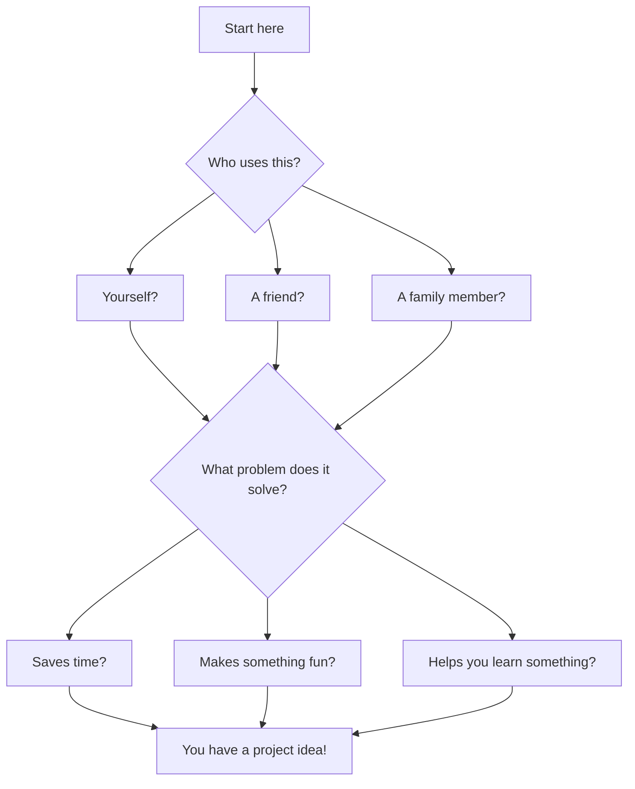
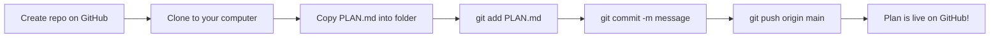

## Day 1 — Plan Your Project

> **Goal:** Choose one project idea and fill in a complete planning template so you know exactly what to build before you write a single line of code.

---

### Why planning matters

Have you ever started building something and got completely stuck halfway through?

That happens when you jump into code without a plan. Professional developers always plan first. Today you will spend the whole session thinking and planning — and by the end you will have a GitHub repo ready to go.

> **Rule for today:** No code yet. Just thinking and planning.

---

### Step 1 — Brainstorm: what problem does your project solve?

Every great program solves a problem or fills a need. Before you pick your idea, ask yourself these questions:



Ask yourself:

- What is something I do a lot that could be easier?
- What would be fun to show a friend or family member?
- Which Python skill from this course am I most proud of?

**Examples of problems and solutions:**

| Problem | Project idea |
| ------- | ------------ |
| I always forget jokes | Joke Bot with Memory |
| Studying for tests is boring | Personal Quiz Maker |
| I stare at blank paper when writing stories | AI Story Generator |
| I don't know what to cook | Recipe Suggester |
| Homework questions confuse me | Homework Explainer |
| I want to remember how I felt each day | Mood Journal + AI Reflection |

---

### Step 2 — Review the project ideas

Here are the six project options in more detail. Read each one carefully.

#### Option A — Joke Bot with Memory (⭐ Beginner)

A program that tells jokes one at a time. You can save your favourite jokes to a file. The bot never tells the same joke twice in one session.

**Python concepts you will use:** lists, files, `random`, loops, functions

```python
# A tiny preview of what this might look like
import random

jokes = [
    ("Why don't scientists trust atoms?", "Because they make up everything!"),
    ("What do you call a fish with no eyes?", "A fsh!"),
]

setup, punchline = random.choice(jokes)
print(setup)
input("Press Enter for the punchline...")
print(punchline)
```

#### Option B — Personal Quiz Maker (⭐ Beginner)

You write questions and answers in a JSON file. The program quizzes you, tells you your score, and saves your score history so you can see if you are improving.

**Python concepts you will use:** files, JSON, loops, functions, `input()`

#### Option C — AI Story Generator (⭐⭐ Intermediate)

You type a prompt like "a dragon who is afraid of heights". The program sends it to the Claude API and prints back a short story. You can save the stories you like to a file.

**Python concepts you will use:** `anthropic` library, functions, files, `input()`

#### Option D — Recipe Suggester (⭐⭐ Intermediate)

You tell the program what ingredients you have. It looks through a list of recipes stored in a JSON file and suggests matches. You can add new recipes too.

**Python concepts you will use:** JSON, dictionaries, functions, loops

#### Option E — Homework Explainer (⭐⭐ Intermediate)

You paste in a confusing question or concept. The Claude API explains it in simple, friendly language — like having a patient tutor available any time.

**Python concepts you will use:** `anthropic` library, `input()`, functions, loops

#### Option F — Mood Journal + AI Reflection (⭐⭐⭐ Advanced)

You write a short journal entry each day. The Claude API reads it and gives you a kind, positive reflection. All entries are saved with dates so you can look back.

**Python concepts you will use:** `anthropic` library, JSON files, `datetime`, functions

---

### Step 3 — Choose ONE project

Do not try to combine two ideas. Do not try to build everything.

Pick one project and commit to it.

> **If you are unsure:** Pick Option A or B. A small, finished project is much better than a big, broken one. Judges always prefer something that actually works.

Write your choice down. Say it out loud. You have chosen your project.

---

### Step 4 — Fill in the planning template

This is today's most important task. Open VS Code and create a new file called `PLAN.md` in your home folder. Fill in every single section.

```markdown
# Project Plan

## Project name
_Write a short, catchy name here_

## What it does
_One or two sentences. What happens when someone runs it?_

## Who uses it
_Is it for you? For a friend? For anyone?_

## The 3 main features

1. Feature one — _describe it in one sentence_
2. Feature two — _describe it in one sentence_
3. Feature three — _describe it in one sentence_

## Files I will need

- `main.py` — _what this file does_
- `helpers.py` — _what this file does (delete this line if not needed)_
- `data.json` — _what this stores (delete this line if not needed)_
- `requirements.txt` — list of pip packages

## Python concepts I will use

- _list them here: functions, loops, files, JSON, API calls, etc._

## What might be hard

- _write one or two things you are unsure about — that is perfectly okay!_
```

Take your time with this. A good plan makes the next three build days much easier.

---

### Step 5 — Create your GitHub repo and make the first commit

Now you will create a real home for your project on GitHub.

**Create the repo on GitHub:**

1. Go to [https://github.com](https://github.com) and sign in
2. Click **+** → **New repository**
3. Give it a name like `quiz-maker` or `joke-bot` (use dashes, no spaces)
4. Set it to **Public**
5. Tick **Add a README file**
6. Click **Create repository**

**Clone it to your computer:**

```bash
cd ~/projects
git clone https://github.com/YOUR-USERNAME/YOUR-REPO-NAME.git
cd YOUR-REPO-NAME
```

**Copy your plan file in and commit it:**

```bash
cp ~/PLAN.md .
git add PLAN.md
git commit -m "Add project plan"
git push origin main
```



Check GitHub in your browser. You should see your `PLAN.md` file there. Your project has officially started.

---

### Hands-on exercise

**Time: 45–60 minutes**

Work through Steps 1–5 above. By the end of today you should have:

- [ ] Read through all 6 project options
- [ ] Chosen ONE project
- [ ] Filled in every section of the `PLAN.md` template
- [ ] Created a GitHub repo with your project name
- [ ] Cloned the repo to your computer
- [ ] Committed and pushed `PLAN.md` to GitHub

**Bonus challenge:** Update the GitHub README that was auto-created. Replace the placeholder text with a short paragraph describing what your project will do. Commit and push that change too.

---

### What you learned today

- Why planning before coding saves time and avoids getting stuck halfway
- How to think about a project in terms of the problem it solves
- How to break a project into features and files before writing any code
- How to create a GitHub repo and clone it to your computer
- How to make your very first commit on a brand-new project

---

### Tip and trick for deeper understanding

#### Trick 1: Your plan is a hypothesis, not a contract
When you write your `PLAN.md`, you are making your best guess about what you will build — and that is completely fine! Professional developers call this "planning under uncertainty." The most valuable part of planning is not the document itself, it is the thinking you do while writing it. Update your plan freely as you learn more over the next three build days.

#### Trick 2: Give your GitHub repo a name you would be proud to show a teacher
Your repo name appears on your GitHub profile, in every URL, and in your commit history. Pick something descriptive like `quiz-maker` or `mood-journal` instead of something vague like `project1` or `test`. A clear name tells the world exactly what you built before they even open a single file. It also makes you feel more like a real developer — because you are one!

#### Quick challenge (10 minutes)
Open your `PLAN.md` and read the "What might be hard" section out loud. For each thing you listed, search Google for it followed by "Python example" — for instance, "read from JSON file Python example". Spend five minutes just skimming results. You do not need to understand everything yet. The goal is to make the unknown feel a little less scary before you start building tomorrow.

---

### Day 1 tip

> Your plan does not need to be perfect. It will change as you build — that is completely normal. Every developer changes their plan as they learn more. The point is to start with a direction, not a perfect map.
