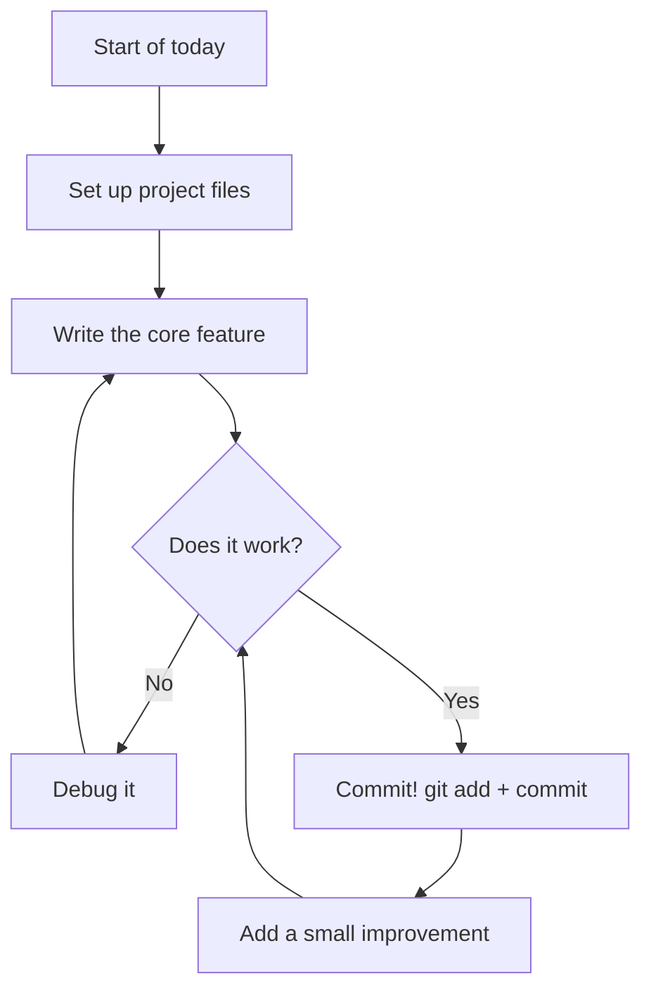
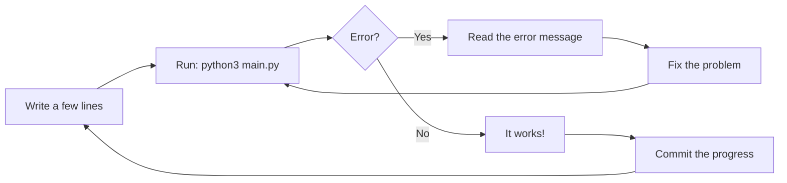

## Day 2 — Build Day 1: Core Feature

> **Goal:** Set up your project files and build the single most important feature of your program — the one thing it absolutely must do.

---

### The golden rule of building

There is one rule that professional developers live by:

> **Build the most important thing first. Make it work. Then add more.**

Today you are not trying to finish your project. You are trying to make the core feature work. That is it.

If your project is a Quiz Maker, the core feature is: ask a question, check the answer. Everything else — saving scores, loading from a file — comes after.



---

### Step 1 — Set up your project file structure

Open a terminal and navigate to your project folder:

```bash
cd ~/projects/YOUR-REPO-NAME
```

Create a virtual environment and activate it:

```bash
python3 -m venv venv
source venv/bin/activate
```

You will see `(venv)` appear at the start of your terminal prompt. That means your virtual environment is active. 

Now create your main files. Here is a good starting structure:

```bash
touch main.py
touch helpers.py
```

If your project uses JSON data, create the data file too:

```bash
touch data.json
```

Open VS Code in your project folder:

```bash
code .
```

Your file tree should look something like this:

```
your-project/
├── main.py
├── helpers.py
├── data.json        (if you need it)
├── PLAN.md
├── README.md
└── venv/
```

> **Important:** Never commit your `venv/` folder to GitHub. It is huge and everyone's computer needs its own copy. We will set up `.gitignore` in a moment.

**Create a `.gitignore` file to protect your repo:**

```bash
touch .gitignore
```

Open `.gitignore` in VS Code and add these lines:

```
venv/
__pycache__/
*.pyc
.env
```

Save it. Now commit this setup:

```bash
git add main.py helpers.py .gitignore
git commit -m "Set up project structure"
git push origin main
```

That is your first commit of the build. Well done.

---

### Step 2 — Install packages you need

If your project uses the Claude API, install it now:

```bash
pip install anthropic
```

If your project uses any other packages, install them too. Then save the list:

```bash
pip freeze > requirements.txt
git add requirements.txt
git commit -m "Add requirements.txt"
git push origin main
```

This means anyone who clones your project can run `pip install -r requirements.txt` and get everything they need.

---

### Step 3 — Build the core feature

Now the fun part starts. Open `main.py` and start writing.

**Work in small steps.** Do not write the whole program at once. Write a little, run it, see if it works, then write a little more.

Here are example core features for each project. Find yours and use it as a starting point:

#### Option A — Joke Bot (core feature: tell one joke)

```python
# main.py
import random

def get_jokes():
    return [
        ("Why don't scientists trust atoms?", "Because they make up everything!"),
        ("What do you call a fish with no eyes?", "A fsh!"),
        ("Why did the scarecrow win an award?", "Because he was outstanding in his field!"),
    ]

def tell_joke(jokes):
    setup, punchline = random.choice(jokes)
    print(f"\n{setup}")
    input("Press Enter for the punchline...")
    print(f"{punchline}\n")

jokes = get_jokes()
tell_joke(jokes)
```

#### Option B — Quiz Maker (core feature: ask one question and check the answer)

```python
# main.py
import json

def load_questions(filename):
    with open(filename, "r") as f:
        return json.load(f)

def ask_question(question, answer):
    print(f"\nQuestion: {question}")
    user_answer = input("Your answer: ").strip().lower()
    if user_answer == answer.lower():
        print("Correct! Well done.")
        return True
    else:
        print(f"Not quite. The answer was: {answer}")
        return False
```

And create a starter `data.json`:

```json
[
    {"question": "What is 7 times 8?", "answer": "56"},
    {"question": "What is the capital of France?", "answer": "Paris"}
]
```

#### Option C — AI Story Generator (core feature: send a prompt, print the story)

```python
# main.py
import anthropic

def generate_story(prompt):
    client = anthropic.Anthropic()
    message = client.messages.create(
        model="claude-opus-4-5",
        max_tokens=500,
        messages=[
            {
                "role": "user",
                "content": f"Write a short, fun story (about 150 words) about: {prompt}"
            }
        ]
    )
    return message.content[0].text

topic = input("What should the story be about? ")
story = generate_story(topic)
print("\n--- Your Story ---")
print(story)
```

> **API key reminder:** Make sure your `ANTHROPIC_API_KEY` environment variable is set. If you saved it in a `.env` file, load it with `python-dotenv`.

---

### Step 4 — Test as you go

Every time you add something new, run your code immediately:

```bash
python3 main.py
```

Ask yourself:

- Did it do what I expected?
- Is there an error message?
- Does it feel right to use?

**If something breaks, do not panic.** Read the error message carefully. Python error messages tell you:

1. Which file the error is in
2. Which line number
3. What kind of error it is



---

### Step 5 — Commit every time something works

This is not optional. Every time a piece of code works, commit it.

```bash
git add main.py
git commit -m "Add core joke-telling feature"
git push origin main
```

Use clear commit messages. Future-you will be grateful.

Good commit message examples:
- `"Add function to load questions from JSON"`
- `"Core quiz loop working"`
- `"Display score at end of quiz"`

Bad commit message examples:
- `"stuff"`
- `"fix"`
- `"aaaaaa"`

---

### Hands-on exercise

**Time: 45–60 minutes**

Work through Steps 1–5. By the end of today you should have:

- [ ] Virtual environment set up and activated
- [ ] `.gitignore` created with `venv/` listed
- [ ] All starter files created
- [ ] `requirements.txt` committed
- [ ] The **core feature** of your project working (even in a basic form)
- [ ] At least **3 commits** pushed to GitHub

**Bonus challenge:** Open GitHub and look at your commit history. Click on one of the commits. You can see exactly what changed in every file. This is the time machine we talked about in Week 2!

---

### What you learned today

- How to set up a clean Python project with a virtual environment
- Why `.gitignore` exists and what belongs in it
- How to save your dependencies with `pip freeze`
- The golden rule: build the core feature first, test constantly
- How to read Python error messages to find and fix bugs
- Why committing after every working change is a great habit

---

### Tip and trick for deeper understanding

#### Trick 1: Build the "happy path" first
The "happy path" is what happens when everything goes perfectly — the user types exactly what you expected, files exist, and nothing breaks. Build that first. Once the happy path works and is committed, then add checks for weird situations like empty input or missing files. Trying to handle every possible problem before your core feature works is like building a safety net before you have built the trapeze — completely backwards!

#### Trick 2: Small commits are a superpower
Every time something new works — even one tiny function — commit it. If you make a mistake in your next ten lines of code, you can run `git diff` to see exactly what changed since your last commit, or use `git checkout main.py` to undo all your recent changes in one go. Big commits mean big disasters if something goes wrong. Small commits mean small setbacks you can recover from in seconds.

```bash
# See exactly what changed since your last commit
git diff main.py

# See your commit history in one line each
git log --oneline
```

#### Quick challenge (10 minutes)
Look at your last three commit messages on GitHub. Rewrite each one in your head as if you were explaining to a friend what you actually built — not just what you did. Instead of `"fix bug"`, try `"Fix score counter that was always showing zero"`. Starting tomorrow, write every commit message at that level of detail. Your future self will genuinely thank you.

---

### Day 2 tip

> If your code does not work on the first try, that is completely normal. Professional developers spend about half their time fixing bugs. Reading error messages carefully is a real skill — and you are already practising it.
