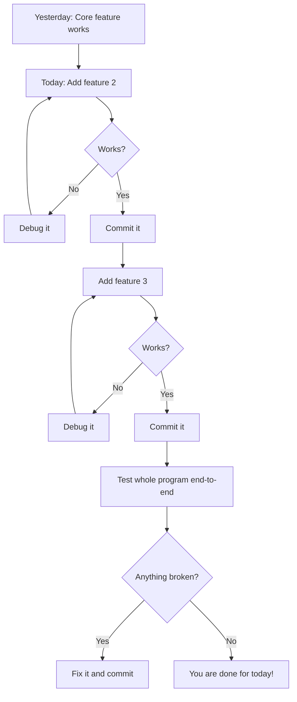
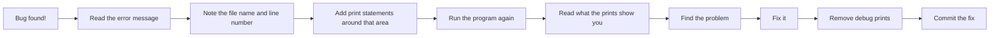

## Day 3 — Build Day 2: Add Features and Fix Bugs

> **Goal:** Add your second and third features, squash any bugs, and reach a point where your project works end-to-end from start to finish.

---

### Where you should be right now

By the end of yesterday, your core feature was working and you had at least 3 commits on GitHub. Today you build on top of that foundation.

The aim for today: **by the end of this session, your project runs from start to finish without crashing.**

It does not need to be beautiful. It does not need to be perfect. It just needs to work.



---

### Step 1 — Review yesterday's work

Open your project in VS Code and run it:

```bash
cd ~/projects/YOUR-REPO-NAME
source venv/bin/activate
python3 main.py
```

Make sure everything from yesterday still works. If something broke overnight (this happens!), fix it before adding anything new.

---

### Step 2 — Add feature 2

Look at your `PLAN.md` and find feature number 2. Build it.

Here are examples of "feature 2" for each project:

#### Joke Bot — Feature 2: Save a favourite joke to a file

```python
# helpers.py
import json
import os

def load_favourites(filename="favourites.json"):
    if os.path.exists(filename):
        with open(filename, "r") as f:
            return json.load(f)
    return []

def save_favourite(joke, filename="favourites.json"):
    favourites = load_favourites(filename)
    favourites.append({"setup": joke[0], "punchline": joke[1]})
    with open(filename, "w") as f:
        json.dump(favourites, f, indent=2)
    print("Joke saved to your favourites!")
```

Then in `main.py`, after telling the joke:

```python
save_it = input("Save this joke? (y/n): ").lower()
if save_it == "y":
    save_favourite((setup, punchline))
```

#### Quiz Maker — Feature 2: Track score and show result at the end

```python
# In main.py
def run_quiz(questions):
    score = 0
    total = len(questions)
    for q in questions:
        correct = ask_question(q["question"], q["answer"])
        if correct:
            score += 1
    print(f"\nYou scored {score} out of {total}!")
    percentage = (score / total) * 100
    if percentage == 100:
        print("Perfect score! Amazing!")
    elif percentage >= 60:
        print("Great work!")
    else:
        print("Keep practising — you'll get there!")
    return score
```

#### AI Story Generator — Feature 2: Save the story to a file

```python
# In main.py
import datetime

def save_story(topic, story, filename="stories.txt"):
    timestamp = datetime.datetime.now().strftime("%Y-%m-%d %H:%M")
    with open(filename, "a") as f:
        f.write(f"\n\n--- Story about: {topic} ({timestamp}) ---\n")
        f.write(story)
    print(f"Story saved to {filename}")
```

---

### Step 3 — Add feature 3

Once feature 2 is committed and working, add feature 3.

Take the same approach:
1. Write a small piece
2. Run it
3. Check it works
4. Commit

Here are "feature 3" examples:

#### Joke Bot — Feature 3: Never repeat a joke in the same session

```python
# In main.py
told_jokes = []

def tell_new_joke(jokes, told_jokes):
    remaining = [j for j in jokes if j not in told_jokes]
    if not remaining:
        print("You've heard all the jokes! Restarting the list.")
        told_jokes.clear()
        remaining = jokes
    joke = random.choice(remaining)
    told_jokes.append(joke)
    return joke
```

#### Quiz Maker — Feature 3: Save score history to a file

```python
# In helpers.py
def save_score(score, total, filename="scores.json"):
    history = []
    if os.path.exists(filename):
        with open(filename, "r") as f:
            history = json.load(f)
    timestamp = datetime.datetime.now().strftime("%Y-%m-%d")
    history.append({"date": timestamp, "score": score, "total": total})
    with open(filename, "w") as f:
        json.dump(history, f, indent=2)
    print(f"Score saved! You have {len(history)} attempts recorded.")
```

---

### Step 4 — Debug like a detective

Bugs are not a sign that you are bad at coding. Every developer deals with bugs every single day. What matters is knowing how to find them.

**The best debugging tool: the print statement.**

When something is not working, add `print()` calls everywhere to see what is happening:

```python
def ask_question(question, answer):
    print(f"DEBUG: question={question}")      # add this
    print(f"DEBUG: expected answer={answer}") # add this
    user_answer = input("Your answer: ").strip().lower()
    print(f"DEBUG: user typed={user_answer}") # add this
    if user_answer == answer.lower():
        return True
    return False
```

Once you find the bug and fix it, **remove your debug print statements** before committing. Debug prints left in code are messy.

**Common bugs and how to fix them:**

| Bug | What it looks like | How to fix it |
| --- | ------------------ | ------------- |
| `FileNotFoundError` | `No such file or directory: 'data.json'` | Check the filename spelling; make sure the file exists in the right folder |
| `KeyError` | `KeyError: 'question'` | Check that your dictionary key name matches exactly — spelling and capitalisation matter |
| `JSONDecodeError` | `Expecting value: line 1 column 1` | Your JSON file is empty or has a syntax error — check the file content |
| `IndentationError` | `IndentationError: unexpected indent` | Python cares about spacing — check that your lines are indented consistently |
| Infinite loop | Program never stops | Make sure your loop has a way to end; press `Ctrl+C` to stop a stuck program |



---

### Step 5 — Test the whole program end-to-end

Once all three features are in, run the whole program from the very beginning as if you are a user who has never seen it before.

Ask yourself:

- Does it start cleanly without errors?
- Are the messages clear and easy to understand?
- Does every feature work?
- Does it end gracefully?

Fix anything that feels broken or confusing. Commit each fix.

---

### Hands-on exercise

**Time: 45–60 minutes**

By the end of today you should have:

- [ ] Feature 2 built, tested, and committed
- [ ] Feature 3 built, tested, and committed
- [ ] The whole program runs from start to finish without crashing
- [ ] At least **3 new commits** today (aim for more)
- [ ] All debug print statements removed from your code

**Bonus challenge:** Add input validation. What happens if the user presses Enter without typing anything? What happens if they type a letter where you expected a number? Try to handle at least one case like that gracefully.

```python
# Example: handle empty input
user_answer = input("Your answer: ").strip()
if not user_answer:
    print("Please type something!")
```

---

### What you learned today

- How to add features one at a time on top of a working foundation
- How to use `print()` statements as a debugging tool
- How to read common Python error messages and fix them
- How to write data to files so your program remembers things
- Why committing after each working feature keeps you safe

---

### Tip and trick for deeper understanding

#### Trick 1: Change one thing at a time when debugging
When you are hunting a bug, the golden rule is: only change ONE thing, then test. If you change three things at once and the bug disappears, you will not know which fix worked. And if the bug gets worse, you will not know which change caused it. One change → test → one change → test. This feels slow but it is actually the fastest route to a working program.

#### Trick 2: Tag your debug prints so you can delete them all at once
Instead of `print("here")` or `print(x)`, always write your debug prints with a clear tag:

```python
print(f"DEBUG: score={score}, total={total}")
print(f"DEBUG: entering ask_question with question={question}")
```

When the feature is working, press `Ctrl+Shift+F` in VS Code and search for `DEBUG:`. Every single debug print shows up in the results — you can delete them all in one sweep instead of hunting through your file line by line.

#### Quick challenge (10 minutes)
Find one place in your program where the user types something. Add this check directly below the `input()` line and test it by pressing Enter without typing anything:

```python
if not user_input.strip():
    print("Hmm, you didn't type anything! Let's try that again.")
    continue  # if inside a loop, or ask again
```

Making your program respond kindly to unexpected input is one of the things that separates a polished project from a rough one.

---

### Day 3 tip

> If you have not finished all three features by the end of today, that is okay. Having two features that work perfectly is better than three features where one crashes. Focus on quality, not quantity. You have tomorrow to polish.
