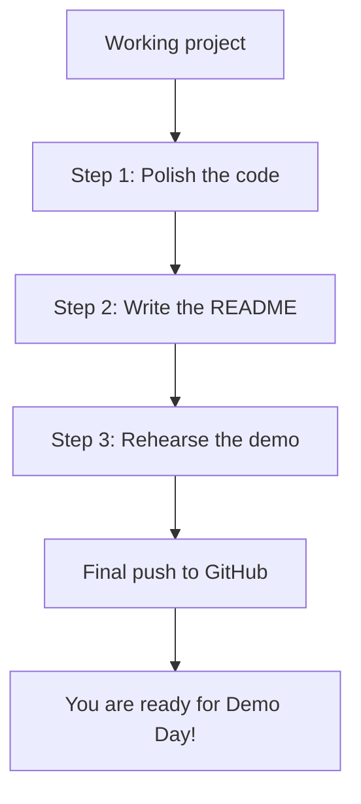
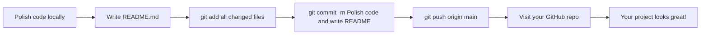

## Day 4 — Polish and Prepare Your Demo

> **Goal:** Make your project shine, write a proper README, and rehearse the 3-minute demo you will give tomorrow.

---

### The difference between "working" and "finished"

Your project works. That is a huge deal. But today you are going to take it from "it works on my computer" to "I am proud to show this to anyone".

There are three parts to today:

1. **Polish the code** — clean it up so it is easy to read and pleasant to use
2. **Write the README** — so anyone who finds your project knows what it is
3. **Prepare your demo** — so you can confidently explain it tomorrow



No new features today. Today is about making what you have as good as it can be.

---

### Step 1 — Polish the code

**Polish means:** clear messages, good variable names, no debug prints, and code that is easy to read.

Work through your code file by file and look for these things:

#### 1a — Remove all debug print statements

Yesterday you added `print(f"DEBUG: ...")` lines to help find bugs. Remove every single one.

Search for them in VS Code: press `Ctrl+Shift+F` and search for `DEBUG`.

#### 1b — Make your messages friendly and clear

Read every `print()` message in your program out loud. Ask: does this make sense to someone who has never used my program?

**Before:**

```python
print("err: file missing")
print("q done")
print("score:", s)
```

**After:**

```python
print("Could not find the questions file. Please check that data.json exists.")
print("Quiz complete!")
print(f"Your score: {score} out of {total}")
```

#### 1c — Use clear variable names

Short, cryptic names are hard to understand.

**Before:**

```python
def do_thing(x, y, lst):
    for i in lst:
        if i[0] == x:
            return i
```

**After:**

```python
def find_recipe(ingredient, recipes):
    for recipe in recipes:
        if ingredient in recipe["ingredients"]:
            return recipe
```

#### 1d — Add a welcome message and a goodbye message

Every good program says hello and goodbye. Add these to your `main.py`:

```python
# At the very top of your main() function or program
print("=" * 40)
print("  Welcome to [Your Project Name]!")
print("=" * 40)
print()

# At the very end
print()
print("Thanks for using [Your Project Name]. See you next time!")
```

#### 1e — Add a main guard

This is a Python best practice. Wrap your program's entry point in a `if __name__ == "__main__":` block:

```python
def main():
    # your program runs here
    pass

if __name__ == "__main__":
    main()
```

This means your functions can be imported by other Python files without the whole program running. It is what professional Python code looks like.

---

### Step 2 — Write your project README

Your README is the front door to your project. When someone visits your GitHub repo, they read the README first. Make it count.

Open `README.md` in VS Code. Replace the auto-generated content with this structure:

```markdown
# [Your Project Name]

A short, punchy one-sentence description of what your project does.

## What it does

Write 2–3 sentences here. Be specific. What happens when you run it?
What problem does it solve?

## Features

- Feature 1: _describe it_
- Feature 2: _describe it_
- Feature 3: _describe it_

## How to run it

1. Clone this repo:
   ```
   git clone https://github.com/YOUR-USERNAME/YOUR-REPO.git
   cd YOUR-REPO
   ```

2. Create and activate a virtual environment:
   ```
   python3 -m venv venv
   source venv/bin/activate
   ```

3. Install dependencies:
   ```
   pip install -r requirements.txt
   ```

4. Run the program:
   ```
   python3 main.py
   ```

## What I learned

Write 2–3 sentences about what was the hardest part to build
and what you are most proud of.

## Built with

- Python 3
- [Any other tools or libraries you used]

## About

Made by [Your Name] as the final project for the Our AI Journey coding course.
```

Take your time writing this. Good writing matters as much as good code.

---

### Step 3 — Push your polished code to GitHub

Once your code is polished and your README is written, make a final commit:

```bash
git add main.py helpers.py README.md
git add .   # catches any other changed files
git commit -m "Polish code and write README"
git push origin main
```

Open GitHub in your browser and visit your repo page. You should see your beautiful README displayed. This is what the world sees when they find your project.



---

### Step 4 — Prepare your 3-minute demo script

Tomorrow is Demo Day. You will have 3–5 minutes to show your project to the group. Prepare what you are going to say.

A great demo follows this structure:

```
1. What it is (30 seconds)
   "My project is called [name]. It [does this one thing]."

2. Show it working (90 seconds)
   Run the program live. Talk through what you are doing.
   "I'm going to type in a topic, and watch what happens..."

3. How it works (30 seconds)
   "The main thing it does is [explain one interesting part of the code]."
   You do not need to show every line. Just one interesting bit.

4. What was hard (20 seconds)
   "The hardest part was [one thing]. I fixed it by [how]."

5. What you are proud of (20 seconds)
   "I'm most proud of [one specific thing]."
```

Write your demo script down in a file called `DEMO.md` in your project folder.

**Important demo tips:**

- Run through it at least twice before tomorrow
- Have your terminal and VS Code open and ready before you start
- Speak slowly — when people are nervous they speak too fast
- If something goes wrong live, stay calm and say "Let me try that again" — everyone has been there
- Look up at your audience when you can, not just at the screen

---

### Hands-on exercise

**Time: 45–60 minutes**

Work through all four steps. By the end of today you should have:

- [ ] All debug print statements removed
- [ ] All user messages are clear and friendly
- [ ] Variable names are readable and descriptive
- [ ] A welcome message and goodbye message added
- [ ] `if __name__ == "__main__":` block added
- [ ] `README.md` fully written with all sections
- [ ] Final polished version committed and pushed to GitHub
- [ ] `DEMO.md` written with your 3-minute demo script
- [ ] Demo rehearsed at least once out loud

**Bonus challenge:** Ask someone at home to try to run your program. Give them zero instructions — just the README. Watch them. Notice where they get confused. Fix those things.

---

### What you learned today

- How to clean up code so it is easy for others (and future-you) to read
- Why clear messages and variable names matter as much as working logic
- How to write a project README that makes people want to try your work
- How to structure a confident, clear technical demo
- The importance of rehearsing before presenting

---

### Tip and trick for deeper understanding

#### Trick 1: Read your code out loud like it is a story
Sit back and read every function in your code out loud. If you stumble over a variable name, or if you have to re-read a line twice to understand it, that line needs a better name or a short comment. Good code reads almost like plain English — `if score >= passing_score:` should feel natural to say aloud. This trick catches confusing names and tangled logic faster than staring at the screen ever will.

#### Trick 2: Your README's first sentence is your superpower
Most people who visit your GitHub repo will read only the first sentence of your README before deciding whether to stay or leave. Make that sentence answer: "What does this do and why is it cool?" A weak opener: `"This is my Python project."` A strong opener: `"A quiz maker that lets you create your own questions and tracks your score over time so you can see yourself improving."` One great sentence does more work than five confusing paragraphs.

#### Quick challenge (10 minutes)
Set a timer for exactly 3 minutes, stand up, and deliver your demo out loud — to yourself, a pet, a stuffed animal, anyone. When the timer goes off, stop mid-sentence if you have to. Notice which parts you rushed through, which parts felt smooth, and what you forgot entirely. Those are the exact things to focus on in your next rehearsal. The timer is the trick: you cannot skip it.

---

### Day 4 tip

> The best demos are not about showing perfect code — they are about telling a story. What problem did you solve? Show it working. That is all that matters. Even professional developers feel nervous before a demo. That feeling means you care about your work.
