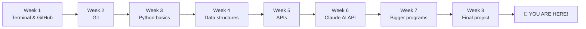
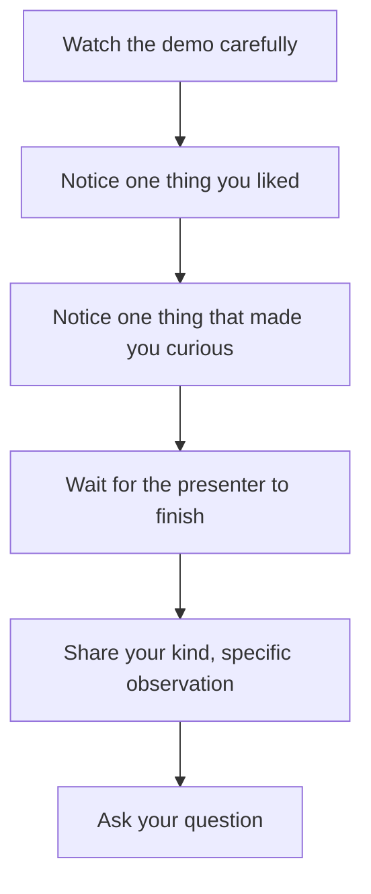

## Day 5 — Demo Day + What's Next

> **Goal:** Show your project to the world, celebrate eight weeks of hard work, and map out the exciting path that lies ahead of you.

---

### Today is the finish line

Eight weeks ago you opened a terminal for the first time.

Today you are a developer who has built a real Python project with Git version control, a proper README on GitHub, and a live demo to show for it.

That is not a small thing. That is genuinely impressive. Take a moment to appreciate how far you have come.



---

### Part 1 — Demo Day

#### How Demo Day works

Each person gets **3–5 minutes** to show their project. The order can be random or volunteered.

While someone is presenting:
- Everyone else watches and listens
- No typing on your own keyboard
- Save your questions for after

After each demo there is **2 minutes** for feedback and questions.

---

#### How to give good feedback

Feedback is a skill. Here is how to do it well:

**Do say:**
- "I really liked how you handled [specific thing]."
- "That was clever — I would not have thought to do it that way."
- "What does it do when [edge case]?"
- "What would you add if you had more time?"

**Do not say:**
- "That's boring."
- "Mine is better."
- "Why didn't you just do it this way?"

The goal of feedback is to help the presenter feel proud and think about improvements — not to show off your own ideas.



---

#### Demo order: what to say

Use your `DEMO.md` from yesterday. As a reminder, the structure is:

1. **What it is** — one sentence
2. **Show it working** — run the program live, talk through it
3. **How it works** — explain one interesting bit of code
4. **What was hard** — one honest challenge
5. **What you are proud of** — one specific thing

You built this. Be proud of it.

---

### Part 2 — What you have learned over 8 weeks

Let's look back at everything you can now do. This is your real certificate of completion.

#### Week 1 — Ubuntu, VS Code, and GitHub
- Navigate your Linux filesystem from the terminal
- Install software using `apt` and `snap`
- Create and edit files in VS Code
- Write Markdown
- Create a GitHub account and repository
- Make your first commit

#### Week 2 — Git: version control
- Initialise a Git repository with `git init`
- Stage and commit changes
- Read a commit history with `git log`
- Create and switch branches
- Merge branches and resolve conflicts
- Push to and pull from GitHub

#### Week 3 — Python basics
- Variables, strings, numbers, and booleans
- `if`, `elif`, `else` conditionals
- `for` and `while` loops
- Define and call functions
- Read and write files

#### Week 4 — Data structures and modules
- Lists, tuples, dictionaries, and sets
- Import and use Python modules
- Use `json` to read and write structured data
- Use `datetime` to work with dates and times

#### Week 5 — APIs and real data
- What an API is and how HTTP requests work
- Use the `requests` library to fetch data
- Parse JSON responses from real APIs
- Handle errors in network calls

#### Week 6 — The Claude AI API
- Send prompts to Claude using the `anthropic` library
- Understand how language models respond
- Build an interactive AI-powered feature
- Store API keys safely in environment variables

#### Week 7 — Bigger programs
- Split a program into multiple files and functions
- Use helper functions to keep code organised
- Think about a program as a set of parts working together

#### Week 8 — Final project
- Plan a project before writing code
- Build features one at a time and commit as you go
- Debug using print statements and error messages
- Write a proper README
- Present your work to an audience

---

### Part 3 — What is next?

You have a very strong foundation. Here are the paths you can take from here.

#### Path 1 — More Python

You know the basics really well. The next level is:

- **Object-oriented programming** — organise code into classes and objects
- **Error handling** — use `try`/`except` to handle problems gracefully
- **Regular expressions** — find patterns in text
- **Testing** — write code that checks your own code with `pytest`

**Where to learn:** [Python.org beginner's guide](https://www.python.org/about/gettingstarted/), [Real Python](https://realpython.com)

---

#### Path 2 — Web development

Make things that run in a browser:

- **HTML and CSS** — the building blocks of every web page
- **JavaScript** — make web pages interactive
- **Flask or Django** — build web apps entirely in Python

**Where to learn:** [freeCodeCamp.org](https://www.freecodecamp.org), [The Odin Project](https://www.theodinproject.com)

---

#### Path 3 — Data science

Work with data, find patterns, make charts:

- **pandas** — work with tables of data in Python
- **matplotlib** — make charts and graphs
- **Jupyter notebooks** — write code and see results side by side

**Where to learn:** [Kaggle Learn](https://www.kaggle.com/learn), [DataCamp](https://www.datacamp.com)

---

#### Path 4 — Game development

Build games with Python:

- **Pygame** — a Python library for 2D games
- **Godot** — a free, beginner-friendly game engine

**Where to learn:** [Pygame tutorials on YouTube](https://www.youtube.com/results?search_query=pygame+tutorial+beginners), [GDQuest for Godot](https://www.gdquest.com)

---

#### Path 5 — AI engineering

Go deeper with AI:

- **Prompt engineering** — learn to write prompts that get great results
- **LangChain** — a framework for building AI apps
- **Machine learning basics** — understand how models learn
- **Hugging Face** — explore thousands of free AI models

**Where to learn:** [fast.ai](https://www.fast.ai), [Anthropic documentation](https://docs.anthropic.com), [DeepLearning.AI short courses](https://www.deeplearning.ai/short-courses/)

---

### Part 4 — Free resources to keep learning

| Resource | What it is | Best for |
| -------- | ---------- | -------- |
| [freeCodeCamp.org](https://www.freecodecamp.org) | Free full courses: web dev, Python, data science | Structured learning |
| [Kaggle Learn](https://www.kaggle.com/learn) | Short data science and ML courses with real datasets | Data and AI |
| [CS50 (Harvard)](https://cs50.harvard.edu/x/) | Free university-level intro to computer science | Going deeper |
| [Real Python](https://realpython.com) | Python articles and tutorials for all levels | Python |
| [GitHub Explore](https://github.com/explore) | Browse interesting open-source projects | Inspiration and learning |
| [YouTube: Tech With Tim](https://www.youtube.com/@TechWithTim) | Python and game dev tutorials | Beginners to intermediate |
| [YouTube: Fireship](https://www.youtube.com/@Fireship) | Fast, fun overviews of tech topics | Staying curious |
| [Anthropic Cookbook](https://github.com/anthropics/anthropic-cookbook) | Real code examples using the Claude API | AI engineering |

---

### Hands-on exercise

**Time: 45–60 minutes**

#### Part A — Demo your project (15–20 min total for the group)

Present your project using your `DEMO.md` script. Give kind, specific feedback to every other person in the group.

#### Part B — Write a "what I learned" journal entry (15 min)

Open a new file in VS Code called `JOURNAL.md`. Write freely for 15 minutes. Answer these questions:

```markdown
# My Learning Journal — Week 8

## What I built
_Describe your project in your own words._

## What surprised me
_What was easier than you expected? What was harder?_

## The moment I was most proud of
_Describe one specific moment during these 8 weeks._

## What I want to build next
_What is the first thing you want to try after today?_

## One piece of advice for someone starting this course
_What would you tell someone on Day 1 of Week 1?_
```

Commit and push your journal if you would like to keep it on GitHub.

#### Part C — Star 3 GitHub repos for future inspiration (10 min)

Browse [GitHub Explore](https://github.com/explore) or [GitHub Trending](https://github.com/trending/python). Find 3 repos that look interesting or that you want to understand one day. Star them (click the star button on each repo).

This is how real developers bookmark things they want to come back to.

---

### What you learned today

- How to give a confident, structured technical demo
- How to give kind and specific feedback to others
- Everything you have learned across 8 weeks — and it is a lot
- That there are many exciting directions to go from here
- Where to find free, high-quality resources to keep growing

---

### Tip and trick for deeper understanding

#### Trick 1: Open your demo with the problem, not the code
The most memorable demos start with one sentence about WHY the project exists — the problem it solves — before showing any code or running the program. `"I always forget jokes, so I built a bot that tells me a fresh one every time"` is far more gripping than `"My project is called joke-bot.py and it uses the random module."` Hook your audience with the story first. The running program is the proof. This works in school presentations, job interviews, and science fairs — remember it forever.

#### Trick 2: A live bug is a plot twist, not a disaster
If something goes wrong during your demo — the program crashes, the API times out, you mis-type a command — stay calm and narrate what you expected to happen: `"Usually this saves to the file — let me check the path real quick."` Being calm and curious under pressure is a skill that professional developers get paid for. The audience is not judging you on perfection; they are watching how you handle the unexpected. A smooth recovery often impresses people more than a flawless demo.

#### Quick challenge (10 minutes)
Before the demos begin, write a "one-sentence pitch" for your project that you could say to absolutely anyone — your grandparent, a stranger, a friend who hates computers. It must answer: what does it do, and why is that useful or fun? Share it with the group as a warm-up. You will find that writing one honest, clear sentence is surprisingly hard — and that making it great is incredibly satisfying.

---

### Day 5 tip

> The most important thing you learned over these 8 weeks is not a Python command or a Git shortcut. It is this: **you can learn hard things by trying, breaking, fixing, and trying again.** That skill will take you further than any single technology. Keep building.

---

## You did it.

Eight weeks. Five days a week. One commit at a time.

You started with no experience and you are finishing with:

- A GitHub profile with real projects
- A working Python program you designed and built yourself
- The ability to read error messages, find bugs, and fix them
- An understanding of how AI APIs work
- A community of people you learned alongside

The learning never stops — but the beginning is behind you now. You are a developer.

**Keep building. The best project you will ever make is the next one.**
